# خواننده تلگرام

<!-- TOP_NAV START -->

<a href="https://github.com/cljen94-source/aio-downloader/blob/main/telegram/content/archive_1.md" style="display:inline-block; padding:6px 12px; margin:0 4px; background-color:#2ea44f; color:white; text-decoration:none; border-radius:4px; font-weight:bold;">صفحه بعد</a>

<!-- TOP_NAV END -->

<!-- MSG START -->

---
📅 بروزرسانی: 1405/02/26 11:04
---

## VahidOOnLine — post 240426

  

♦️خبرگزاری فارس، روز شنبه ۲۶ اردیبهشت ماه گزارش داد، وزارت اقتصاد در حال پیگیری طرحی است که با استفاده از سازوکار بیمه، «مدیریت تنگه هرمز را امکان‌پذیر کند». طرحی که به گفته فارس، می‌تواند در شرایط غیرجنگی از سوی کشورها نیز پذیرفته شود و در عین حال امکان مدیریت عبور و مرور دریایی را برای ایران فراهم کند.
فارس بر اساس سندی که به دست این رسانه رسیده است گزارش کرد، در قالب طرح موسوم به «بیمه هرمز»، امکان اشراف اطلاعاتی ایران بر تردد کشتی‌ها و همچنین تفکیک و شناسایی شناورهای متعلق به کشورهای مختلف فراهم خواهد شد.
به ادعای این رسانه حکومتی، جمهوری اسلامی در شرایط پس از جنگ می‌تواند تا دو میلیارد دلار از این روش درامدزایی کند. با این حال، این گزارش می‌افزاید محدودیت‌های زیرساختی ایران ظرفیت چنین درآمدی را نیز محدود می‌کند.
به نوشته فارس، مزیت این طرح آن است که «مدیریت تنگه از طریق بیمه» ماهیتی غیرنظامی و مدنی دارد و برخلاف اخذ عوارض، احتمال پذیرش آن از سوی کشورها بیشتر است.
جمهوری اسلامی از زمان آغاز جنگ با آمریکا در اسفندماه گذشته، تنگه هرمز را بسته و بارها بر کنترل و مدیریت این آبراه راهبردی تاکید کرده است. پیش‌تر نیز مجلس ایران طرح‌هایی درباره دریافت عوارض از کشتی‌های عبوری را مطرح کرده بود، موضوعی که همزمان با اعتراض گسترده جامعه جهانی، بحث‌های حقوقی و سیاسی گسترده‌ای درباره آینده تردد در تنگه هرمز ایجاد کرده است.
‌🇸🇦 Indypersian

🤖 @VahidOOnLine

## VahidOOnLine — post 240425

  

کرملین در بیانیه‌ای اعلام کرد ولادیمیر پوتین، رییس‌جمهوری روسیه، به‌زودی راهی چین خواهد شد و در روزهای سه‌شنبه و چهارشنبه، ۲۹ و ۳۰ اردیبهشت، با مقام‎‌های این کشور دیدار خواهد کرد.

بر اساس این بیانیه، پوتین و شی جین‌پینگ، رییس‌جمهوری چین، قرار است درباره «روابط دوجانبه» و «مسائل کلیدی بین‌المللی و منطقه‌ای» گفت‌وگو کنند.

پوتین در حالی به چین سفر خواهد کرد که دونالد ترامپ، رییس‌جمهوری آمریکا، سفر دوروزه خود به پکن را ۲۵ اردیبهشت به پایان رساند.
‌🏁 🇬🇧 IranintlTV

🤖 @VahidOOnLine

## VahidOOnLine — post 240424

  <a href="telegram/content/VahidOOnLine_240424_1778916858.mp4" target="_blank">🎬 Download video</a>

⭕️ پارک ملی توران سمنان؛
ثبت زادآوری گونه نادر گورخر آسیایی در ۱۴۰۵

♦️اداره‌کل حفاظت محیط زیست استان سمنان از ثبت نخستین زادآوری گورخر آسیایی در پارک ملی توران طی سال ۱۴۰۵ خبر داد.
گورخر آسیایی یا گور ایرانی، از گونه‌های در معرض خطر انقراض است که بخش مهمی از جمعیت باقی‌مانده آن در پارک ملی توران زندگی می‌کنند.
پارک ملی توران در استان سمنان که به «آفریقای ایران» شهرت دارد، یکی از مهم‌ترین زیستگاه‌های حیات‌وحش کشور محسوب می‌شود و گونه‌های نادری مانند یوزپلنگ آسیایی، جبیر و گورخر ایرانی را در خود جای داده است. فعالان محیط زیست امیدوارند ادامه روند زادآوری این گونه، به افزایش جمعیت و کاهش خطر انقراض گورخر آسیایی در ایران کمک کند.
‌🇸🇦 Indypersian

🤖 @VahidOOnLine

## VahidOOnLine — post 240423

  

مسعود پزشکیان، رییس دولت جمهوری اسلامی، در پیامی به پاپ لئو، رهبر کاتولیک‌های جهان، از آنچه «موضع اخلاقی و منطقی» او در قبال جنگ ایران خواند، قدردانی کرد.

در این پیام آمده است: «حملات آمریکا و اسرائیل صرفا علیه ایران نیست، بلکه علیه حاکمیت قانون و ارزش‌های انسانی است.»

پزشکیان افزود جمهوری اسلامی «در چارچوب دفاع مشروع، اهداف و منافع متجاوزین را مورد هدف قرار داد».

او همچنین خواستار واکنش «مسئولانه» جامعه جهانی به «اقدامات غیرقانونی» ایالات متحده شد.
‌🏁 🇬🇧 IranintlTV

🤖 @VahidOOnLine

## VahidOOnLine — post 240422

  <a href="telegram/content/VahidOOnLine_240422_1778916862.mp4" target="_blank">🎬 Download video</a>

ارتش اسرائیل اعلام کرد در پی فعال شدن هشدار نفوذ پهپاد در منطقه میرون، یک هدف هوایی مشکوک شناسایی شده است.
ارتش اسرائیل همچنین اعلام کرد جزئیات این رویداد در حال بررسی است و این حادثه بدون تلفات پایان یافته اس
‌🏁 🇬🇧 ManotoTV

🤖 @VahidOOnLine

## VahidOOnLine — post 240421

🗣روایت شما از زندگی در آتش‌بس- شنبه ۲۶ اردیبهشت ۱۴۰۵

🔹از قزوین ۲۶ اردیبهشت؛ از ساعت ۶ صبح یه‌سری صدا از آسمون می‌شنوم که مثل صدای جنگنده‌ست و رد می‌شه.

🔹بامداد ۲۶ اردیبهشت صدای جنگنده می‌اومد در ارومیه.

🔹اینجا اوضاع واقعاً خرابه، من ۴ ماه پیش تخم‌مرغ خریدم ۲۵۰ یه شونه، الان ۶۷۰ تومن یه شونه تخم‌مرغ.

🔹سیستم آموزشی بسیار ضعیفه و معلم‌ها فقط با روزی ۲ تا کلیپ از اینترنت کتاب رو تموم کردن، حالا بچه‌ی اول دبستانی رو می‌گن باید بیاد حضوری مدرسه در اهواز.

🔹بنزین در استان بوشهر تقریباً نایاب شده. دکه‌های کنار جاده لیتری ۱۰ هزار تومان، در بشکه‌های پنج لیتری می‌فروشن.

🔹هر شب آب ولنجک و محمودیه رو تا صبح قطع می‌کنن. روزها هم فشار آب اون‌قدر کم شده که ورودی منبع مدام قطع‌و‌وصل می‌شه. به نظر می‌رسه قطعی آب رو هم دارن عادی‌سازی می‌کنن.

🔹از اصفهان دانش‌آموز پایه نهمی‌ام. درس خوندنم با اینترنت و کلیپ‌های معلم‌ها بود. از هوش مصنوعی استفاده زیادی برای درس‌ها داشتم. الان دسترسی ندارم. قیمت VPN اومده پایین تا ۲۸۰ هزار تومن. ولی ما دانش‌آموزان... هی آقایون فروشنده VPN، خدا رو همه رو وصل کنید. #وی‌پی‌ان‌‌برای‌همه

🔹از ملارد استان تهران؛ از ساعت ۱۲ شب تا ۵ صبح آب اینجا قطع بود. با این وجود، به‌تازگی از ساعت ۲ بعدازظهر تا ۶ عصر هم قطع می‌کنن.
‌🏁 🇬🇧 IranintlTV

🤖 @VahidOOnLine

## VahidOOnLine — post 240420

  

♦️خبرگزاری رویترز به نقل از یک منبع آگاه گزارش داد که ماتیاس گرافستروم، دبیرکل فیفا، روز شنبه در استانبول با مقام‌های فدراسیون فوتبال ایران دیدار خواهد کرد تا درباره حضور تیم ملی ایران در جام جهانی با آنها گفتگو کند.
ایران قرار است هر سه بازی مرحله گروهی خود در جام جهانی را در ایالات متحده برگزار کند، اما از زمان حملات آمریکا و اسرائیل به ایران در اسفندماه گذشته، حضور تیم ملی ایران در این رقابت‌‌ها با ابهام‌هایی روبه‌رو شده است.
به گزارش رویترز، انتظار می‌رود مقام‌های فیفا در این دیدار درباره وضعیت حضور ایران در این مسابقات توضیح داده و پیام‌هایی «با هدف کاهش نگرانی‌ها» ارائه کنند.
پیشتر مهدی تاج، رئیس فدراسیون فوتبال ایران در اظهاراتی متناقض، با اعلام حضور «قطعی» تیم‌ ملی در جام‌جهانی، برای شرکت دراین رقابت‌ها شروط تعیین کرده بود.
‌🇸🇦 Indypersian

🤖 @VahidOOnLine

## VahidOOnLine — post 240419

  

⭕️ ثبت بیش از ۲۵۰ زمین‌لرزه در ایران طی سه هفته اخیر

♦️بر اساس گزارش موسسه ژئوفیزیک دانشگاه تهران، از ۲۹ فروردین تا ۱۸ اردیبهشت‌ماه امسال بیش از ۲۵۰ زمین‌لرزه در نقاط مختلف کشور به ثبت رسیده است.
شدیدترین زمین‌لرزه این بازه، زلزله ۵.۱ ریشتری سفیدآبه در استان سیستان و بلوچستان اعلام شده، رخدادی که بار دیگر توجه‌ها را به وضعیت لرزه‌خیزی ایران و ضرورت آمادگی در برابر حوادث طبیعی جلب کرده است.
ایران به‌دلیل قرار گرفتن روی کمربند زلزله آلپ-هیمالیا، از جمله کشورهای زلزله‌خیز جهان به شمار می‌رود و کارشناسان همواره بر مقاوم‌سازی ساختمان‌ها، آموزش عمومی و آمادگی مدیریت بحران تاکید دارند.
‌🇸🇦 Indypersian

🤖 @VahidOOnLine

## VahidOOnLine — post 240418

  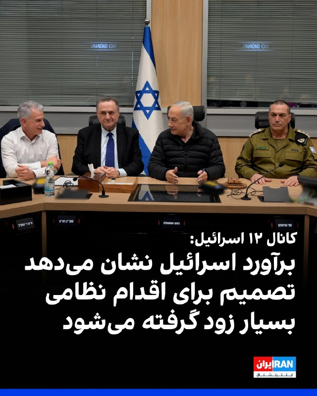

کانال ۱۲ اسرائیل گزارش داد انتظار می‌رود دونالد ترامپ، رییس‌جمهوری آمریکا، طی ۲۴ ساعت آینده تیم مشاوران نزدیک خود را تشکیل دهد تا درباره ایران تصمیم نهایی بگیرد. برآوردها در اسرائیل حاکی است تصمیم درباره اقدام نظامی ممکن است بسیار به‌زودی اتخاذ شود.

برنامه تلویزیونی «اولپن شیشی» به نقل از یک مقام ارشد اسرائیلی گزارش داد که «ازسرگیری درگیری نزدیک است» و اسرائیل خود را برای احتمال «چند روز تا چند هفته جنگ» آماده می‌کند.

این مقام گفت آمریکایی‌ها دریافته‌اند که مذاکرات به سمت پیشرفت تعیین‌کننده پیش نمی‌رود و در اورشلیم در انتظار تصمیم ترامپ هستند. بر اساس این ارزیابی، تصویر کلی تحولات طی حدود ۲۴ ساعت آینده روشن‌تر خواهد شد.
‌🏁 🇬🇧 IranintlTV

🤖 @VahidOOnLine

## VahidOOnLine — post 240417

  <a href="telegram/content/VahidOOnLine_240417_1778916866.mp4" target="_blank">🎬 Download video</a>

رسانه‌های اسرائیلی گزارش داده‌اند با بازگشت دونالد ترامپ، رئیس‌جمهوری آمریکا، از سفر چین، کاخ سفید به مرحله‌ای تعیین‌کننده در پرونده ایران نزدیک شده و احتمال تصمیم‌گیری درباره اقدام نظامی در روزهای آینده افزایش یافته است.
کانال ۱۲ اسرائیل گزارش داد در اسرائیل برآورد می‌شود دونالد ترامپ طی ۲۴ ساعت آینده درباره اقدام نظامی علیه جمهوری اسلامی تصمیم‌گیری کند. این شبکه به نقل از یک مقام ارشد اسرائیلی گزارش داد «ازسرگیری درگیری‌ها نزدیک است» و اسرائیل خود را برای «روزها تا هفته‌ها درگیری» آماده می‌کند.
بر اساس این گزارش، مقام‌های اسرائیلی معتقدند آمریکا به این جمع‌بندی رسیده که مذاکرات با ایران به سمت پیشرفت جدی حرکت نمی‌کند و انتظار می‌رود تصویر روشن‌تری از تصمیم واشنگتن طی ساعات آینده مشخص شود.
‌🏁 🇬🇧 ManotoTV

🤖 @VahidOOnLine

## VahidOOnLine — post 240416

  <a href="telegram/content/VahidOOnLine_240416_1778916867.mp4" target="_blank">🎬 Download video</a>

دونالد ترامپ، رئیس‌جمهوری آمریکا، در تروث سوشیال اعلام کرد نیروهای آمریکایی و ارتش نیجریه در عملیاتی مشترک، «ابوبلال المنوکی» از فرماندهان ارشد داعش را کشته‌اند.
ترامپ گفت این عملیات به دستور او و با برنامه‌ریزی دقیق انجام شده و «ابوبلال المنوکی» که به گفته او نفر دوم داعش در سطح جهانی بوده، در آفریقا مخفی شده بود.
او افزود با کشته شدن این فرمانده داعش، توان عملیاتی جهانی این گروه به‌شدت تضعیف شده است.
‌🏁 🇬🇧 ManotoTV

🤖 @VahidOOnLine

## VahidOOnLine — post 240415

  

♦️مسعود پزشکیان، در پیامی به پاپ لئو چهاردهم از «مواضع اخلاقی و منطقی» او در قبال حملات اخیر به ایران قدردانی کرد.
پزشکیان در این نامه نوشت: «از موضع اخلاقی و منطقی شما در قبال تجاوزات نظامی اخیر به ایران قدردانی می‌کنم.»
او همچنین حملات آمریکا و اسرائیل را فراتر از رویارویی با ایران توصیف کرد و گفت این اقدامات «صرفا علیه ایران نیست، بلکه علیه حاکمیت قانون و ارزش‌های انسانی» انجام شده است.
رئیس‌جمهوری ایران تاکید کرد جمهوری اسلامی در چارچوب «دفاع مشروع» اهداف و منافع «متجاوزان» را هدف قرار داده است.
پزشکیان در ادامه با تاکید بر آنکه جمهوری اسلامی ایران همچنان به دیپلماسی و راه‌حل‌های مسالمت‌آمیز پایبند است نوشت: «از جامعه بین‌المللی انتظار می‌رود با اتخاذ رویکردی واقع‌بینانه و منصفانه، با مطالبات غیرقانونی و سیاست‌های ماجراجویانه و خطرناک آمریکا مقابله نماید.»
‌🇸🇦 Indypersian

🤖 @VahidOOnLine

## VahidOOnLine — post 240414

  

♦️شبکه سی‌ان‌ان به نقل از چند مقام امنیتی گزارش داد مقام‌های آمریکایی گمان می‌کنند هکرهای مرتبط با جمهوری اسلامی ایران پشت مجموعه‌ای از نفوذهای سایبری به سامانه‌هایی هستند که میزان سوخت مخازن جایگاه‌های بنزین را در چند ایالت آمریکا رصد می‌کنند.
بر اساس این گزارش، مهاجمان سامانه‌های پایش میزان سوخت مخازن موسوم به ATG را هدف قرار داده‌اند. هکرها در بعضی موارد توانسته‌اند داده‌های نمایش‌داده‌شده را دستکاری کنند، اما سطح واقعی سوخت در مخازن تغییری نکرده است.
به گفته مقام‌های آمریکایی، این نفوذها تاکنون خسارت فیزیکی ایجاد نکرده‌اند، اما کارشناسان هشدار داده‌اند که دسترسی به چنین سامانه‌هایی می‌تواند از نظر تئوری به پنهان ماندن نشت سوخت یا ایجاد اختلال در زیرساخت‌های حساس منجر شود.
به گزارش سی‌ان‌ان، یکی از دلایلی که ایران به‌عنوان مظنون اصلی مطرح شده، سابقه گروه‌های وابسته به تهران در هدف قرار دادن سامانه‌های مشابه است؛ هرچند منابع تاکید کرده‌اند کمبود ردپای دیجیتال می‌تواند شناسایی قطعی عاملان را دشوار کند. همچنین از زمان آغاز جنگ با ایران در اواخر زمستان، هکرهای مرتبط با تهران به ایجاد اختلال در تاسیسات نفت، گاز و آب آمریکا نیز متهم شده‌اند.
‌🇸🇦 Indypersian

🤖 @VahidOOnLine

## VahidOOnLine — post 240413

  <a href="telegram/content/VahidOOnLine_240413_1778916870.mp4" target="_blank">🎬 Download video</a>

♦️دلسی رودریگز، رئیس‌جمهور موقت ونزوئلا، در کاراکاس با سوزانا کوردیرو گوئرا، معاون بانک جهانی در امور آمریکای لاتین و کارائیب و هیئت همراه دیدار و گفتگو کرد، نشستی که در ادامه ازسرگیری رسمی روابط ونزوئلا با نهادهای مالی بین‌المللی برگزار شده است.
بر اساس بیانیه دولت ونزوئلا، این دیدار با محوریت همکاری‌های اقتصادی، توسعه سرمایه‌گذاری، بازسازی زیرساخت‌ها و بازگشت تدریجی کاراکاس به بازارهای مالی جهانی انجام شد. دولت ونزوئلا اعلام کرده است که با احیای کانال‌های همکاری چندجانبه، به‌دنبال حرکت به سمت اقتصادی متنوع، جذب سرمایه خارجی و بهبود وضعیت معیشتی شهروندان است.
روابط ونزوئلا با بانک جهانی و صندوق بین‌المللی پول از سال ۲۰۱۹ به‌دلیل اختلافات سیاسی و بحران مشروعیت دولت این کشور متوقف شده بود، اما در ماه فروردین امسال، دو طرف رسما از آغاز دوباره همکاری‌ها خبر دادند.
این نشست در حالی برگزار می‌شود که دولت ونزوئلا همزمان روند بازسازی ساختار بدهی‌های خارجی خود را آغاز کرده و مقام‌های اقتصادی این کشور از برنامه سفر هیئتی رسمی به واشنگتن برای مذاکره با صندوق بین‌المللی پول در هفته‌های آینده خبر داده‌اند.
‌🇸🇦 Indypersian

🤖 @VahidOOnLine

## VahidOOnLine — post 240412

♦️رویدادی در لندن با نام «بالد فس» (Bald Fest) با اهدای آبجوی رایگان به افراد طاس یا کسانی که حاضرند موهای خود را بتراشند، به تجلیل از افراد بی‌مو پرداخت.
در این جشن، افرادی که سر کاملا تراشیده دارند یا در محل حاضر می‌شوند موهای خود را بتراشند، می‌توانند یک نوشیدنی رایگان دریافت کنند. برگزارکنندگان می‌گویند هدف از این رویداد، ایجاد فضایی سرگرم‌کننده و مثبت برای تغییر نگاه به طاسی و بزرگداشت افراد کم‌مو یا بی‌مو است.
این رویداد با فضایی طنزآمیز و جشن‌گونه برگزار شد و توجه بسیاری را در شبکه‌های اجتماعی به خود جلب کرد.
‌🇸🇦 Indypersian

🤖 @VahidOOnLine

## VahidOOnLine — post 240411

  <a href="telegram/content/VahidOOnLine_240411_1778916874.mp4" target="_blank">🎬 Download video</a>

شبکه سی‌ان‌ان به نقل از چند منبع گزارش داده هکرهای مظنون به ارتباط با ایران موفق شده‌اند به سامانه‌های پایش مخازن سوخت در آمریکا نفوذ کنند و نمایشگر میزان سوخت را تغییر دهند.
بر اساس این گزارش، سامانه‌های «اندازه‌گیری خودکار مخازن» بدون رمز عبور و متصل به اینترنت بوده‌اند. منابع آگاه می‌گویند هکرها توانسته‌اند ارقام نمایش‌داده‌شده را دستکاری کنند، اما امکان تغییر واقعی میزان سوخت در مخازن را نداشته‌اند و هیچ خسارت فیزیکی گزارش نشده است.
سی‌ان‌ان همچنین گزارش داده این حملات تنها به سامانه‌های سوخت محدود نبوده و زیرساخت‌های نظامی و شبکه‌های آب آمریکا را نیز هدف قرار گرفته‌اند.
‌🏁 🇬🇧 ManotoTV

🤖 @VahidOOnLine

## VahidOOnLine — post 240410

  

ترامپ در تروث‌سوشال اعلام کرد ابو بلال المینوکی، نفر دوم داعش در جهان، در عملیاتی که از سوی نیروهای آمریکا و نیجریه انجام شد، کشته شده است.
او در پیامی نوشت: «امشب به دستور من، نیروهای شجاع آمریکایی و نیروهای مسلح نیجریه یک ماموریت بسیار دقیق و پیچیده را به‌طور بی‌نقص اجرا کردند تا فعال‌ترین تروریست جهان را از میدان نبرد حذف کنند. ابو بلال المینوکی، نفر دوم داعش در سطح جهانی، فکر می‌کرد می‌تواند در آفریقا پنهان شود، اما نمی‌دانست ما منابعی داریم که ما را از آنچه انجام می‌داد آگاه می‌کردند.»
ترامپ همچنین از دولت نیجریه برای همکاری در این عملیات قدردانی کرد.

‌🏁 🇬🇧 IranintlTV

🤖 @VahidOOnLine

## VahidOOnLine — post 240409

  

♦️دونالد ترامپ، رئیس‌جمهوری ایالات متحده، در مصاحبه اخیر با شبکه فاکس‌نیوز گفت «آستانه درد» و تاب‌آوری ایران را دست‌کم نگرفته است. ترامپ با اشاره به سیاست خویشتن‌داری واشنگتن تاکید کرد ایالات متحده عامدانه از هدف قرار دادن زیرساخت‌های حیاتی و غیرنظامی نظیر پل‌ها و تأسیسات تولید برق خودداری کرده است.
رئیس جمهوری آمریکا با یادآوری میزان خسارات وارد شده به ایران گفت: «ما به شکل باورنکردنی و بسیار سخت به آن‌ها ضربه زدیم. ببینید، ما پل‌ها و ظرفیت برق آن‌ها را رها کردیم؛ در حالی که می‌توانیم همه این‌ها را ظرف دو روز از بین ببریم. ظرف دو روز، همه چیز را.»
او در پاسخ به این سوال که آیا تاب‌آوری رژیم ایران در برابر آسیب‌ها را دست‌کم گرفته است، گفت: «من هیچ چیز را دست‌کم نگرفتم. ما به جز شیرهای خروجی نفت، به بقیه بخش‌ها ضربه زدیم.»
‌🇸🇦 Indypersian

🤖 @VahidOOnLine

## VahidOOnLine — post 240408

  

نیویورک‌تایمز به نقل از دو مقام خاورمیانه‌ای گزارش داد آمریکا و اسرائیل در حال تدارکات فشرده برای از سرگیری احتمالی حملات علیه جمهوری اسلامی در اوایل هفته آینده هستند و این گزینه‌ها شامل بمباران‌های تهاجمی‌تر علیه اهداف نظامی و زیرساختی و عملیات ویژه زمینی برای یافتن مواد هسته‌ای خواهد بود.
طبق این گزارش، نیروهای عملیات ویژه اعزام شده به منطقه می‌توانند در این ماموریت مورد استفاده قرار گیرند، اما چنین عملیاتی به هزاران نیروی پشتیبانی نیاز دارد.
این روزنامه افزود به گفته دستیاران ترامپ، او هنوز در مورد گام‌های بعدی خود تصمیمی نگرفته است.
بر اساس این گزارش، مقام‌های آمریکایی گفتند که حدود پنج هزار تفنگدار دریایی و حدود دو هزار چترباز از لشکر ۸۲ هوابرد ویژه ارتش ایالات متحده در منطقه منتظر دستورالعمل‌ هستند.
مقام‌های نظامی نیز گفتند که این نیروها می‌توانند برای دستیابی به مواد هسته‌ای ایران در سایت اتمی اصفهان، از جمله ایمن‌سازی محیط برای محافظت از اپراتورهای ویژه‌ای که وظیفه ورود به آنجا را دارند، مورد استفاده قرار گیرند.
‌🏁 🇬🇧 IranintlTV

🤖 @VahidOOnLine

## VahidOOnLine — post 240407

  

♦️دونالد ترامپ، رئیس‌جمهوری آمریکا، شنبه ۲۶ اردیبهشت با انتشار پیامی در «تروث سوشال» اعلام کرد که نیروهای آمریکایی با همکاری ارتش نیجریه، در جریان یک عملیات پیچیده و دقیق، «ابوبلال المینوکی» مرد شماره دو و فعال‌ترین عضو ارشد داعش در جهان را از پای درآورده‌اند.
ترامپ در این پیام تاکید کرد که او تصور می‌کرد می‌تواند در آفریقا پنهان شود، اما منابع اطلاعاتی تمامی تحرکات او را زیر نظر داشتند. به گفته رئیس‌جمهوری آمریکا، با حذف این فرمانده ارشد، توانایی عملیاتی جهانی داعش به‌شدت کاهش یافته است و او دیگر نمی‌تواند مردم آفریقا یا منافع آمریکا را هدف قرار دهد. ترامپ همچنین از همکاری و مشارکت دولت نیجریه در اجرای موفقیت‌آمیز این عملیات قدردانی کرد.
‌🇸🇦 Indypersian

🤖 @VahidOOnLine

## WithYashar — post 11371

  

استوری مشاور قالیباف تو اینستاگرام 🤣
@withyashar

## WithYashar — post 11370

## WithYashar — post 11369

@withyashar

## WithYashar — post 11368

نیویورک تایمز از قول مقامات نظامی آمریکا:

اگر جزیره خارگ تصرف شود ، نیروهای زمینی برای حفظ آن لازم خواهند بود.

@withyashar

## WithYashar — post 11367

  <a href="telegram/content/WithYashar_11367_1778916879.mp4" target="_blank">🎬 Download video</a>

تنها چیزی که می‌توانم بگویم این است که این یک موفقیت بزرگ بود.»

رئیس جمهور ترامپ پس از سفر به چین به کاخ سفید بازگشت و به خبرنگاران گفت: «ما به توافق‌های بزرگی رسیدیم» و این دیدار را یک لحظه تاریخی خواند.

سپس او به اتفاقات بیشتری در آینده اشاره کرد: «اتفاقات زیادی افتاده است و شما درباره آنها خواهید شنید.»
@withyashar

## mwarmonitor — post 9149

🔴«گزارش نیویورک تایمز: اسرائیل و ایالات متحده در حال آماده‌سازی برای از سرگیری حملات علیه ایران در هفته آینده هستند.»

@mwarmonitor

## mwarmonitor — post 9148

  

✈️🇦🇿«یک فروند هواپیمای باری Il-76TD-90VD متعلق به شرکت Azerbaijan Silk Way Airlines دیروز در فرودگاه ایلات در جنوب اسرائیل مشاهده شد.

🔸این یک اتفاق نادر است، زیرا این هواپیماهای آذربایجانی معمولاً در فرودگاه بن‌گوریون فرود می‌آیند.

✈️همچنین در ایلات مشاهده شدند: ۷ فروند هواپیمای سوخت‌رسان نیروی هوایی آمریکا و هواپیمایی که به نظر می‌رسید یک هواپیمای گشت دریایی P-8A Poseidon باشد.»

@mwarmonitor

## mwarmonitor — post 9147

🇺🇸امشب با دستور من، نیروهای شجاع آمریکایی و نیروهای مسلح نیجریه، ماموریتی به‌دقت برنامه‌ریزی‌شده و بسیار پیچیده را برای حذف فعال‌ترین تروریست جهان از صحنه نبرد، به‌طور بی‌نقصی اجرا کردند.
«ابوبلال المینوکی»، شخص دوم در فرماندهی جهانی داعش، فکر می‌کرد که می‌تواند در آفریقا پنهان شود، اما روحش هم خبر نداشت که ما منابعی داشتیم که ما را از کارهایی که انجام می‌داد مطلع نگه می‌داشتند. او دیگر مردم آفریقا را وحشت‌زده نخواهد کرد و در برنامه‌ریزی عملیات‌ها برای هدف قرار دادن آمریکایی‌ها نقشی نخواهد داشت. با حذف او، عملیات جهانی داعش به شدت کاهش یافته و ضعیف شده است.
از دولت نیجریه بابت همکاری‌شان در این عملیات سپاسگزارم. خدا آمریکا را حفظ کند!

رئیس‌جمهور دونالد جی. ترامپ

@mwarmonitor

## FoxNewsTwitter — post 341807

Fox News (Twitter/X)

BREAKING: Trump says U.S. forces just helped take out "the most active terrorist in the world."

In a late-night Truth Social post, the president announced that American forces and Nigeria’s military carried out a complex mission that killed Abu-Bilal al-Minuki, whom Trump described as ISIS’s second-in-command globally.

“[He] thought he could hide in Africa,” Trump said, "but little did he know we had sources who kept us informed on what he was doing."

## FoxNewsTwitter — post 341806

  <a href="telegram/content/FoxNewsTwitter_341806_1778916883.mp4" target="_blank">🎬 Download video</a>

Fox News (Twitter/X)

Countless bees swarmed outside the White House, near the press corps' media area, on Friday.

About 20 minutes later, the bees swarmed a hive on a tree on the North Lawn.

## pm_afshaa — post 90832

وزارت دادگستری آمریکا با صدور بیانیه‌ای، مدعی شد «محمد باقر سعد داوود السعدی»، شهروند عراقی و از اعضای شاخص کتائب حزب‌الله دستگیر شده و به ایالات متحده منتقل شده

💧 Rainbet.com the #1 Non-KYC Crypto Casino & Sportsbook @rainbetcom

😁 @Pm_Afshaa

## pm_afshaa — post 90831

🔴رویترز: آمریکا ممکن است از اسرائیل بخواهد میلیاردها دلار از وجوه مالیاتی فلسطینیان که مسدود شده است را به حمایت از طرح بازسازی غزه توسط ترامپ اختصاص دهد

💧 Rainbet.com the #1 Non-KYC Crypto Casino & Sportsbook @rainbetcom

😁 @Pm_Afshaa

## pm_afshaa — post 90830

امروز از دنده چپ پا شدم میخام همه رو فحش بدم کیرم تو ناموس سپاهی و بسیجی خار مادر همتونو با هم گاییدم با اون رهبر چلاق مقواییتون

## pm_afshaa — post 90829

امروز از دنده چپ پا شدم میخام همه رو فحش بدم

کیرم تو ناموس سپاهی و بسیجی خار مادر همتونو با هم گاییدم با اون رهبر چلاق مقواییتون

## pm_afshaa — post 90828

سازمان ملل: نگرانیم، چون ممکنه منطقه بازم دچار تنش و درگیری بشه 
💧 Rainbet.com the #1 Non-KYC Crypto Casino & Sportsbook @rainbetcom 
😁 @Pm_Afshaa

## pm_afshaa — post 90827

سازمان ملل: نگرانیم، چون ممکنه منطقه بازم دچار تنش و درگیری بشه

💧 Rainbet.com the #1 Non-KYC Crypto Casino & Sportsbook @rainbetcom

😁 @Pm_Afshaa

## pm_afshaa — post 90826

اینایی که تو اپای ایرانی به اسم ما فعالیت میکنن به زودی یه کپی رایت میزنم دهن همتونو میگام خسارت بد نام کردنم رو هم ازتون میگیرم کونتونو پاره میکنم

## iaghapour — post 2614

⭕️ بحران در زیرساخت فناوری؛ سقوط درآمدها و خطر عقب‌ماندگی ۱۰ ساله!

اختلالات اینترنتی دیگر فقط یک مشکل ساده برای کاربران عادی نیست؛ بلکه به گفته رئیس کمیسیون شبکه سازمان نصر، تیشه به ریشه‌ی زیرساخت‌های فناوری کشور زده است. این وضعیت نه تنها درآمد شرکت‌ها را تا ۷۰ درصد کاهش داده، بلکه باعث فرار متخصصان کلیدی و فرسودگی شدید تجهیزات شده است.

🔹 سقوط درآمد و انفجار هزینه‌ها: شرکت‌های حوزه شبکه با کاهش درآمد ۳۰ تا ۷۰ درصدی روبرو هستند. از سوی دیگر، به دلیل اختلال در مسیریابی و افت کیفیت، این شرکت‌ها مجبور به پرداخت جریمه‌های سنگین ناشی از نقض توافق‌نامه سطح خدمات (SLA) شده‌اند.

🔸 تهدید امنیت سایبری: محدودیت دسترسی به مخازن اصلی و سرورهای به‌روزرسانی جهانی، ریسک نفوذ و حملات سایبری را تا ۴۰ درصد افزایش داده است. در واقع، امنیت سایبری قربانی ناپایداری شبکه شده است.

🔹 تخلیه ژنتیکی تخصص: صنعت شبکه با بحران خروج نیروهای کلیدی مواجه است. تربیت یک متخصص ارشد سال‌ها زمان و هزینه‌ی ارزی سنگین می‌طلبد که با مهاجرت این افراد، سرمایه‌های انسانی چند میلیاردی کشور به راحتی از دست می‌رود.

🔸 عقب‌ماندگی ۱۰ ساله: ادامه این وضعیت، ایران را با شکاف تکنولوژیک ۱۰ ساله نسبت به کشورهای منطقه مواجه می‌کند؛ شکافی که در فضای پرشتاب فناوری، جبران آن تقریباً غیرممکن خواهد بود.

زیرساخت شبکه کشور به جای اتصال طبیعی به اینترنت جهانی، در حال حرکت به سمت یک ساختار جزیره‌ای و فرسوده است. اگر ثبات پیش‌بینی‌پذیر به این فضا بازنگردد، شرکت‌های بزرگ فناوری به اپراتورهای ساده تجهیزات قدیمی تنزل پیدا خواهند کرد. / دیجیاتو

🆔 @iaghapour

## mamlekate — post 103532

📝 نیویورک‌تایمز: آمریکا و اسرائیل برای جنگ جدید آماده می‌شوند

به گزارش نیویورک‌تایمز، دونالد ترامپ پس از بازگشت از چین با تصمیمی تعیین‌کننده درباره ایران روبه‌رو شده است؛ در حالی که مذاکرات برای کاهش تنش متوقف مانده، آمریکا و اسرائیل آماده‌سازی‌های گسترده‌ای را برای احتمال ازسرگیری حملات نظامی علیه جمهوری اسلامی آغاز کرده‌اند.

📝 ترامپ به آمریکایی‌ها: فشار اقتصادی را تحمل کنید؛ باید جلوی «گروهی دیوانه» را بگیریم

ترامپ در گفت‌وگو با فاکس‌نیوز با اشاره به افزایش هزینه‌های اقتصادی ناشی از تقابل با جمهوری اسلامی، از آمریکایی‌ها خواست این فشار کوتاه‌مدت را تحمل کنند و گفت جلوگیری از تهدید حکومت ایران اولویتی بالاتر از پیامدهای کوتاه‌مدت اقتصادی دارد.

@mamlekate

## mamlekate — post 103531

  <a href="telegram/content/mamlekate_103531_1778916886.mp4" target="_blank">🎬 Download video</a>

علی موسوی، پسر عبدالرحیم موسوی، رئیس پیشن ستاد کل نیروهای مسلح جمهوری اسلامی، گفت که جنازه پدرش که در نخستین روز حملات اسرائیل و آمریکا به بیت رهبر کشته شد نزدیک به ۳۰ روز در زیر آوار ماند و یک ماه در جستجوی جنازه اش بودند.

موسوی پس از کشته شدن محمد باقری در جنگ ۱۲ روزه، به‌عنوان رییس ستاد کل نیروهای مسلح منصوب شده بود.

indypersian
@mamlekate

## mamlekate — post 103530

📝 الو یکی از علت‌هایی که در تهران مدارس را حضوری نمی‌کنند، بخاطر حضور نیروها و بعضی از سازمان‌های نظامی و حیاتی مثل فرمانداری در داخل بعضی مدارس است. مدارسی که تخلیه نشده‌اند هنوز اجازه برگزاری کلاس حضوری ندارند.

@mamlekate

## mamlekate — post 103529

  <a href="telegram/content/mamlekate_103529_1778916888.mp4" target="_blank">🎬 Download video</a>

📺 جمهوری اسلامی به جایی رسیده که نفر آورده با ماسک آموزش کلاشینکف تو برنامه زنده صداوسیما میده

📝 توان جنگیدن با آمریکا که ندارن (در صورت جنگ زمینی)، این برای کشتار مردم بی‌سلاح ایران در اعتراضات آینده ست.

📝 اسلحه بیاد بین مردم، فرصت انتقام تعدادی از ده‌ها هزار نفری که توی دی‌ماه کشتند هم بوجود میاد اما ابعاد این احتمال بزرگ نیست. ابعاد احتمالی مسلح شدن، اختلافات بین باندهای مختلف مافیای اشغالگره که با تنگ‌تر شدن محاصره اقتصادی، از خشونت سیاسی به خشونت فیزیکی دست خواهند زد. برای پول راحت‌تره آدمکشی تا برای عقیده.

@mamlekate

## VahidOnline — post 75494

دونالد ترامپ با اشاره به افزایش هزینه‌های اقتصادی ناشی از تقابل با جمهوری اسلامی، از آمریکایی‌ها خواست این فشار کوتاه‌مدت را تحمل کنند و گفت جلوگیری از تهدید حکومت ایران اولویتی بالاتر از پیامدهای کوتاه‌مدت اقتصادی دارد.

او تاکید کرد: «متاسفم که این فشار را تحمل می‌کنید، اما باید جلوی این گروه بسیار دیوانه را بگیریم.»

رییس‌جمهوری آمریکا در بخش دیگری از این مصاحبه گفت حکومت ایران از نظر نظامی به‌شدت آسیب دیده و بار دیگر تاکید کرد: «آن‌ها دیگر نیروی دریایی ندارند. نیروی هوایی ندارند. همه‌چیز نابود شده است. نیروی هوایی‌شان از بین رفته است.»

او تاکید کرد: «تنگه باز خواهد شد. آن‌ها سلاح هسته‌ای نخواهند داشت و دنیا ادامه خواهد یافت.»

رییس‌جمهوری آمریکا گفت به درخواست مقام‌هایی از پاکستان، مرحله نهایی عملیات علیه ایران را متوقف کرده است. او گفت: «آن‌ها گفتند: می‌توانید متوقف شوید؟ ما قرار است به توافق برسیم. و واقعاً چارچوب یک توافق را داشتیم؛ بدون برنامه هسته‌ای.»

ترامپ در ادامه تاکید کرد تهران پذیرفته بود مواد باقی‌مانده از برنامه هسته‌ای خود را تحویل دهد، اما بعد از هر توافق عقب‌نشینی کرده است. او گفت: «هر بار توافق می‌کنند، روز بعد انگار می‌گویند چنین گفت‌وگویی نداشته‌ایم. این حدود پنج بار اتفاق افتاده است. مشکلی در آن‌ها وجود دارد. واقعاً دیوانه‌اند. و به همین دلیل نمی‌توانند سلاح هسته‌ای داشته باشند.»

رییس‌جمهوری آمریکا در بخش دیگری از مصاحبه، در پاسخ به این پرسش که آیا توان و مقاومت حکومت ایران را دست‌کم گرفته، گفت: «هیچ‌چیز را دست‌کم نگرفتم. ما به‌شدت به آن‌ها ضربه زدیم.»

ترامپ تاکید کرد آمریکا عمداً بخشی از زیرساخت‌های ایران را هدف قرار نداده است و افزود: «پل‌هایشان را باقی گذاشتیم. زیرساخت برق‌شان را باقی گذاشتیم. می‌توانیم همه آن را در دو روز نابود کنیم؛ همه‌چیز.» او گفت به تاسیسات نفتی و برخی زیرساخت‌ها در خارک حمله نشده، زیرا آسیب به آن‌ها می‌توانست موجب از بین رفتن نفت شود.

رییس‌جمهوری آمریکا درباره وضعیت مذاکرات با جمهوری اسلامی گفت افرادی که آمریکا با آن‌ها در حال گفت‌وگو است، به گفته او «منطقی» به نظر می‌رسند، اما توان یا آمادگی لازم برای تصمیم‌گیری ندارند.

ترامپ در پاسخ به این پرسش که آمریکا در حال حاضر با چه کسانی در ایران طرف است، گفت: «با افرادی طرف هستیم که فکر می‌کنم منطقی هستند، اما از توافق می‌ترسند. نمی‌دانند چطور توافق کنند. قبلاً در چنین موقعیتی نبوده‌اند.»
او در پاسخ به این سوال که آیا تا زمان دستیابی به توافق صبر خواهد کرد، تاکید کرد: «من کاری را انجام می‌دهم که درست باشد. باید کار درست را انجام دهم.»

او همچنین گفت مقام‌های ایرانی به او گفته‌اند محل نگهداری مواد هسته‌ای به‌شدت هدف قرار گرفته و «کوه گرانیتی» روی آن فرو ریخته است. ترامپ افزود: «آن‌ها گفتند فقط دو کشور می‌توانند به آن دسترسی پیدا کنند؛ ما و چین. گفتند خودشان توانایی دسترسی ندارند چون کاملاً نابود شده است.»
ترامپ گفت: «نمی‌توان اجازه داد ایران سلاح هسته‌ای داشته باشد. آن‌ها از آن علیه ما استفاده خواهند کرد. اول اسرائیل را نابود می‌کنند، بعد خاورمیانه را، بعد اروپا را.»

او درباره افزایش قیمت سوخت در آمریکا گفت فشار اقتصادی ناشی از بحران کوتاه‌مدت خواهد بود و افزود: «وقتی مردم توضیح کامل را می‌شنوند، همه موافق می‌شوند. این یک درد کوتاه‌مدت خواهد بود.» ترامپ گفت پس از پایان بحران، قیمت انرژی «مثل سنگ سقوط خواهد کرد.»

رییس‌جمهوری آمریکا در پاسخ به نگرانی‌ها درباره افزایش فشار اقتصادی بر خانواده‌های آمریکایی در پی جنگ با ایران و رشد هزینه‌ها، گفت شهروندان باید این فشارها را تحمل کنند زیرا به گفته او هدف، مقابله با تهدیدی بزرگ‌تر است.

ترامپ در واکنش به این موضوع که برخی آمریکایی‌ها افزایش هزینه‌ها و بدبینی اقتصادی را احساس می‌کنند، گفت: «باید تحمل کنند و باور داشته باشند که ما آن‌ها را به نقطه بهتری می‌رسانیم. اما من باید کار درست را انجام دهم.»

ترامپ در ادامه، فشارهای اقتصادی ناشی از بحران را با ضرورت مقابله با جمهوری اسلامی مرتبط دانست و گفت: «به مردم گفتم متاسفم که این فشار را تحمل می‌کنید، اما باید جلوی این گروه بسیار دیوانه را بگیریم.»

رییس‌جمهوری آمریکا همچنین گفت کشتی‌های حامل نفت ایران که چین در روزهای اخیر خارج کرده، با اجازه واشینگتن حرکت کرده‌اند. او گفت: «ما اجازه دادیم این اتفاق بیفتد.»

ترامپ در پایان در پاسخ به این پرسش که آیا حکومت ایران در نهایت عقب‌نشینی خواهد کرد گفت: «بله، قطعاً. هیچ شکی ندارم.»
@VahidOOnLine

📡 @VahidOnline

## VahidOnline — post 75493

  

عباس عراقچی، وزیر خارجه جمهوری اسلامی، در واکنش به بالا رفتن قیمت انرژی در آمریکا، در ایکس نوشت: «در حال حاضر، افزایش قیمت بنزین و حباب بازار سهام را کنار بگذارید. درد واقعی زمانی آغاز می‌شود که بدهی آمریکا و نرخ وام‌های مسکن شروع به جهش کنند.»
او نوشت همین حالا هم میزان ناتوانی در بازپرداخت وام خودرو به بالاترین سطح خود در بیش از ۳۰ سال گذشته رسیده است، اما تمام این‌ها قابل اجتناب بود.
@VahidOOnLine

📡 @VahidOnline

## VahidOnline — post 75492

  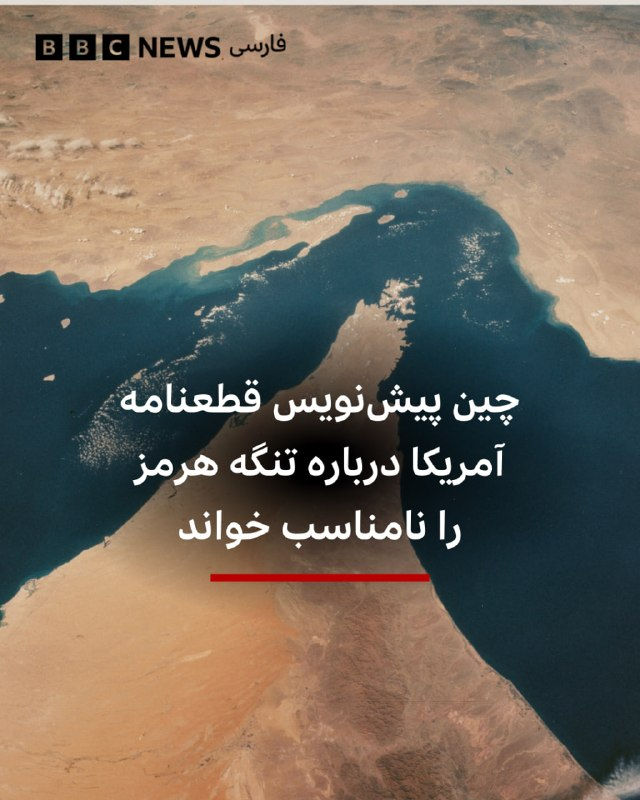

‌ نماینده چین در سازمان ملل و و رئیس دوره‌ای شورای امنیت، از پیش‌نویس قطعنامه پیشنهادی آمریکا و بحرین درباره تنگه هرمز انتقاد کرد و گفت که «محتوا و زمان‌بندی آن مناسب نیست و تصویبش کمکی نخواهد کرد.»

به گزارش رویترز، این پیش‌نویس قطعنامه از ایران می‌خواهد که حملات و مین‌گذاری در تنگه هرمز را متوقف کند. اما دیپلمات‌ها گفتند که اگر این قطعنامه به رای گذاشته شود، احتمالا با وتوی روسیه و چین روبه‌رو خواهد شد.

دو کشور ماه گذشته نیز قطعنامه مشابه مورد حمایت آمریکا را وتو کرده بودند و متن آن را علیه ایران «جانبدارانه» خواندند.
@VahidHeadline

📡 @VahidOnline

## kianmeli1 — post 87425

  <a href="telegram/content/kianmeli1_87425_1778916893.mp4" target="_blank">🎬 Download video</a>

🔴برت بایر از فاکس: آیا تاب آوری ایران را دست کم گرفتید ؟

ترامپ: چیزی را دست کم نگرفتم ما می توانیم پل ها و ظرفیت برق آنها را در دو روز از بین ببریم.
https://t.me/kianmeli1

## kianmeli1 — post 87424

  

🔴به گزارش نیویورک تایمز، به نقل از دو مقام خاورمیانه، ایالات متحده و اسرائیل در حال آماده شدن برای از سرگیری احتمالی عملیات جنگی علیه ایران، احتمالاً با نامی جدید، از اوایل هفته آینده هستند. طبق این گزارش، گزینه‌های هدف‌گیری شامل حملات تهاجمی‌تر علیه اهداف نظامی و زیرساختی است که یکی از مقامات آن را حملات تهاجمی‌تر نامیده است. علاوه بر این، گزینه دیگری که روی میز است، استفاده از نیروهای ویژه برای ورود و استخراج اورانیوم غنی‌شده با غلظت بالا از داخل ایران است. با این حال، طبق این گزارش، این امر برای موفقیت به هزاران نیروی پشتیبانی و عناصر پشتیبانی متعدد دیگری نیاز دارد و خطرات چنین عملیاتی بسیار زیاد است
https://t.me/kianmeli1

## IranIntlTV — post 337423

  

کرملین در بیانیه‌ای اعلام کرد ولادیمیر پوتین، رییس‌جمهوری روسیه، به‌زودی راهی چین خواهد شد و در روزهای سه‌شنبه و چهارشنبه، ۲۹ و ۳۰ اردیبهشت، با مقام‎‌های این کشور دیدار خواهد کرد.

بر اساس این بیانیه، پوتین و شی جین‌پینگ، رییس‌جمهوری چین، قرار است درباره «روابط دوجانبه» و «مسائل کلیدی بین‌المللی و منطقه‌ای» گفت‌وگو کنند.

پوتین در حالی به چین سفر خواهد کرد که دونالد ترامپ، رییس‌جمهوری آمریکا، سفر دوروزه خود به پکن را ۲۵ اردیبهشت به پایان رساند.
https://iranintl.com/202605160617

## IranIntlTV — post 337422

  <a href="telegram/content/IranIntlTV_337422_1778916898.mp4" target="_blank">🎬 Download video</a>

🔻در فاصله یک ماه تا شروع جام جهانی، تیم ملی فوتبال در پی انزوای سیاسی جمهوری اسلامی نتوانست با حریفان تدارکاتی مناسب دیدار کند و درباره بازی‌های تدارکاتی تناقض‌گویی در صحبت‌های مدیران فدراسیون فوتبال جمهوری اسلامی دیده می‌شود.

🔹توضیحات رها پوربخش، ایران‌اینترنشنال در برنامه هت‌تریک

🔹تماشای نشخه کامل هت‌تریک؛👇
https://youtu.be/v5Exyf8Nyes

@iranintltvsport

## IranIntlTV — post 337421

  

مسعود پزشکیان، رییس دولت جمهوری اسلامی، در پیامی به پاپ لئو، رهبر کاتولیک‌های جهان، از آنچه «موضع اخلاقی و منطقی» او در قبال جنگ ایران خواند، قدردانی کرد.

در این پیام آمده است: «حملات آمریکا و اسرائیل صرفا علیه ایران نیست، بلکه علیه حاکمیت قانون و ارزش‌های انسانی است.»

پزشکیان افزود جمهوری اسلامی «در چارچوب دفاع مشروع، اهداف و منافع متجاوزین را مورد هدف قرار داد».

او همچنین خواستار واکنش «مسئولانه» جامعه جهانی به «اقدامات غیرقانونی» ایالات متحده شد.
https://iranintl.com/202605167385

## IranIntlTV — post 337420

  <a href="telegram/content/IranIntlTV_337420_1778916901.mp4" target="_blank">🎬 Download video</a>

یک شهروند با ارسال پیامی از تهران به ایران‌اینترنشنال می‌گوید: «انسولین نوراپید دانه‌ای ۹۰۰ هزار تومان شده و قرص مُداسین هم کلا پیدا نمی‌شود. داروخانه می‌گوید از داروهای گیاهی استفاده کنید. لعنت بر جمهوری اسلامی که ما را به این روز انداخته و نیم قرن ما به عقب برگردانده.»

## IranIntlTV — post 337419

  <a href="telegram/content/IranIntlTV_337419_1778916904.mp4" target="_blank">🎬 Download video</a>

روح‌الله رحیم‌پور، روزنامه‌نگار و تحلیل‌گر سیاسی، گفت احتمال حمله به زیرساخت‌های انرژی و بنادر ایران برای افزایش فشار بر جمهوری اسلامی بسیار بالاست. او تاکید کرد احتمال گسترش جنگ در شرایط کنونی بسیار جدی است.
@iranintltv

## IranIntlTV — post 337418

  <a href="telegram/content/IranIntlTV_337418_1778916907.mp4" target="_blank">🎬 Download video</a>

جاویدنامان انقلاب ملی ایرانیان
«سورنا گلگون» در شهر شهسوار (تنکابن) از پشت هدف گلوله نیروهای سرکوب جمهوری اسلامی قرار گرفت و با اصابت گلوگه به قلبش کشته شد. نامش در حافظه‌ این سرزمین می‌ماند و یادش چراغ راه آزادی‌خواهان است.
@iranintltv

## IranIntlTV — post 337417

  <a href="telegram/content/IranIntlTV_337417_1778916909.mp4" target="_blank">🎬 Download video</a>

🔻محمد تقوی، ایران اینترنشنال در برنامه هت‌تریک درباره خواندن ترانه تیم ملی از سوی پرواز همای گفت: «همان‌طور که در ورزش می‌‎بینیم آدم‌ها سقوط اخلاقی می‌کنند، این شخص هم سقوط کرد. این افراد هسته‌های پنهانی هستند که حکومت آنها را برای چنین روزهایی آماده کرده و از آنها استفاده می‌کند.»

@iranintltvsport

## IranIntlTV — post 337416

🗣روایت شما از زندگی در آتش‌بس- شنبه ۲۶ اردیبهشت ۱۴۰۵

🔹از قزوین ۲۶ اردیبهشت؛ از ساعت ۶ صبح یه‌سری صدا از آسمون می‌شنوم که مثل صدای جنگنده‌ست و رد می‌شه.

🔹بامداد ۲۶ اردیبهشت صدای جنگنده می‌اومد در ارومیه.

🔹اینجا اوضاع واقعاً خرابه، من ۴ ماه پیش تخم‌مرغ خریدم ۲۵۰ یه شونه، الان ۶۷۰ تومن یه شونه تخم‌مرغ.

🔹سیستم آموزشی بسیار ضعیفه و معلم‌ها فقط با روزی ۲ تا کلیپ از اینترنت کتاب رو تموم کردن، حالا بچه‌ی اول دبستانی رو می‌گن باید بیاد حضوری مدرسه در اهواز.

🔹بنزین در استان بوشهر تقریباً نایاب شده. دکه‌های کنار جاده لیتری ۱۰ هزار تومان، در بشکه‌های پنج لیتری می‌فروشن.

🔹هر شب آب ولنجک و محمودیه رو تا صبح قطع می‌کنن. روزها هم فشار آب اون‌قدر کم شده که ورودی منبع مدام قطع‌و‌وصل می‌شه. به نظر می‌رسه قطعی آب رو هم دارن عادی‌سازی می‌کنن.

🔹از اصفهان دانش‌آموز پایه نهمی‌ام. درس خوندنم با اینترنت و کلیپ‌های معلم‌ها بود. از هوش مصنوعی استفاده زیادی برای درس‌ها داشتم. الان دسترسی ندارم. قیمت VPN اومده پایین تا ۲۸۰ هزار تومن. ولی ما دانش‌آموزان... هی آقایون فروشنده VPN، خدا رو همه رو وصل کنید. #وی‌پی‌ان‌‌برای‌همه

🔹از ملارد استان تهران؛ از ساعت ۱۲ شب تا ۵ صبح آب اینجا قطع بود. با این وجود، به‌تازگی از ساعت ۲ بعدازظهر تا ۶ عصر هم قطع می‌کنن.

## IranIntlTV — post 337415

  

کانال ۱۲ اسرائیل گزارش داد انتظار می‌رود دونالد ترامپ، رییس‌جمهوری آمریکا، طی ۲۴ ساعت آینده تیم مشاوران نزدیک خود را تشکیل دهد تا درباره ایران تصمیم نهایی بگیرد. برآوردها در اسرائیل حاکی است تصمیم درباره اقدام نظامی ممکن است بسیار به‌زودی اتخاذ شود.

برنامه تلویزیونی «اولپن شیشی» به نقل از یک مقام ارشد اسرائیلی گزارش داد که «ازسرگیری درگیری نزدیک است» و اسرائیل خود را برای احتمال «چند روز تا چند هفته جنگ» آماده می‌کند.

این مقام گفت آمریکایی‌ها دریافته‌اند که مذاکرات به سمت پیشرفت تعیین‌کننده پیش نمی‌رود و در اورشلیم در انتظار تصمیم ترامپ هستند. بر اساس این ارزیابی، تصویر کلی تحولات طی حدود ۲۴ ساعت آینده روشن‌تر خواهد شد.
https://iranintl.com/202605166935

## IranIntlTV — post 337414

  <a href="telegram/content/IranIntlTV_337414_1778916912.mp4" target="_blank">🎬 Download video</a>

سی‌ان‌ان به نقل از مقام‌های آمریکایی گزارش داد «هکرهایی که گمان می‌رود با جمهوری اسلامی مرتبط باشند»، سامانه‌های پایش سوخت در جایگاه‌های بنزین در چند ایالت آمریکا را هدف حملات سایبری قرار دادند.

گفت‌وگو با مهدی صارمی‌فر، روزنامه‌نگار علم و تکنولوژی
@iranintltv

## IranIntlTV — post 337413

  <a href="telegram/content/IranIntlTV_337413_1778916915.mp4" target="_blank">🎬 Download video</a>

دولت لبنان در اقدامی کم‌سابقه، با ارسال نامه‌ای به سازمان ملل متحد، جمهوری اسلامی را به «سوءاستفاده از مصونیت دیپلماتیک، دخالت در امور داخلی لبنان و انتقال نیروهای سپاه پاسداران به این کشور تحت پوشش فعالیت دیپلماتیک» متهم کرده است.

جزییات بیشتر در گفت‌وگو با امیر گیتی، عضو تحریریه ایران‌اینترنشنال

@iranintltv

## IranIntlTV — post 337412

  <a href="telegram/content/IranIntlTV_337412_1778916917.mp4" target="_blank">🎬 Download video</a>

امید معماریان، تحلیل‌گر سیاسی در موسسه دان، گفت همه نشانه‌ها حاکی از آن است که اگر تهران و واشینگتن انعطاف نشان ندهند، درگیری و رویارویی دوباره غیرقابل اجتناب خواهد بود.
@iranintltv

## IranIntlTV — post 337411

  <a href="telegram/content/IranIntlTV_337411_1778916919.mp4" target="_blank">🎬 Download video</a>

شاهزاده رضا پهلوی با انتشار پیامی ویدیویی به نیروهای حکومتی هشدار داد همکاری آگاهانه با ساختارهای سرکوبگر در جمهوری اسلامی، از جمله مشارکت در ایست‌های بازرسی و همکاری در سرکوب و خرید و فروش اموال مصادره‌شده معترضان، می‌تواند مصداق یاری‌رسانی به «جنایت علیه بشریت» باشد و مسئولیت کیفری ایجاد کند.

گفت‌وگو با نازلی صدقی، حقوقدان و عضو شبکه وکلای «یک‌ کلمه»
@iranintltv

## IranIntlTV — post 337410

  <a href="telegram/content/IranIntlTV_337410_1778916923.mp4" target="_blank">🎬 Download video</a>

سرخط خبرهای شنبه ۲۶ اردیبهشت
@iranintltv

## IranIntlTV — post 337409

  

ترامپ در تروث‌سوشال اعلام کرد ابو بلال المینوکی، نفر دوم داعش در جهان، در عملیاتی که از سوی نیروهای آمریکا و نیجریه انجام شد، کشته شده است.
او در پیامی نوشت: «امشب به دستور من، نیروهای شجاع آمریکایی و نیروهای مسلح نیجریه یک ماموریت بسیار دقیق و پیچیده را به‌طور بی‌نقص اجرا کردند تا فعال‌ترین تروریست جهان را از میدان نبرد حذف کنند. ابو بلال المینوکی، نفر دوم داعش در سطح جهانی، فکر می‌کرد می‌تواند در آفریقا پنهان شود، اما نمی‌دانست ما منابعی داریم که ما را از آنچه انجام می‌داد آگاه می‌کردند.»
ترامپ همچنین از دولت نیجریه برای همکاری در این عملیات قدردانی کرد.

https://iranintl.com/202605165314

## IranIntlTV — post 337408

  

نیویورک‌تایمز به نقل از دو مقام خاورمیانه‌ای گزارش داد آمریکا و اسرائیل در حال تدارکات فشرده برای از سرگیری احتمالی حملات علیه جمهوری اسلامی در اوایل هفته آینده هستند و این گزینه‌ها شامل بمباران‌های تهاجمی‌تر علیه اهداف نظامی و زیرساختی و عملیات ویژه زمینی برای یافتن مواد هسته‌ای خواهد بود.
طبق این گزارش، نیروهای عملیات ویژه اعزام شده به منطقه می‌توانند در این ماموریت مورد استفاده قرار گیرند، اما چنین عملیاتی به هزاران نیروی پشتیبانی نیاز دارد.
این روزنامه افزود به گفته دستیاران ترامپ، او هنوز در مورد گام‌های بعدی خود تصمیمی نگرفته است.
بر اساس این گزارش، مقام‌های آمریکایی گفتند که حدود پنج هزار تفنگدار دریایی و حدود دو هزار چترباز از لشکر ۸۲ هوابرد ویژه ارتش ایالات متحده در منطقه منتظر دستورالعمل‌ هستند.
مقام‌های نظامی نیز گفتند که این نیروها می‌توانند برای دستیابی به مواد هسته‌ای ایران در سایت اتمی اصفهان، از جمله ایمن‌سازی محیط برای محافظت از اپراتورهای ویژه‌ای که وظیفه ورود به آنجا را دارند، مورد استفاده قرار گیرند.
https://iranintl.com/202605169621

## IranIntlTV — post 337407

  

فدراسیون بین‌المللی روزنامه‌نگاران اعلام کرد با گذشت حدود ۱۰ روز از بازداشت امیرحسین رضایی، روزنامه‌نگار حوزه اقتصاد در اراک، همچنان خبری از وضعیت او در دست نیست و بازداشت او ادامه دارد.
پیش‌تر گزارش شده بود نیروهای امنیتی صبح ۱۶ اردیبهشت با یورش به منزل پدری رضایی در اراک، او را بازداشت و به مکان نامعلومی منتقل کرده‌اند. رضایی دانشجوی علوم سیاسی دانشگاه تهران و روزنامه‌نگار پیشین «دنیای اقتصاد» است.
فدراسیون بین‌المللی روزنامه‌نگاران نوشت ادامه بازداشت و بی‌خبری از این روزنامه‌نگار در حالی است که محدودیت‌های اینترنتی در ایران ادامه دارد و فشار نهادهای امنیتی بر فعالان رسانه و اطلاع‌رسانی مستقل افزایش یافته است.

https://iranintl.com/202605161865

## IranIntlTV — post 337406

  

فاکس‌نیوز گزارش داد دولت لبنان با ارسال نامه‌ای کم‌سابقه به سازمان ملل، جمهوری اسلامی را به سوءاستفاده از مصونیت دیپلماتیک، دخالت در امور داخلی لبنان و انتقال نیروهای سپاه پاسداران «در پوشش فعالیت دیپلماتیک» متهم کرده است.
به گزارش فاکس، این نامه که اواخر آوریل ارسال و به‌تازگی منتشر شده، هم‌زمان با مذاکرات اسرائیل و لبنان در واشینگتن درباره عادی‌سازی روابط و آینده حزب‌الله اهمیت بیشتری یافته است.
در این نامه، سفیر لبنان در سازمان ملل، ایران را به «اقدامات غیرقانونی در نقض آشکار تصمیمات دولت لبنان» متهم کرده و تأکید کرده این رفتار دخالت مستقیم در امور داخلی لبنان و نقض کنوانسیون ۱۹۶۱ وین درباره روابط دیپلماتیک است.

https://iranintl.com/202605166136

## IranIntlTV — post 337405

  

مایک والتز، سفیر آمریکا در سازمان ملل، در گفت‌وگو با فاکس‌نیوز گفت چین پس از سفر دونالد ترامپ به پکن از جمهوری اسلامی فاصله گرفته است. او افزود پکن با اصل عدم دستیابی ایران به سلاح هسته‌ای و عدم نظامی‌سازی تنگه هرمز موافقت کرده است.
والتز تاکید کرد هیچ کشوری نمی‌تواند از خطوط کشتیرانی بین‌المللی مانند تنگه جبل‌الطارق، تنگه مالاکا یا تنگه هرمز به‌عنوان منبع درآمد خصوصی از طریق دریافت عوارض استفاده کند و این مسیرها باید برای تجارت جهانی باز بمانند.

https://iranintl.com/202605168445

## IranIntlTV — post 337404

  

ترامپ در گفت‌وگو با فاکس‌نیوز در پاسخ به این پرسش که آیا توان و مقاومت حکومت ایران را دست‌کم گرفته، گفت: «هیچ‌چیز را دست‌کم نگرفتم. ما به‌شدت به آن‌ها ضربه زدیم.»
ترامپ تاکید کرد آمریکا عمدا بخشی از زیرساخت‌های ایران را هدف قرار نداده است و افزود: «پل‌هایشان را باقی گذاشتیم. زیرساخت برق‌شان را باقی گذاشتیم. می‌توانیم همه آن را در دو روز نابود کنیم؛ همه‌چیز.» او گفت به تاسیسات نفتی و برخی زیرساخت‌ها در خارک حمله نشده، زیرا آسیب به آن‌ها می‌توانست موجب از بین رفتن نفت شود.
او همچنین گفت مقام‌های ایرانی به او گفته‌اند محل نگهداری مواد هسته‌ای به‌شدت هدف قرار گرفته و «کوه گرانیتی» روی آن فرو ریخته است. ترامپ افزود: «آن‌ها گفتند فقط دو کشور می‌توانند به آن دسترسی پیدا کنند؛ ما و چین. گفتند خودشان توانایی دسترسی ندارند چون کاملاً نابود شده است.»

https://iranintl.com/202605166343

## Shin_Persian — post 6026

↩️ Quoted tweet: سكاي نيوز عربية-عاجل ✓ @SkyNewsArabia_B Sat, 16 May 2026 06:21:13 UTC أ ف ب: دوي انفجارات في بغداد ↩️ Quoted tweet — see the post below for the reply. English AFP: Sounds of explosions in Baghdad 𝕏 · @shin_persian

## Shin_Persian — post 6025

↩️ Quoted tweet:
سكاي نيوز عربية-عاجل ✓ @SkyNewsArabia_B
Sat, 16 May 2026 06:21:13 UTC

أ ف ب: دوي انفجارات في بغداد

↩️ Quoted tweet — see the post below for the reply.

English

AFP: Sounds of explosions in Baghdad

𝕏 · @shin_persian

## ManotoTV — post 105506

  <a href="telegram/content/ManotoTV_105506_1778916930.mp4" target="_blank">🎬 Download video</a>

ارتش اسرائیل اعلام کرد در پی فعال شدن هشدار نفوذ پهپاد در منطقه میرون، یک هدف هوایی مشکوک شناسایی شده است.
ارتش اسرائیل همچنین اعلام کرد جزئیات این رویداد در حال بررسی است و این حادثه بدون تلفات پایان یافته اس

## ManotoTV — post 105505

  <a href="telegram/content/ManotoTV_105505_1778916931.mp4" target="_blank">🎬 Download video</a>

رسانه‌های اسرائیلی گزارش داده‌اند با بازگشت دونالد ترامپ، رئیس‌جمهوری آمریکا، از سفر چین، کاخ سفید به مرحله‌ای تعیین‌کننده در پرونده ایران نزدیک شده و احتمال تصمیم‌گیری درباره اقدام نظامی در روزهای آینده افزایش یافته است.
کانال ۱۲ اسرائیل گزارش داد در اسرائیل برآورد می‌شود دونالد ترامپ طی ۲۴ ساعت آینده درباره اقدام نظامی علیه جمهوری اسلامی تصمیم‌گیری کند. این شبکه به نقل از یک مقام ارشد اسرائیلی گزارش داد «ازسرگیری درگیری‌ها نزدیک است» و اسرائیل خود را برای «روزها تا هفته‌ها درگیری» آماده می‌کند.
بر اساس این گزارش، مقام‌های اسرائیلی معتقدند آمریکا به این جمع‌بندی رسیده که مذاکرات با ایران به سمت پیشرفت جدی حرکت نمی‌کند و انتظار می‌رود تصویر روشن‌تری از تصمیم واشنگتن طی ساعات آینده مشخص شود.

## ManotoTV — post 105504

  <a href="telegram/content/ManotoTV_105504_1778916931.mp4" target="_blank">🎬 Download video</a>

دونالد ترامپ، رئیس‌جمهوری آمریکا، در تروث سوشیال اعلام کرد نیروهای آمریکایی و ارتش نیجریه در عملیاتی مشترک، «ابوبلال المنوکی» از فرماندهان ارشد داعش را کشته‌اند.
ترامپ گفت این عملیات به دستور او و با برنامه‌ریزی دقیق انجام شده و «ابوبلال المنوکی» که به گفته او نفر دوم داعش در سطح جهانی بوده، در آفریقا مخفی شده بود.
او افزود با کشته شدن این فرمانده داعش، توان عملیاتی جهانی این گروه به‌شدت تضعیف شده است.

## ManotoTV — post 105503

  <a href="telegram/content/ManotoTV_105503_1778916932.mp4" target="_blank">🎬 Download video</a>

شبکه سی‌ان‌ان به نقل از چند منبع گزارش داده هکرهای مظنون به ارتباط با ایران موفق شده‌اند به سامانه‌های پایش مخازن سوخت در آمریکا نفوذ کنند و نمایشگر میزان سوخت را تغییر دهند.
بر اساس این گزارش، سامانه‌های «اندازه‌گیری خودکار مخازن» بدون رمز عبور و متصل به اینترنت بوده‌اند. منابع آگاه می‌گویند هکرها توانسته‌اند ارقام نمایش‌داده‌شده را دستکاری کنند، اما امکان تغییر واقعی میزان سوخت در مخازن را نداشته‌اند و هیچ خسارت فیزیکی گزارش نشده است.
سی‌ان‌ان همچنین گزارش داده این حملات تنها به سامانه‌های سوخت محدود نبوده و زیرساخت‌های نظامی و شبکه‌های آب آمریکا را نیز هدف قرار گرفته‌اند.

## FarsiVOA — post 217873

🔺نیویورک‌تایمز: آمریکا و اسرائیل آماده شروع حملات به جمهوری اسلامی می‌شوند

◾️نیویورک‌تایمز به نقل از دو مقام خاورمیانه‌ای گزارش داد که آمریکا و اسرائیل در حال انجام فشرده‌ترین آماده‌سازی‌ها از زمان آتش‌بس ماه گذشته برای ازسرگیری احتمالی حملات علیه ایران هستند؛ حملاتی که ممکن است از اوایل هفته آینده در دستور کار قرار گیرد.

◾️بر اساس این گزارش، یکی از گزینه‌های مورد بررسی آمریکا، اعزام نیروهای ویژه به خاک ایران برای خارج‌کردن مواد هسته‌ای مدفون زیر آوار تأسیسات بمباران‌شده است.

◾️این گزارش در شرایطی منتشر شده که دونالد ترامپ، رئیس جمهوری آمریکا، به تازگی در گفت‌وگویی با فاکس‌نیوز گفت: «خیلی بیشتر از این صبر نخواهم کرد» و افزود که تهران باید با آمریکا به توافق برسد.

⬇️ بیشتر بخوانید:
https://ir.voanews.com/a/8150653.html

## FarsiVOA — post 217872

  

دونالد ترامپ، رئیس جمهوری آمریکا، اعلام کرد نیروهای آمریکایی و ارتش نیجریه در عملیاتی مشترک، ابوبلال المینوکی، از فرماندهان ارشد داعش را کشته‌اند؛ فردی که ترامپ او را «نفر دوم داعش در سطح جهانی» و «فعال‌ترین تروریست جهان» توصیف کرد.

ترامپ در پیامی در شبکه اجتماعی تروث‌سوشال گفت این عملیات «به دستور» او و با اجرای نیروهای آمریکایی و نیجریه‌ای انجام شده و هدف آن حذف المینوکی از میدان نبرد بوده است. او نوشت المینوکی تصور می‌کرد می‌تواند در آفریقا پنهان شود، اما منابع اطلاعاتی آمریکا تحرکات او را زیر نظر داشتند.

ترامپ محل دقیق این عملیات را اعلام نکرد، اما از دولت نیجریه برای همکاری در این مأموریت قدردانی کرد. آسوشیتدپرس نیز به نقل از یک مقام آمریکایی گزارش داد که واشنگتن، المینوکی را چهره‌ای کلیدی در سازمان‌دهی و تأمین مالی داعش می‌دانست و معتقد بود او در طراحی حملات علیه آمریکا و منافع این کشور نقش داشته است.

بر اساس گزارش رویترز، المینوکی تبعه نیجریه بود و در سال ۲۰۲۳، در فهرست «تروریست‌های جهانی به‌طور ویژه تحریم‌شده» قرار گرفته بود.
@FarsiVOA

## FarsiVOA — post 217871

🔺فاکس‌نیوز: لبنان جمهوری اسلامی را به انتقال «تروریست‌های سپاه» در پوشش دیپلماتیک متهم کرد

◾️فاکس‌نیوز با افشای نامه‌ای کم‌سابقه از دولت لبنان به سازمان ملل گزارش داد که بیروت، در بحبوحه درگیری‌های نظامی در منطقه، جمهوری اسلامی را به کشاندن لبنان به جنگ، دخالت آشکار در امور داخلی، سوءاستفاده از مصونیت دیپلماتیک، و انتقال «تروریست‌های سپاه» در پوشش فعالیت دیپلماتیک متهم کرده است.

◾️نامه لبنان به سازمان ملل که تاریخ آن ۲۱ آوریل است، رفتار جمهوری اسلامی «دخالت مستقیم و آشکار» در امور داخلی لبنان توصیف کرده است.

◾️لبنان در نامه خود تأکید کرده که استقرار نیروهای سپاه پاسداران در خاک این کشور «در پوشش فعالیت دیپلماتیک»، نقض اصل حسن نیت میان دولت‌ها و نقض کنوانسیون وین درباره روابط دیپلماتیک است.

⬇️ بیشتر بخوانید:
https://ir.voanews.com/a/8150650.html

## FarsiVOA — post 217870

  

وزارت خارجه امارات می‌گوید همه اقدامات این کشور علیه جمهوری اسلامی در چارچوب تدابیر دفاعی با هدف حفاظت از حاکمیت، شهروندان و زیرساخت‌های حیاتی کشور صورت گرفته است.

پیشتر روزنامه وال‌استریت ژورنال به نقل از افراد آگاه گزارش داده بود که امارات به‌طور مخفیانه حملاتی نظامی علیه جمهوری اسلامی، از جمله پالایشگاه نفت جزیره لاوان، انجام داده است.

در بیانیه وزارت خارجه امارات که روز شنبه در سایت رسمی آن منتشر شده، اشاره‌ای به این گزارش نشده است.

جمهوری اسلامی بارها به امارات حملات موشکی و پهپادی کرد و در عین حال به امارات علیه اقدام نظامی هشدار داده بود.
@FarsiVOA

## FarsiVOA — post 217869

  

⚡️مایک والتز، نماینده آمریکا در سازمان ملل متحد گفت در ارتباط با جمهوری اسلامی، مسئله اورانیوم غنی‌شده، غنی‌سازی اورانیوم، و تنگه هرمز وجود دارد. او به فاکس‌نیوز گفت «باید به یاد داشته باشیم، هیچ دلیلی وجود ندارد» جمهوری اسلامی اورانیوم با غنای ۶۰ درصد داشته باشد آن هم به میزانی که به گفته او می‌تواند به ۱۰ تا ۱۱ بمب هسته‌ای تبدیل شود. آقای والتز با زیر سوال بردن ادعای صلح‌آمیز بودن برنامه هسته‌ای جمهوری اسلامی گفت «هیچ کشوری در دنیا وجود ندارد که تا این سطح غنی‌سازی کند و بعد سلاح هسته‌ای نداشته باشد، چون اصلاً دلیلی برای انجامش (این سطح از غنی‌سازی) وجود ندارد.»
@FarsiVOA

## FarsiVOA — post 217868

⚡️مراسم «انجمن قلم آمریکا» و اهدای «جایزه آزادی نوشتن باربی» به گلرخ ایرایی و علی اسداللهی
@FarsiVOA

## FarsiVOA — post 217867

⚡️توافق آمریکا و چین درباره تنگه هرمز چه پیامدی برای حکومت ایران دارد؟ گفت‌وگو با ابراهیم روشندل
@FarsiVOA

## FarsiVOA — post 217866

  

⚡️سی‌ان‌ان به نقل از «منابع مطلع» نوشت که مقامات آمریکایی احتمال می‌دهند هکرهای جمهوری اسلامی با مجموعه‌ای از نفوذها به سامانه‌های پایش میزان سوخت مخازن پمپ‌بنزین در چند ایالت ارتباط دارند. این گزارش می‌گوید این نفوذها خسارت فیزیکی یا حادثه‌ای ایجاد نکرده‌اند، اما به‌طور بالقوه این امکان را ایجاد می‌کند که نشت سوخت را در صورت نفوذ بیشتر، پنهان کند و این مسئله باعث نگرانی است.
@FarsiVOA

## FarsiVOA — post 217865

  

⚡️دونالد ترامپ، رئیس‌جمهوری آمریکا، در مصاحبه‌ای با فاکس‌نیوز گفت ایالات متحده می‌تواند پل‌ها و نیروگاه‌ها در ایران را «در دو روز» منهدم کند.
آقای ترامپ در پاسخ به برت بایر،‌ مجری فاکس‌نیوز که با توجه به شرایط حاضر از رئیس‌جمهوری آمریکا پرسید که آیا آستانه تحمل درد جمهوری اسلامی را دست‌‌کم گرفته است؟ گفت: «من هیچ چیزی را دست کم نگرفتم. ما به طرز باورنکردنی به آنها ضربه زدیم.»
آقای ترامپ گفت: «ببینید، ما پل‌هایشان را باقی گذاشتیم. ظرفیت تولید برقشان را باقی گذاشتیم. می‌توانیم همه آن‌ها را ظرف دو روز، فقط دو روز، کاملاً از بین ببریم.»
آقای ترامپ افزود به تاسیسات حساس انرژی جزیره خارک نیز آمریکا حمله نکرد: «ما جزیره خارک را هم باقی گذاشتیم،..من گفتم بزنیدش، اما نه شیرهایی را که نفت از آن‌ها خارج می‌شود، چون اگر آن‌ها را بزنید، یعنی مقداری نفت از دست خواهد رفت.»
@FarsiVOA

## DW_Farsi — post 124748

🔶 آیا فاصله ایران با بمب اتمی واقعا کوتاه است؟

🔻 گزارشی از مراد رحمتی

اینکه گفته می‌شود جمهوری اسلامی به ساخت بمب اتمی نزدیک‌تر شده، موضوع تازه‌ای نیست. پیش از جنگ ائتلاف آمریکا و اسرائیل علیه ایران رافائل گروسی، مدیرکل آژانس بین‌المللی انرژی اتمی، اعلام کرده بود که ایران "فاصله زیادی تا دستیابی به سلاح هسته‌ای ندارد".

گروسی توسعه سلاح هسته‌ای را به حل یک پازل تشبیه کرده و گفته بود که ایران "قطعات این پازل را دارد و ممکن است روزی بتواند آن‌ها را کنار هم بگذارد".

استیو ویتکاف، نماینده ترامپ در مذاکرات با جمهوری اسلامی هم گفته بود که مذاکره‌کنندگان ارشد ایران در دور نخست گفت‌وگوهای خود با آمریکا گفته‌ بودند ۴۶۰ کیلوگرم اورانیوم با غنای ۶۰ درصد در اختیار دارند و می‌دانند که از این مقدار می‌توان ۱۱ بمب هسته‌ای ساخت.

اما این اظهارنظر پیش از جنگ ائتلاف آمریکا و اسرائیل علیه ایران بیان شده است.

حال کریس رایت، وزیر انرژی آمریکا روز پنجشنبه ۲۴ اردیبهشت (۱۴ مه) سه ماه بعد از جنگ در جلسه کمیته نیروهای مسلح سنا گفت که "ایران به غنای ۶۰ درصد رسیده و ۹۰ درصد راه را طی کرده است". به گفته این مقام دولت ترامپ جمهوری اسلامی تنها "چند هفته" با دستیابی به مواد لازم برای ساخت سلاح هسته‌ای فاصله دارد.

آیا این ارزیابی‌ها یک واقعیت فنی را نشان می‌دهند یا بیشتر بازتاب نگاه سیاسی به پرونده هسته‌ای ایران هستند و آیا فاصله میان "تولید مواد لازم" و "ساخت سلاح هسته‌ای" واقعا در حد چند هفته است؟

@dw_farsi

## DW_Farsi — post 124746

  

🔶 عبدالحمید خواستار توقف اعدام‌های سیاسی در کشور شد

مولانا عبدالحمید، امام‌جمعه اهل‌سنت زاهدان در خطبه‌های نماز جمعه در روز ۲۵ اردیبهشت (۱۵ مه) با انتقاد از افزایش اعدام‌ها در کشور تاکید کرد که "اعدام‌های سیاسی" به زیان کشور، حاکمیت و مردم است و باید متوقف شود.

این روحانی اهل سنت تاکید کرد "اعدام‌های سیاسی در زمان پیامبر اسلام و خلفای راشدین وجود نداشته و با سیره آنان همخوانی ندارد".

امام جمعه اهل سنت زاهدان همچنین هشدار داد که ادامه این روند می‌تواند وجهه ایران را در سطح بین‌المللی مخدوش کند.

مولانا عبدالحمید در ادامه "اعترافات اجباری" را نیز مغایر با شریعت اسلام، قانون اساسی و قوانین بین‌المللی دانست و تاکید کرد که این اعترافات نمی‌تواند مبنای صدور حکم قضایی قرار گیرد.

@dw_farsi

## DW_Farsi — post 124745

  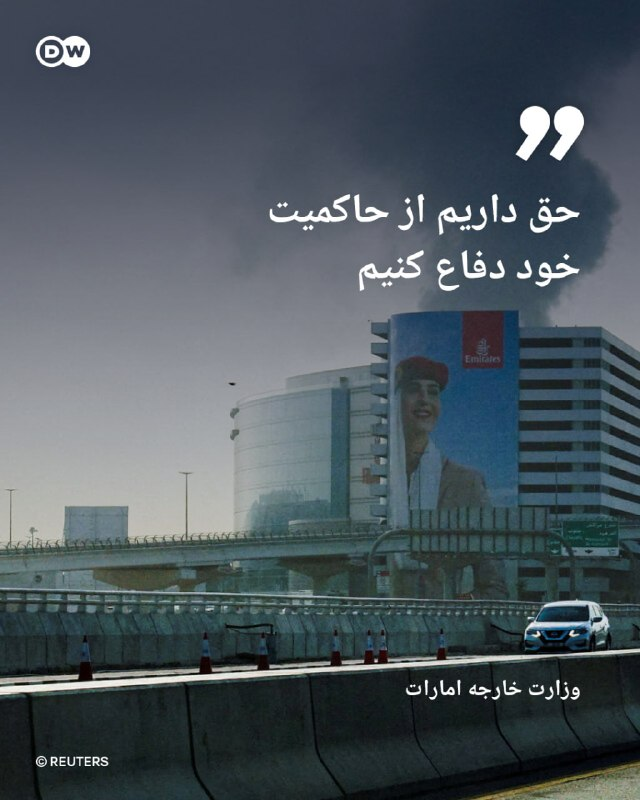

🔶 وزارت خارجه امارات: حق داریم از حاکمیت خود دفاع کنیم

وزارت امور خارجه امارات متحده عربی روز شنبه ۲۶ اردیبهشت (۱۶ مه) در بیانیه‌ای اقدامات نظامی علیه ایران را به‌عنوان "تدابیری کاملا دفاعی برای حفظ حاکمیت خود" توصیف کرد.

وزارت خارجه این کشور اعلام کرد همه اقدامات انجام‌شده با هدف "حفاظت از غیرنظامیان و زیرساخت‌های حیاتی" صورت گرفته است.

امارات متحده حملات ایران به خاک خود را محکوم کرده و گفت که حق دارد در برابر هرگونه تهدید یا اقدام خصمانه از خود دفاع کند.

جمهوری اسلامی ایران در میان کشورهای حوزه خلیج فارس، بیشترین حملات را علیه امارات انجام داده است.

روزنامه "وال‌استریت ژورنال" روز دوشنبه ۱۸ مه گزارش داده بود که امارات در اوایل آوریل عملیات نظامی علیه ایران انجام داده است. با این وجود، در بیانیه وزارت خارجه امارات هیچ اشاره مستقیمی به این "حملات احتمالی" نشده است.

@dw_farsi

## DW_Farsi — post 124744

  

🔶 نیویورک‌تایمز: آمریکا و اسرائیل برای جنگ با ایران آماده‌اند

روزنامه نیویورک‌تایمز روز جمعه ۲۵ اردیبهشت (۱۵ مه) گزارش داد دونالد ترامپ، رئیس جمهور آمریکا پس از بازگشت از سفر چین با تصمیم‌های مهمی درباره ایران روبه‌رو است و مشاوران ارشد او طرح‌هایی برای ازسرگیریعملیات نظامی در صورت شکست روند مذاکرات و ادامه بن‌بست آماده کرده‌اند.

بر اساس این گزارش ترامپ هنوز درباره گام‌های بعدی خود تصمیم نگرفته است.

به گفته مقام‌های آگاه، برخی کشورها در تلاش‌ هستند میانجی‌گری کنند تا به نوعی توافق دست یابند که بر اساس آن ایران تنگه هرمز را دوباره برای تردد کشتی‌ها باز کند و ترامپ بتواند پایان درگیری را "پیروزی" اعلام کرده و افکار عمومی آمریکا را نسبت به موفقیت این عملیات نظامی پرهزینه و مرگبار قانع کند.

ترامپ در حین بازگشت از سفر چین در گفت‌وگو با خبرنگاران در هواپیمای ریاست‌جمهوری آمریکا تاکید کرد که تازه‌ترین پیشنهاد صلح ایران "قابل قبول نیست". او افزود: «من آن را نگاه کردم و اگر از همان جمله اول خوشم نیاید، آن را کنار می‌گذارم.»

نیویورک‌تایمز در بخشی از گزارش خود به نقل از مقام‌های آگاه و دو مقام خاورمیانه‌ای نوشته است که ایالات متحده و اسرائیل در حال انجام گسترده‌ترین سطح آماده‌سازی نظامی از زمان آتش‌بس اخیر هستند و احتمال ازسرگیری حملات علیه ایران در هفته‌های آینده مطرح شده است.

در همین حال، مقام‌های آمریکایی از تدوین گزینه‌های نظامی جدید از جمله حملات هوایی گسترده‌تر و حتی عملیات نیروهای ویژه خبر داده‌اند؛ گزینه‌هایی که به گفته پنتاگون با خطر بالای تلفات همراه خواهد بود.

پیت هگست، وزیر دفاع آمریکا (وزیر جنگ) نیز در کنگره اعلام کرده است که پنتاگون "طرح‌هایی برای تشدید درگیری در صورت لزوم" در اختیار دارد.

@dw_farsi

## Persian_Trend_Official — post 14227

📍بولتن خبری ۲۵ اردیبهشت ۱۴۰۵

گردآوری تحریریه‌پرشین ترند

🇮🇷 ایران

◾️ ایران پنج شرط خود را برای مذاکره با آمریکا از طریق میانجی پاکستانی اعلام کرد؛ واشنگتن در انتظار بررسی شروط است

◾️ تهران تایمز: آمریکا پیشنهاد ۱۴ ماده‌ای ایران را رد کرد؛ واشنگتن مواضع خود به‌ویژه در بحث هسته‌ای را تکرار کرده است

◾️ عراقچی: پیام‌های متناقض از سوی واشنگتن روند مذاکرات را پیچیده کرده؛ پس از رد پیشنهاد ایران، پیام‌های جدیدی از آمریکا مبنی بر تمایل به ادامه گفت‌وگو دریافت شده است

◾️ عراقچی: تنگه هرمز برای تمامی کشتی‌های تجاری باز است به شرط همکاری با نیروی دریایی ایران؛ این آمریکاست که محاصره ایجاد کرده

◾️ صداوسیما: از شب گذشته تاکنون ۳۰ کشتی با هماهنگی ایران از تنگه هرمز عبور کردند؛ از جمله کشتی‌های چینی و یک کشتی ژاپنی

◾️ بریتانیا: یک کشتی در حال پهلوگیری در الفجیره توقیف و به سمت آب‌های ایران حرکت کرده است

◾️ وال استریت ژورنال: یک کشتی با پرچم هند پس از حمله در نزدیکی سواحل عمان غرق شد؛ تمام خدمه نجات یافتند

◾️ کمیسیون امنیت ملی مجلس: پیشنهاد پرداخت ۵۰ میلیون یورو جایزه دولتی به هرکس که ترامپ را بکشد

◾️ سی‌ان‌ان: هکرهای وابسته به جمهوری اسلامی سامانه‌های پمپ‌بنزین در چند ایالت آمریکا را هدف قرار دادند

◾️ سازمان بورس: آمادگی برای بازگشایی بازار سهام از اواسط هفته آینده؛ زمان دقیق به‌زودی اعلام می‌شود

◾️ خاموشی اینترنت در ایران وارد روز ۷۷ام شد و از ۱۸۰۰ ساعت گذشت

---

🇮🇱 اسرائیل و خاورمیانه

◾️ اسرائیل مدعی ترور عزالدین الحداد، فرمانده نظامی حماس در غزه شد؛ ارتش اسرائیل در تمامی جبهه‌ها اعلام آماده‌باش کرده است

◾️ گزارش‌ها از بمباران شدید و غیرعادی در جنوب لبنان

◾️ رئیس ستاد کل ارتش اسرائیل در جریان جنگ مخفیانه به امارات سفر و با شیخ محمد بن زاید دیدار کرد؛ امارات این دیدارها را انکار می‌کند

◾️ امارات تا ۲۰۲۷ ظرفیت صادرات نفت بدون عبور از تنگه هرمز را از طریق خط لوله جدید به بندر فجیره دو برابر می‌کند

◾️ بحرین، امارات، عربستان، قطر، کویت و اردن در بیانیه مشترک ادعاهای ایران درباره مدیریت تنگه هرمز را محکوم کردند

◾️ عراقچی در واکنش: امارات در این جنگ در کنار آمریکا بوده و نمی‌تواند مظلوم‌نمایی کند

◾️ فایننشال تایمز: عربستان سعودی پیشنهاد پیمان عدم تعرض میان کشورهای خاورمیانه و ایران را مطرح کرده است

◾️ در خبری[FBI] مدعی شدهدرهبر حزب‌الله عراق، محمدباقر السعدی را بازداشت کرد؛ او متهم حداقل ۲۰ حمله تروریستی در اروپا و کانادا می‌باشد

---

🌍 آمریکا و جهان

◾️ ترامپ: صبر زیادی نخواهم داشت؛ ایران باید توافق را امضا کند؛ آمریکا آماده پذیرش توقف ۲۰ ساله فعالیت هسته‌ای ایران است

◾️ ترامپ: تأسیسات هسته‌ای ایران زیر نظر ۹ دوربین ۲۴ ساعته است؛ هرگونه تحرک داخلی با واکنش نظامی مستقیم مواجه خواهد شد

◾️ اکسیوس: تیم ترامپ گزینه‌های تشدید نظامی برای شکستن بن‌بست با ایران را بررسی می‌کند

◾️ فرمانده سنتکام در کنگره: مذاکرات حساسی با ایران در جریان است؛ ما آماده‌ایم

◾️ ترامپ پس از دیدار با شی جین‌پینگ پکن را ترک کرد؛ چین آمادگی کمک برای توافق با ایران را اعلام و قول داد تجهیزات نظامی به تهران منتقل نکند

◾️ کاخ سفید: آمریکا و چین بر لزوم باز ماندن تنگه هرمز و مخالفت با هسته‌ای شدن ایران توافق کردند

◾️ الجزیره: مذاکرات شی و ترامپ نقش میانجیگری پاکستان در بحران را تقویت کرده نه تضعیف

◾️ پاکستان: آتش‌بس میان ایران و آمریکا همچنان برقرار است

◾️ مدیر سرویس اطلاعات خارجی روسیه: هیچ نشانه‌ای از پایان درگیری نظامی وجود ندارد؛ آمریکا و اسرائیل برای پیروزی آسان بر ایران شرط‌بندی کردند اما نتیجه نگرفتند

📌 @persian_trend_official
پرشین ترند | متفاوت‌ترین کانال نظامی
💻

## Persian_Trend_Official — post 14226

  <a href="telegram/content/Persian_Trend_Official_14226_1778916939.mp4" target="_blank">🎬 Download video</a>

صبحتون بخیر ☕️🤍

📝 Nick
📌 @persian_trend_official
پرشین ترند | متفاوت‌ترین کانال نظامی

## RadioFarda — post 157249

  

🔸دونالد ترامپ، رئیس جمهور آمریکا، در مصاحبه‌ای تازه با شبکه فاکس‌نیوز گفت که در پی آتش‌بس حکومت ایران «پنج بار» تا آستانه توافق کامل با آمریکا آمده، اما در لحظه آخر عقب کشیده است.

🔸او در این مصاحبه تأکید می‌کند: «هر بار که توافق می‌کنند، روز بعد انگار نه انگار که با هم حرف زده‌ایم. و این پنج بار اتفاق افتاده است. یک جای کارشان ایراد دارد. راستش دیوانه‌اند.»

🔸او چنین ادامه می‌دهد: «و چون دیوانه‌اند، نباید به سلاح هسته‌ای دست پیدا کنند.»

🔸آن طور که رئیس جمهور آمریکا در این مصاحبه نقل می‌کند، حکومت ایران در مذاکرات اخیر حتی پذیرفته است که کل اورانیوم غنی‌شده‌اش را تحویل دهد.

🔸ترامپ گفت: «هسته‌ای خلاص. قرار بود غبار هسته‌ای را به ما بدهند. هر چه که ما خواسته بودیم.»

🔸این‌ها نکاتی است که دونالد ترامپ پیش از سفرش به چین هم با خبرنگاران در میان گذاشته بود.

🔸این در حالی است که مقام‌های جمهوری اسلامی از جمله عباس عراقچی، وزیر خارجه، تکذیب می‌کنند که شرایط آمریکا را پذیرفته‌اند.

@RadioFarda

## RadioFarda — post 157248

  

🔸دونالد ترامپ، رئیس جمهور آمریکا، بامداد شنبه در شبکه اجتماعی خود اعلام کرد که فرد شماره دو گروه تروریستی داعش، حکومت اسلامی، در عملیات مشترک ارتش آمریکا و ارتش نیجریه کشته شده است.

🔸ترامپ این فرد را «ابو بلال المینوکی» معرفی کرده است.

🔸به گفته رئیس جمهور آمریکا، با حذف این عضو ارشد داعش به عملیات این گروه در سطح جهان لطمه بزرگی وارد شده است.

🔸گروه امارت یا حکومت اسلامی، معروف به داعش، بیش از یک دهه پیش از دل هرج و مرجی ظهور کرد که در پی بروز جنگ داخلی در سوریه پیش آمد. این گروه در سال‌های اول به‌سرعت پیشروی کرد و در سوریه و عراق مناطق وسیعی را به تصرف درآورد.

🔸با این حال پس از آن گروه داعش در هر دو کشور متحمل شکست‌های سنگین شد و اکنون گفته می‌شود که جز هسته‌هایی کوچک از آن باقی نمانده است. اما ارتش آمریکا هرازگاهی اعلام می‌کند که یک فرمانده محلی یا سردسته یک گروه داعش را از پا درآورده است.

@RadioFarda

## RadioFarda — post 157244

🔸 به گزارش رسانه‌های ایران یحیی دهقان‌پور، از عکاسان برجسته و مدرسان عکاسی ایران، روز جمعه ۲۵ اردیبهشت در سن ۸۶ سالگی درگذشت.

🔸آقای دهقان‌پور متولد ۱۳۱۹ در تهران بود. تدریس در مدرسه‌ عالی تلویزیون در سال‌ ۱۳۵۷ سرآغاز دوران تدریس او در رشته‌ عکاسی بود؛ دورانی که در دانشگاه‌های متعدد و تا اوایل دهه‌ ۱۳۹۰ و بیش از ۳۰ سال طول کشید.

🔸این استاد برجسته از سال ۱۳۵۷ به بعد، علاوه‌ بر تدریس، برگزاری چندین نمایشگاه انفرادی برگزار و در نمایشگاه‌های گروهی متعدد شرکت کرد.

🔸از معروف‌ترین آثار آقای دهقان‌پور تصاویر تشییع فروغ فرخزاد، شاعر برجسته و جوان، در قبرستان ظهیرالدوله تهران است. او این عکس‌ها را در تاریخ ۲۵ بهمن ۱۳۴۵ با دوربین مدیوم فرمت برداشته شده بود.

🔸یحیی دهقان‌پور در زمان ثبت این عکس‌ها ۲۶ ساله و دانشجوی رشته ادبیات بود و سال‌ها بعد در نمایشی با عنوان «آن روز فروغ را در باغچه کاشتند» مجموعه خود را ارائه کرد.

🔸 از این عکاس برجسته و استاد پیشکسوت چند کتاب عکس نیز به یادگار مانده است.

@RadioFarda

## RadioFarda — post 157243

  

🔸خبرگزاری بلومبرگ روز جمعه ۲۵ اردیبهشت خبر داد که دولت دونالد ترامپ در حال بررسی تعلیق تحریم‌های چین در ارتباط با خرید نفت ایران است.

🔸این خبر ساعاتی پس از آن منتشر شد که هواپیمای ترامپ از پکن عازم سفر بازگشت به آمریکا شد.

🔸به نوشته بلومبرگ، دونالد ترامپ در حال بررسی آن است که تحریم‌های شرکت‌های نفتی چین که مواد اولیه خود را از ایران خریداری می‌کنند بردارد یا به حال تعلیق درآورد.

🔸به گفته رئیس جمهور آمریکا، این مسئله در دیدار رسمی‌اش با شی جین‌پینگ، همتای چینی‌اش،‌ در پکن مطرح شده است.

🔸هفته گذشته وزارت امور خارجه و وزارت خزانه‌داری آمریکا اعلام کردند که چند شرکت از جمله یک کارگزار تخلیه صادرات نفتی ایران مستقر در چین با نام شرکت «چینگدائو هایه» و مدیر چینی آن را تحریم کرده‌اند.

🔸در صورت تعلیق این گونه تحریم‌ها علیه چین، علاوه بر شرکت‌های چینی که به نفت می‌رسند، جمهوری اسلامی هم به میلیاردها دلار درآمدی می‌رسد که به دلیل تحریم‌ها از آن محروم شده است.

@RadioFarda

## RadioFarda — post 157242

  

🔸اف‌بی‌آی، اداره پلیس فدرال آمریکا، روز جمعه ۲۵ اردیبهشت خبر داد که یک عضو ارشد گروه عراقی کتائب حزب‌الله، از گروه‌های نیابتی اصلی جمهوری اسلامی، به نام محمدباقر سعد داوود السعدی، بازداشت و برای محاکمه به ایالات متحده منتقل شده است.

🔸دادستانی ایالت نیویورک در حساب شبکه ایکس خود عکسی از این عضو کتائب در کنار قاسم سلیمانی، فرمانده سابق سپاه قدس، منتشر کرده است که در حمله آمریکا در دوره اول ریاست جمهوری دونالد ترامپ کشته شد.

🔸آمریکا گروه کتائب حزب‌الله را گروهی تروریستی قلمداد می‌کند. این گروه پیش از جنگ ایران اعلام کرده بود که در صورت آغاز هر جنگی به نفع جمهوری اسلامی وارد نبرد خواهد شد.

🔸محمدباقر سعد داوود السعدی به دلیل فعالیتش به عنوان یک عضو کتائب و همکاری با سپاه قدس، شاخه برون‌مرزی سپاه پاسداران، با شش اتهام مرتبط با تروریسم روبه‌روست.

@RadioFarda

## RadioFarda — post 157240

  

🔸پسر عبدالرحیم موسوی، فرمانده پیشین نیروهای مسلح، که در جریان حمله به «بیت رهبری» کشته شده بود، در یک گفت‌وگوی تلویزیونی اعلام کرد که جنازه پدرش ۳۰ روز زیر آوار بوده است.

🔸فرزند آقای موسوی گفت که حوالی ساعت ۹ صبح روز نهم اسفند ۱۴۰۴ قطعی شد که پدرش باید به جلسه برود و پس از حمله هوایی به بیت رهبری حدود ۳۰ روز گروه تفحص و او به دنبال پیکر پدرش می‌گشتند.

🔸در جریان حمله نهم اسفند به مقر علی‌خامنه‌ای، رهبر پیشین جمهوری اسلامی، علاوه بر او ده‌ها مقام بلندپایه حکومت کشته شدند.

@RadioFarda

## RadioFarda — post 157239

  <a href="https://t.me/radiofarda/157239" target="_blank">📎 Download file</a>

📻بشنوید: سرخط خبرها با رادیوفردا، ۲۶ اردیبهشت ۱۴۰۵‌

@RadioFarda

## IranianMinds — post 20224

  

کاش یه روزی بیاد که تنها دغدغه و اخبارای مهم مام این چیزا باشه:)

@IranianMinds

## IranianMinds — post 20223

  

۱۸ و ۱۹ دی ، میلیونها ایرانی بند کفششون رو بستند که ایرانو از بند جمهوری اسلامی آزاد کنند. بیش از پنجاه هزار نفرشون دیگه برنگشتند. ما تا روز دادخواهی، به زندگی عادی برنخواهیم گشت.
آخرین عکس از جاویدنام محسن جبارزاده

@IranianMinds

## IranianMinds — post 20222

🔴 ترامپ در گفت‌وگو با فاکس‌نیوز:

می‌دونم مردم آمریکا فشار اقتصادی رو تحمل می‌کنن، اما باید جلوی این گروهِ واقعا دیوانه(جمهوری اسلامی) رو بگیریم.

جمهوری اسلامی از نظر نظامی «شدیدا ضربه خورده» و «دیگه نه نیروی دریایی دارن، نه نیروی هوایی؛ همه‌چیزشون نابود شده.»

هر بار توافق می‌کنن، فرداش انگار نه انگار همچین حرفی زده شده. واقعا دیوانه‌ان و به همین خاطر نمی‌تونن سلاح هسته‌ای داشته باشن.

آمریکا عمدا بعضی زیرساخت‌های ایران رو هدف نگرفته، اما «اگر بخواهیم، می‌توانیم ظرف دو روز همه‌چیز رو نابود کنیم.»

@IranianMinds

## IranianMinds — post 20221

🔴 طبق برخی گزارشات

مهدی طارمی، شجاع خلیل زاده، دانیال اسماعیلی فر و احسان حاج صفی

به علت گذراندن خدمت سربازی در سپاه ویزا براشون صادر نشد

@IranianMinds

## IranianMinds — post 20220

  

ترامپ:

امشب به دستور من، نیروهای شجاع آمریکایی و نیروهای مسلح نیجریه یک ماموریت با برنامه ریزی دقیق و بسیار پیچیده را برای از بین بردن فعال ترین تروریست جهان از میدان نبرد، بدون نقص اجرا کردند.

ابوبلال المنوکی، دومین فرمانده داعش در سطح جهان، فکر می‌کرد که می‌تواند در آفریقا مخفی شود، اما او نمی‌دانست که ما منابعی داریم که ما را در جریان کارهای او قرار می‌دهند. او دیگر مردم آفریقا را به وحشت نخواهد انداخت، یا به برنامه ریزی عملیات برای هدف قرار دادن آمریکایی ها کمک نخواهد کرد.

با برکناری او، عملیات جهانی داعش تا حد زیادی کاهش یافته است. با تشکر از دولت نیجریه برای مشارکت شما در این عملیات. خدا برکت آمریکا را بدهد!

@IranianMinds

## BBCPersian — post 281200

🔻دونالد ترامپ، رئیس جمهور آمریکا گفته است که نیروهای آمریکا و نیجریه در یک عملیات مشترک، نفر دوم گروه دولت اسلامی (داعش) را کشته‌اند. آقای ترامپ در پستی در تروث سوشال گفت که ابوبلال المینوکی دیگر به مردم آفریقا آسیب نخواهد زد و نمی‌تواند برای هدف قرار دادن…

## BBCPersian — post 281193

🖊سوفیا بتیزا, بی‌بی‌سی در کی‌یف

کارینا شش‌ ماهه باردار است، اما جنینی که در رحم اوست متعلق به خودش نیست.

این زن ۲۲ ساله اهل شرق اوکراین، یک مادر جایگزین است که رویانی حاصل از تخمک و اسپرم یک زوج چینی را در شکم دارد.

زمانی که کارینا تنها ۱۷ سال داشت، خانه‌اش ویران شد؛ در آن هنگام شهر او، باخموت، در اولین مراحل تهاجم تمام‌عیار روسیه، به یکی از پرکشمکش‌ترین میدان‌های نبرد تبدیل شده بود.

در حالی که بخش اعظم شهر به تلی از آوار و خاکستر بدل شده بود، او و شریک زندگی‌اش راهی کی‌یف شدند، اما در آنجا برای یافتن شغلی پایدار با دشواری روبه‌رو گشتند.

یک روز، وقتی کارینا در فروشگاهی بود و پولش به‌زحمت به خرید نان و پوشک برای دختر یک‌ و نیم‌ ساله‌شان می‌رسید، تصمیم گرفت برای تامین معاش، رحمش را اجاره دهد.

او می‌گوید اگر به خاطر جنگ نبود، هرگز یک مادر جایگزین نمی‌شد؛ جنگی که باعث بیکاری میلیون‌ها نفر و نابودی کسب‌وکارها شده و تورم فزاینده و سقوط شدید تولید ناخالص داخلی اوکراین را به همراه داشته است.

برای خواندن مطلب کامل:
https://bbc.in/4wDd7Le
📷BBC/ Getty/ BioTexCom
@BBCPersian

## BBCPersian — post 281192

🔻انفجار کنترل شده بمب‌های عمل نکرده در شیراز و حومه به مدت سه روز

محمد فرهادی، رئیس ستاد ارشد نظامی ارتش در استان‌های فارس و کهگیلویه و بویراحمد از انفجار کنترل شده بمب‌های عمل نکرده در شیراز طی سه روز خبر داد.

او گفته است که عملیات خنثی سازی و انفجار کنترل شده بمب‌های عمل نکرده جنگ در شیراز و حومه این شهر از امروز به مدت سه روز انجام می شود.

روابط عمومی ستاد ارتش در این استان‌ها هم گفته است که شنیده شدن صدا هر گونه انفجاری مربوط به این عملیات است.
https://bbc.in/3RJvbmB
@BBCPersian

## BBCPersian — post 281191

🔻واکنش اولیانوف به پیشنهاد تعلیق ۲۰ ساله برنامه هسته‌ای ایران: موضع آمریکا فاقد استدلال است

میخائیل اولیانوف، نماینده روسیه در آژانس بین‌المللی انرژی اتمی در وین به پیشنهاد دونالد ترامپ در مورد تعلیق ۲۰ ساله برنامه هسته‌ای ایران واکنش نشان داده و گفته است: «چرا ۲۰ سال و نه ۱۵ یا ۲۵ سال؟»

آقای اولیانوف در پستی در شبکه اجتماعی ایکس موضع آمریکا را «فاقد هر گونه استدلال» و صرفا براساس «ملاحظات ایدئولوژیک» دانسته و افزوده است: «اگر چنین رویکردی برای آمریکا قابل قبول است، لطفا در صورت بی نتیجه بودن آن شکایت نکنید.»

دونالد ترامپ ساعاتی پیش، پس از بازگشت از پکن گفته بود که تعلیق ۲۰ ساله برنامه هسته‌ای ایران را می‌پذیرد.

پیشتر، او از ایران خواسته بود که غنی‌سازی اورانیوم را به طور دائم متوقف کند و از دستیابی به سلاح‌های هسته‌ای برای همیشه جلوگیری شود.

اخیرا ایران پیشنهاد‌های آمریکا برای رسیدن به توافق را رد کرده بود و پس آن هم واشنگتن پیشنهاد‌های تهران را قابل قبول ندانست.

@BBCPersian

## BBCPersian — post 281183

🖊عمر دراز ننگیانه, بی‌بی‌سی اردو،‌ اسلام‌آباد

در حالی که در روزهای اخیر برخی محافل در آمریکا نسبت به نقش پاکستان به عنوان میانجی مذاکرات ایران و آمریکا ابراز تردید کرده‌اند، واشنگتن و تهران بار دیگر بر اعتماد خود به نقش اسلام‌آباد تاکید کرده‌اند.

با این حال، به نظر می‌آید روند میانجی‌گری در بن‌بست قرار گرفته است. ایران چند روز پیش پیشنهادهای خود درباره آتش‌بس را از طریق پاکستان برای آمریکا فرستاد، اما دونالد ترامپ، رئیس‌جمهور آمریکا، این پیشنهادها را «غیرقابل قبول» خواند و رد کرد.

از آن زمان تاکنون، تحول مهمی در این فرایند رخ نداده است.

اما تنها یک روز پیش از آغاز سفر دونالد ترامپ، رئیس‌جمهور آمریکا، به پکن، چین از طریق خبرگزاری رسمی خود پیامی منتشر کرد و از پاکستان خواست «روند میانجی‌گری میان آمریکا و ایران را تسریع کند».

اکنون پرسش اصلی این است که اسلام‌آباد چگونه می‌تواند روند میانجی‌گری را که ظاهرا در بن‌بست قرار گرفته و فعلا بیشتر به انتقال پیام محدود شده، تسریع کند؟

برای خواندن مطلب کامل:
https://bbc.in/4dtS7xK
📸GettyImages/ AFP/ White House/VCG
@BBCPersian

## BBCPersian — post 281182

  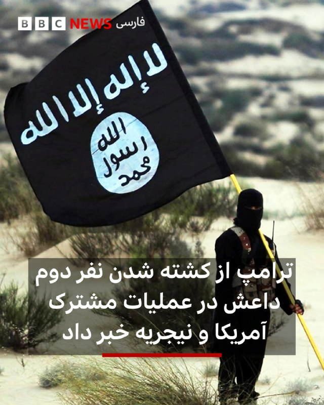

🔻دونالد ترامپ، رئیس جمهور آمریکا گفته است که نیروهای آمریکا و نیجریه در یک عملیات مشترک، نفر دوم گروه دولت اسلامی (داعش) را کشته‌اند.

آقای ترامپ در پستی در تروث سوشال گفت که ابوبلال المینوکی دیگر به مردم آفریقا آسیب نخواهد زد و نمی‌تواند برای هدف قرار دادن آمریکایی‌ها عملیات برنامه‌ریزی کند.

او المینوکی را «فعال‌ترین تروریست جهان» توصیف کرد و گفت که با کشته شدن او، عملیات جهانی این گروه به‌شدت تضعیف شده است.

المینوکی در سال ۲۰۲۳ به دلیل ارتباط با گروه داعش تحت تحریم‌های ایالات متحده قرار گرفته بود.

📷Getty Images
@BBCPersian

## BBCPersian — post 281181

  

‌ ‌ ‌
آژانس بهداشتی آفریقا شیوع ابولا را در استان شرقی ایتوری جمهوری دموکراتیک کنگو اعلام کرد.

مرکز کنترل و پیشگیری از بیماری‌های آفریقا اعلام کرد که حدود ۲۴۶ مورد ابتلا و ۶۵ مورد مرگ گزارش شده است که عمدتا در شهرهای معدن طلا در مونگوالو و روآمپارا اتفاق افتاده است.

مقامات اوگاندا روز جمعه یک مورد ابتلا به ابولا از جمهوری دموکراتیک کنگو را تایید کردند و وزارت بهداشت آن کشور اعلام کرد که آزمایش یک مرد ۵۹ ساله که روز پنجشنبه درگذشت، مثبت بوده است.

ابولا اولین بار در سال ۱۹۷۶ در جایی که اکنون جمهوری دموکراتیک کنگو است، کشف شد و تصور می‌شود که از خفاش‌ها شیوع یافته باشد. این هفدهمین شیوع این بیماری ویروسی کشنده در آن کشور است.

این بیماری از طریق تماس مستقیم با مایعات بدن و از طریق پوست آسیب دیده منتقل می‌شود و باعث خونریزی شدید و نارسایی اندام می‌شود.

https://bbc.in/4nwKU4t
📷Reuters
@BBCPersian

## Hranews — post 112960

مجید درویش‌نژاد با تودیع وثیقه آزاد شد

❗️
❗️
❗️
❗️
❗️– مجید درویش‌نژاد، شهروند اهل ارومیه، با تودیع وثیقه از یکی از بازداشتگاه‌های امنیتی این شهر آزاد شد.

#مجید_درویش_‌نژاد

ادامه مطلب

## manototv — post 105506

  <a href="telegram/content/manototv_105506_1778916950.mp4" target="_blank">🎬 Download video</a>

ارتش اسرائیل اعلام کرد در پی فعال شدن هشدار نفوذ پهپاد در منطقه میرون، یک هدف هوایی مشکوک شناسایی شده است.
ارتش اسرائیل همچنین اعلام کرد جزئیات این رویداد در حال بررسی است و این حادثه بدون تلفات پایان یافته اس

## manototv — post 105505

  <a href="telegram/content/manototv_105505_1778916951.mp4" target="_blank">🎬 Download video</a>

رسانه‌های اسرائیلی گزارش داده‌اند با بازگشت دونالد ترامپ، رئیس‌جمهوری آمریکا، از سفر چین، کاخ سفید به مرحله‌ای تعیین‌کننده در پرونده ایران نزدیک شده و احتمال تصمیم‌گیری درباره اقدام نظامی در روزهای آینده افزایش یافته است.
کانال ۱۲ اسرائیل گزارش داد در اسرائیل برآورد می‌شود دونالد ترامپ طی ۲۴ ساعت آینده درباره اقدام نظامی علیه جمهوری اسلامی تصمیم‌گیری کند. این شبکه به نقل از یک مقام ارشد اسرائیلی گزارش داد «ازسرگیری درگیری‌ها نزدیک است» و اسرائیل خود را برای «روزها تا هفته‌ها درگیری» آماده می‌کند.
بر اساس این گزارش، مقام‌های اسرائیلی معتقدند آمریکا به این جمع‌بندی رسیده که مذاکرات با ایران به سمت پیشرفت جدی حرکت نمی‌کند و انتظار می‌رود تصویر روشن‌تری از تصمیم واشنگتن طی ساعات آینده مشخص شود.

## manototv — post 105504

  <a href="telegram/content/manototv_105504_1778916952.mp4" target="_blank">🎬 Download video</a>

دونالد ترامپ، رئیس‌جمهوری آمریکا، در تروث سوشیال اعلام کرد نیروهای آمریکایی و ارتش نیجریه در عملیاتی مشترک، «ابوبلال المنوکی» از فرماندهان ارشد داعش را کشته‌اند.
ترامپ گفت این عملیات به دستور او و با برنامه‌ریزی دقیق انجام شده و «ابوبلال المنوکی» که به گفته او نفر دوم داعش در سطح جهانی بوده، در آفریقا مخفی شده بود.
او افزود با کشته شدن این فرمانده داعش، توان عملیاتی جهانی این گروه به‌شدت تضعیف شده است.

## manototv — post 105503

  <a href="telegram/content/manototv_105503_1778916952.mp4" target="_blank">🎬 Download video</a>

شبکه سی‌ان‌ان به نقل از چند منبع گزارش داده هکرهای مظنون به ارتباط با ایران موفق شده‌اند به سامانه‌های پایش مخازن سوخت در آمریکا نفوذ کنند و نمایشگر میزان سوخت را تغییر دهند.
بر اساس این گزارش، سامانه‌های «اندازه‌گیری خودکار مخازن» بدون رمز عبور و متصل به اینترنت بوده‌اند. منابع آگاه می‌گویند هکرها توانسته‌اند ارقام نمایش‌داده‌شده را دستکاری کنند، اما امکان تغییر واقعی میزان سوخت در مخازن را نداشته‌اند و هیچ خسارت فیزیکی گزارش نشده است.
سی‌ان‌ان همچنین گزارش داده این حملات تنها به سامانه‌های سوخت محدود نبوده و زیرساخت‌های نظامی و شبکه‌های آب آمریکا را نیز هدف قرار گرفته‌اند.

## alonews — post 120329

  <a href="telegram/content/alonews_120329_1778916953.webm" target="_blank">🎬 Download video</a>

👈نیروی هوایی اوکراین اعلام کرد: 269 پهپاد از 294 پهپاد پرتاب شده توسط ارتش روسیه را شب گذشته سرنگون کرده است

✅ @AloNews خبر جنگ

## alonews — post 120328

  <a href="telegram/content/alonews_120328_1778916954.webm" target="_blank">🎬 Download video</a>

👈نیویورک تایمز گزارش می‌دهد که نیروهای نظامی آمریکا "در حال آماده‌سازی برای دور دیگری از حملات هستند... این بار با شدت بیشتر. این حملات ممکن است از روز دوشنبه آغاز شود. اهداف نظامی بیشتری از ایران در نظر گرفته شده است که شامل زیرساخت‌ها نیز می‌شود."

✅ @AloNews خبر جنگ

## alonews — post 120325

  <a href="telegram/content/alonews_120325_1778916954.webm" target="_blank">🎬 Download video</a>

👈شب گذشته در بسیاری از برنامه های صداوسیما، مجریان با تفنگ حاضر شدند!

✅ @AloNews خبر جنگ

## alonews — post 120324

  <a href="telegram/content/alonews_120324_1778916954.mp4" target="_blank">🎬 Download video</a>

👈مارکو روبیو: چین کاری را انجام می‌دهد که من اگر رهبر چینی بودم انجام می‌دادم. آن‌ها تلاش می‌کنند در تمام این صنایع کلیدی آینده بر جهان مسلط شوند.

🔴 شاید ما از آن خوشمان نیاید، اما این همان کاری است که آن‌ها انجام خواهند داد زیرا به نفع بهترین منافع خود عمل می‌کنند. ما نیز باید به نفع بهترین منافع خود عمل کنیم.

✅ @AloNews خبر جنگ

## alonews — post 120323

  <a href="telegram/content/alonews_120323_1778916956.mp4" target="_blank">🎬 Download video</a>

👈روبیو: اگر جی دی ونس کاندیدای ریاست جمهوری شود، اولین نفری هستم که از او حمایت می کنم

✅ @AloNews خبر جنگ

## alonews — post 120322

  <a href="telegram/content/alonews_120322_1778916959.webm" target="_blank">🎬 Download video</a>

👈روزنامه عبری هاآرتص: چهار ماه از ایجاد «شورای صلح» برای نوار غزه می‌گذرد؛ تاکنون طرح ترامپ اجرا نشده است

✅ @AloNews خبر جنگ

## alonews — post 120321

  <a href="telegram/content/alonews_120321_1778916959.webm" target="_blank">🎬 Download video</a>

👈ترامپ: نفت ونزوئلا ما را ثروتمند کرد!

✅ @AloNews خبر جنگ

## alonews — post 120320

  <a href="telegram/content/alonews_120320_1778916959.webm" target="_blank">🎬 Download video</a>

👈استوری مشاور قالیباف در اینستاگرام

✅ @AloNews خبر جنگ

## alonews — post 120319

  <a href="telegram/content/alonews_120319_1778916960.webm" target="_blank">🎬 Download video</a>

👈وزارت دادگستری آمریکا با صدور بیانیه‌ای، مدعی شد «محمد باقر سعد داوود السعدی»، شهروند عراقی و از اعضای شاخص کتائب حزب‌الله دستگیر شده و به ایالات متحده منتقل شده است.

🔴وزارت دادگستری آمریکا افزود كه این شهروند عراقی در برابر «سارا نتبورن»، قاضی دادگاه فدرال در منطقه منهتن شهر نیویورک حاضر شده و او دستور بازداشت را تا زمان محاکمه صادر کرده است.

✅ @AloNews خبر جنگ

## alonews — post 120318

  <a href="telegram/content/alonews_120318_1778916960.webm" target="_blank">🎬 Download video</a>

👈سی‌ان‌بی‌سی: ترامپ چند هفته قبل از آنکه به طور علنی سهام شرکت هوش مصنوعی Palantir Technologies را در شبکه Truth Social تحسین کند، سهام این شرکت را خریداری کرد.

🔴سوابق نشان می‌دهد که ترامپ در اوایل سال ۲۰۲۶ بین حدود ۲۴۷,۰۰۰ تا ۶۳۰,۰۰۰ دلار سهام Palantir خریداری کرده است، از جمله چند خرید در ماه مارس. او بعداً این شرکت را در یک پست در Truth Social در آوریل، در زمانی که سهام فناوری به شدت کاهش یافته بود، تبلیغ کرد.

🔴اسناد همچنین نشان می‌دهد که ترامپ در فوریه تا ۵ میلیون دلار سهام Palantir فروخته و سرمایه‌گذاری‌های بزرگ دیگری در حوزه فناوری انجام داده است، از جمله در Nvidia، Apple، Amazon، Microsoft و Oracle.

✅ @AloNews خبر جنگ

## alonews — post 120317

  <a href="telegram/content/alonews_120317_1778916960.webm" target="_blank">🎬 Download video</a>

👈کرملین: پوتین در تاریخ ۱۹ و ۲۰ مه به چین سفر خواهد کرد.

✅ @AloNews خبر جنگ

## alonews — post 120316

  <a href="telegram/content/alonews_120316_1778916961.webm" target="_blank">🎬 Download video</a>

👈رسانه‌های عراقی از شنیده‌شدن صدای انفجار در منطقه الکراده بغداد خبر دادند

✅ @AloNews خبر جنگ

## alonews — post 120315

  <a href="telegram/content/alonews_120315_1778916961.webm" target="_blank">🎬 Download video</a>

👈پیام پزشکیان به رهبر کاتولیک‌های جهان: از موضع اخلاقی و منطقی شما در قبال تجاوزات نظامی اخیر به ایران قدردانی می‌کنم

🔴حملات آمریکا و اسرائیل صرفاً علیه ایران نیست، بلکه علیه حاکمیت قانون و ارزش‌های انسانی است

✅ @AloNews خبر جنگ

## alonews — post 120314

  <a href="telegram/content/alonews_120314_1778916962.webm" target="_blank">🎬 Download video</a>

🔴فوووری / منابع روسی: یک جنگنده سوخو-35 نیروی هوایی روسیه، یک جنگنده F-16 فایتینگ فالکون ناتو را سرنگون کرده است

✅ @AloNews خبر جنگ

## alonews — post 120313

  <a href="telegram/content/alonews_120313_1778916962.webm" target="_blank">🎬 Download video</a>

👈هشدار نارنجی هواشناسی: بارش‌های شدید و وزش باد در شمال کشور

✅ @AloNews خبر جنگ

## alonews — post 120312

  <a href="telegram/content/alonews_120312_1778916962.webm" target="_blank">🎬 Download video</a>

👈کوبا: آماده دفاع از خود در مقابل تهاجم احتمالی آمریکا هستیم

✅ @AloNews خبر جنگ

## alonews — post 120311

  <a href="telegram/content/alonews_120311_1778916962.webm" target="_blank">🎬 Download video</a>

👈مدیرکل مدیریت بحران استانداری اصفهان گفت: در ساعات بعدازظهر امروز تا روز دوشنبه وزش باد شدید و تندبادهای لحظه‌ای همراه با گردوغبار در استان پیش‌بینی می‌شود و سرعت باد به ۹۰ کیلومتر می‌رسد.

✅ @AloNews خبر جنگ

## alonews — post 120310

  <a href="telegram/content/alonews_120310_1778916963.webm" target="_blank">🎬 Download video</a>

👈انفجار کنترل‌شده بمب‌های عمل‌نکرده در شیراز 

✅ @AloNews خبر جنگ

---
📅 بروزرسانی: 1405/02/26 03:14
---

## VahidOOnLine — post 240393

  

♦️ایلان ماسک، میلیاردر مشهور آمریکایی، مالک پلتفرم اکس و بنیان‌گذار تسلا و اسپیس‌ایکس، با انتشار عبارتی کوتاه در حساب کاربری خود در اکس نوشت: «اینستاگرام برنامه‌ای برای دختران است.»
در روزهای گذشته، برخی از مشهورترین مدیران ارشد آمریکایی، از جمله ایلان ماسک، دونالد ترامپ را در سفر رسمی و تاریخی‌اش به چین همراهی کرده‌اند.
‌🇸🇦 Indypersian

🤖 @VahidOOnLine

## VahidOOnLine — post 240392

  

سفیر چین در سازمان ملل از پیش‌نویس قطعنامه پیشنهادی آمریکا و بحرین درباره تنگه هرمز انتقاد کرد و گفت «هم محتوا و هم زمان آن نامناسب است» و کمکی به کاهش تنش‌ها با جمهوری اسلامی نخواهد کرد.
این پیش‌نویس از تهران می‌خواهد حملات و فعالیت‌های مین‌گذاری در تنگه هرمز را متوقف کند. چین و روسیه ماه گذشته نیز قطعنامه مشابهی را با این استدلال که جمهوری اسلامی را ناعادلانه هدف قرار می‌دهد، مسدود کرده بودند.

‌🏁 🇬🇧 IranintlTV

🤖 @VahidOOnLine

## VahidOOnLine — post 240391

  

سفیر چین در سازمان ملل از پیش‌نویس قطعنامه پیشنهادی آمریکا و بحرین درباره تنگه هرمز انتقاد کرد و گفت «هم محتوا و هم زمان آن نامناسب است» و کمکی به کاهش تنش‌ها با جمهوری اسلامی نخواهد کرد.
این پیش‌نویس از تهران می‌خواهد حملات و فعالیت‌های مین‌گذاری در تنگه هرمز را متوقف کند. چین و روسیه ماه گذشته نیز قطعنامه مشابهی را با این استدلال که جمهوری اسلامی را ناعادلانه هدف قرار می‌دهد، مسدود کرده بودند.

‌🏁 🇬🇧 IranintlTV

🤖 @VahidOOnLine

## VahidOOnLine — post 240390

  

سفیر چین در سازمان ملل از پیش‌نویس قطعنامه پیشنهادی آمریکا و بحرین درباره تنگه هرمز انتقاد کرد و گفت «هم محتوا و هم زمان آن نامناسب است» و کمکی به کاهش تنش‌ها با جمهوری اسلامی نخواهد کرد.
این پیش‌نویس از تهران می‌خواهد حملات و فعالیت‌های مین‌گذاری در تنگه هرمز را متوقف کند. چین و روسیه ماه گذشته نیز قطعنامه مشابهی را با این استدلال که جمهوری اسلامی را ناعادلانه هدف قرار می‌دهد، مسدود کرده بودند.

‌🏁 🇬🇧 IranintlTV

🤖 @VahidOOnLine

## VahidOOnLine — post 240389

♦️دونالد ترامپ، رئیس‌جمهوری آمریکا، بامداد شنبه ۲۶ اردیبهشت پس از پایان سفر رسمی خود به چین وارد پایگاه مشترک اندروز در نزدیکی واشنگتن شد.
پکن در دو روز گذشته میزبان دیدار تاریخی دونالد ترامپ و شی جین‌پینگ، رئیس‌جمهوری چین، بود؛ سفری که با استقبال رسمی گسترده و گفتگو درباره روابط اقتصادی، تجاری و تنش‌های منطقه‌ای همراه بود.
‌🇸🇦 Indypersian

🤖 @VahidOOnLine

## VahidOOnLine — post 240388

♦️حساب رسمی کاخ سفید، روز جمعه ۲۵ اردیبهشت، با انتشار تصاویری از سفر دونالد ترامپ به چین اعلام کرد رئیس‌جمهوری آمریکا از «معبد آسمان» در پکن بازدید کرده است.
پکن در دو روز گذشته میزبان دیدار تاریخی دونالد ترامپ، رئیس‌جمهوری آمریکا، و شی جین‌پینگ، رئیس‌جمهوری چین، بود؛ دیداری که با استقبال رسمی گسترده و گفتگو درباره مسائل اقتصادی، تجاری و تنش‌های منطقه‌ای همراه بود.
‌🇸🇦 Indypersian

🤖 @VahidOOnLine

## VahidOOnLine — post 240387

  <a href="telegram/content/VahidOOnLine_240387_1778888662.mp4" target="_blank">🎬 Download video</a>

دادستان‌های آمریکا اعلام کردند یک شهروند عراقی به اتهام طراحی حمله تروریستی به یک کنیسه مشهور در نیویورک و حمایت از گروه‌های مورد حمایت جمهوری اسلامی بازداشت و متهم شده است.

محمد باقر سعد داوود الساعدی، ۳۲ ساله، روز جمعه در دادگاهی در منهتن حاضر شد و مقام‌های آمریکایی او را به «توطئه برای ارائه حمایت مادی به سازمان‌های تروریستی خارجی» از جمله سپاه پاسداران و گروه کتائب حزب‌الله عراق متهم کردند.

بر اساس اسناد دادگاه، الساعدی از فرماندهان کتائب حزب‌الله معرفی شده و متهم است از ماه مارس در طراحی، اجرا و تبلیغ حدود ۱۸ حمله علیه منافع آمریکا و اسرائیل در اروپا نقش داشته است.

دادستان‌ها می‌گویند او برای انجام حمله به یک کنیسه در نیویورک، با فردی که در واقع مامور مخفی اف‌بی‌آی بوده تماس گرفته و تصاویر، نقشه‌ها و اطلاعات مربوط به محل حمله را در اختیار او قرار داده است. به گفته مقام‌های آمریکایی، او همچنین تصاویری از مراکز یهودیان در لس‌آنجلس و اسکاتسدیل آریزونا ارسال کرده بود.

در یکی از مکالمات ضبط‌شده، الساعدی درباره هزینه «انجام عملیات بمب‌گذاری» در آمریکا پرس‌وجو کرده و گفته بود: «ما برایش یک معبد یهودیان یا یک مرکز یهودیان فراهم می‌کنیم.»

دادستان‌ها می‌گویند او با مامور مخفی بر سر پرداخت ۱۰ هزار دلار رمزارز برای اجرای حمله توافق کرده و سه هزار دلار به‌عنوان پیش‌پرداخت ارسال کرده بود. بر اساس این گزارش، الساعدی بعدتر در ترکیه بازداشت و به اف‌بی‌آی تحویل داده شد.

پلیس نیویورک اعلام کرد این پرونده «تهدیدهای جهانی ناشی از جمهوری اسلامی و گروه‌های نیابتی‌اش» را آشکار می‌کند. مقام‌های آمریکایی همچنین گفتند با همکاری نهادهای امنیتی، طرح حمله به کنیسه‌ای در منهتن خنثی شده است.

در اسناد دادگاه همچنین تصاویری از دیدار الساعدی با قاسم سلیمانی، فرمانده پیشین نیروی قدس سپاه پاسداران، منتشر شده است.
‌🏁 🇬🇧 ManotoTV

🤖 @VahidOOnLine

## VahidOOnLine — post 240386

  

♦️عباس عراقچی، وزیر امور خارجه جمهوری اسلامی، در واکنش به افزایش قیمت انرژی در آمریکا، با انتشار پیامی در اکس نوشت آمریکایی‌ها مجبور شده‌اند «هزینه‌های سرسام‌آور جنگ انتخابی علیه ایران» را تحمل کنند.
او در این پیام نوشت: «فعلا افزایش قیمت بنزین و حباب بازار سهام را کنار بگذارید. درد واقعی زمانی آغاز می‌شود که بدهی آمریکا و نرخ وام‌های مسکن شروع به افزایش کنند.»
عراقچی همچنین مدعی شد میزان ناتوانی در بازپرداخت وام خودرو در آمریکا به بالاترین سطح خود در بیش از ۳۰ سال گذشته رسیده و افزود: «تمام این‌ها قابل اجتناب بود.»
‌🇸🇦 Indypersian

🤖 @VahidOOnLine

## VahidOOnLine — post 240385

  

عباس عراقچی، وزیر خارجه جمهوری اسلامی، در واکنش به بالا رفتن قیمت انرژی در آمریکا، در ایکس نوشت: «در حال حاضر، افزایش قیمت بنزین و حباب بازار سهام را کنار بگذارید. درد واقعی زمانی آغاز می‌شود که بدهی آمریکا و نرخ وام‌های مسکن شروع به جهش کنند.»
او نوشت همین حالا هم میزان ناتوانی در بازپرداخت وام خودرو به بالاترین سطح خود در بیش از ۳۰ سال گذشته رسیده است، اما تمام این‌ها قابل اجتناب بود.

‌🏁 🇬🇧 IranintlTV

🤖 @VahidOOnLine

## VahidOOnLine — post 240384

  

♦️نمایندگی دائم جمهوری اسلامی در سازمان ملل متحد روز جمعه ۲۵ اردیبهشت، در پیامی در شبکه اجتماعی اکس نوشت آمریکا تلاش دارد با استفاده از شمار کشورهای حامی پیش‌نویس قطعنامه پیشنهادی خود، تصویری از حمایت گسترده بین‌المللی برای اقداماتش ایجاد کند و زمینه را برای تشدید تنش‌ها در منطقه فراهم سازد.
این نمایندگی افزود: در صورت هرگونه تشدید تنش تازه از سوی آمریکا، کشورهای حامی این قطعنامه نیز در پیامدهای آن شریک خواهند بود و هیچ «توجیه سیاسی» یا «پوشش دیپلماتیک» نمی‌تواند مسئولیت کشورهایی را که در تسهیل و مشروعیت‌بخشی به اقدامات آمریکا نقش دارند، از میان ببرد.
‌🇸🇦 Indypersian

🤖 @VahidOOnLine

## VahidOOnLine — post 240383

  

مایک والتز، سفیر آمریکا در سازمان ملل ، به فاکس‌نیوز گفت: «باید به خاطر داشته باشیم که هیچ دلیلی وجود ندارد که جمهوری اسلامی این گرد و غبار را که شامل ۶۰ درصد اورانیوم با غنای بالا است، در اختیار داشته باشد.»
او گفت:« هیچ کشوری در جهان وجود ندارد که تا آن سطح غنی‌سازی کند و سپس سلاح هسته‌ای نداشته باشد زیرا هیچ دلیلی برای انجام این کار وجود ندارد.»

‌🏁 🇬🇧 IranintlTV

🤖 @VahidOOnLine

## VahidOOnLine — post 240382

  

♦️علی موسوی، پسر عبدالرحیم موسوی، رئیس پیشن ستاد کل نیروهای مسلح جمهوری اسلامی، گفت که جنازه پدرش که در نخستین روز حملات اسرائیل و آمریکا به بیت رهبر کشته شد نزدیک به ۳۰ روز در زیر آوار ماند و  یک ماه در جستجوی جنازه اش بودند. موسوی پس از کشته شدن محمد باقری در جنگ ۱۲ روزه، به‌عنوان رییس ستاد کل نیروهای مسلح منصوب شده بود.
‌🇸🇦 Indypersian

🤖 @VahidOOnLine

## VahidOOnLine — post 240381

  <a href="telegram/content/VahidOOnLine_240381_1778888666.mp4" target="_blank">🎬 Download video</a>

یک شهروند در پیامی به ایران اینترنشنال از شرایط سخت معیشتی خود می‌گوید. او اشاره می‌کند که همسر و بچه‌اش را به خانه مادرخانمش فرستاده و خودش تنها در خانه «نان خشک» می‌خورد. او از کار اخراج شده است. صدای او با هوش مصنوعی بازخوانی شده است.
‌🏁 🇬🇧 IranintlTV

🤖 @VahidOOnLine

## VahidOOnLine — post 240380

  

♦️به گزارش نیویورک تایمز، روز جمعه ۲۵ اردیبهشت به نقل از دو مقام خاورمیانه‌ای نوشت ایالات متحده و اسرائیل در حال انجام تدارکات فشرده برای احتمال ازسرگیری حملات علیه جمهوری اسلامی، حتی از اوایل هفته آینده، هستند. این تحرکات، بزرگ‌ترین تدارکات جنگی دو کشور از زمان اجرایی شدن آتش‌بس در ۱۸ فروردین به شمار می‌رود. هم‌زمان، پیت هگست، وزیر دفاع آمریکا، در کنگره اعلام کرد که پنتاگون علاوه بر طرح افزایش تنش، برنامه‌ای نیز برای بازگرداندن بیش از ۵۰ هزار نیروی اعزامی به خاورمیانه به شرایط استقرار استاندارد دارد. این آمادگی‌ها در حالی صورت می‌گیرد که دونالد ترامپ با «غیرقابل قبول» خواندن آخرین پیشنهاد صلح تهران، هشدار داده است که ایران یا باید توافق کند یا با نابودی نظامی روبرو خواهد شد.
نیویورک تایمز به نقل از مقام‌های اطلاعاتی آمریکا نوشت جمهوری اسلامی دوباره به بخش عمده‌ای از پایگاه‌های موشکی، پرتابگرها و تاسیسات زیرزمینی خود دسترسی پیدا کرده و همچنین دسترسی عملیاتی به ۳۰ پایگاه از ۳۳ پایگاه موشکی خود در امتداد تنگه هرمز را بازیابی کرده است.
‌🇸🇦 Indypersian

🤖 @VahidOOnLine

## WithYashar — post 11366

ترامپ: افزایش قیمت‌ بنزین مرتبط با جنگ ایران «درد کوتاه‌مدت» است که بسیار کمتر از چیزی است که مردم انتظار داشتن.

وقتی به کسی میگید که باید کمی بیشتر برای بنزین در یک دوره بسیار کوتاه بپردازید، چون میخوایم جلوی تهدید تکه‌تکه شدن توسط یک دیوانه، یک فرد دیوانه رو بگیریم، و آنها دیوانه هستن با استفاده از سلاح‌های هسته‌ای، همه میگن که این خوب است.
@withyashar

## WithYashar — post 11365

## WithYashar — post 11364

صادق هدایت میگه دیگه
میگه اگه کارت با سر و کله زدن با ادماس میفهمی چه ملت شریف زبون نفهمی داریم

## WithYashar — post 11363

  <a href="telegram/content/WithYashar_11363_1778888668.mp4" target="_blank">🎬 Download video</a>

اف‌بی‌آی ترامپ یک توطئه تروریستی بزرگ را که قرار بود توسط یک فرمانده شبه‌نظامی تحت حمایت ایران در خاک ایالات متحده، کانادا و اروپا انجام شود، خنثی کرده است.
محمد السعدی - رهبر کتائب حزب‌الله اسلام‌گرا - بیش از ۲۰ حمله را برنامه‌ریزی کرده بود. هدف او اماکن یهودی، از جمله یکی در نیویورک بود.
جان‌های بیشتری نجات یافت
«بنابراین او به اینجا آورده شد و امروز زودتر در دادگاه حاضر شد.»
می خواهم در مورد این عملیات محتاط باشم تا کسی را به خطر نیندازم، اما همین کافی است که بگویم این تلاشی بود که نه تنها اف‌بی‌آی، بلکه شرکای اجرای قانون ما در خارج از کشور را نیز شامل می‌شد.
@withyashar

## WithYashar — post 11361

  <a href="telegram/content/WithYashar_11361_1778888670.mp4" target="_blank">🎬 Download video</a>

ترامپ: ما ۹ تا دوربین مختلف در فضا روی سایت هسته ای ایران داریم

می‌تونیم اسم طرف رو هم بخونیم
مثلاً اگه اسمش محمد باشه، ‌که خب بیشترشون محمدن، تقریباً می‌تونیم حدس بزنیم که حدود ۵۰٪ اطلاعاتش درست در میاد
@withyashar

## WithYashar — post 11360

ترامپ : ویتنام ۱۹ سال طول کشید، عراق حدود ۱۰ سال، کره ۷ سال، یکی دیگه ۱۴ سال، یکی ۱۲ سال، یکی هم ۹ سال
- ما فقط دو ماه و نیم اونجا بودیم
- چین هم این هفته سه تا نفتکش پر از نفت ایران رو برد، چون ما اجازه دادیم این اتفاق بیفته،شما اجازه دادید
@withyashar

## WithYashar — post 11359

  <a href="telegram/content/WithYashar_11359_1778888672.mp4" target="_blank">🎬 Download video</a>

مجریان صداوسیما برداشتن یه تصویر هوش مصنوعی رو گذاشتن و دارن تحلیلش میکنن!
😂😂
@withyashar

## WithYashar — post 11358

فقط حال من رو فروشنده های بازار که با مردم سر و کله میززند و جماعت زبون نفهم و میبینند درک میکنند

## WithYashar — post 11357

## WithYashar — post 11356

## WithYashar — post 11355

## WithYashar — post 11354

نیویورک تایمز به نقل از مقامات آمریکا:

دستیاران ترامپ برنامه‌هایی رو برای بازگشت به حملات نظامی به ایران آماده کردن، اگر او تصمیم بگیره با بمباران بیشتر از بن بست خارج بشه.

از جمله گزینه‌ها، اعزام نیروهای ویژه به ایران برای هدف قرار دادن مواد هسته‌ای مدفون شده است و ممکنه از نیروهای ویژه برای کنترل جزیره خارک استفاده بشه.
@withyashar

## WithYashar — post 11353

  

جلد جدید مجله تایم: چگونه دیدار ترامپ و شی، نظم نوین جهانی را نشان داد
@withyashar

## WithYashar — post 11352

ترامپ خیلی عجله داشته هیچ فیلمی عکسی از رسیدنش نیومده بیرون ! عجبیه

## WithYashar — post 11351

  <a href="telegram/content/WithYashar_11351_1778888674.mp4" target="_blank">🎬 Download video</a>

🎬 Video

## WithYashar — post 11350

حوس لوبیا پلو کردم 😅 امشب که بیداریم درست کنم

## WithYashar — post 11349

ترامپ در تروث : تینا را آزاد کنید
@withyashar
تینا پیترز یک مقام انتخاباتی سابق آمریکاست که به‌خاطر دخالت غیرقانونی در سیستم‌های رأی‌گیری بعد از انتخابات 2020 زندانی شده و حالا ترامپ از او حمایت سیاسی می‌کند

## WithYashar — post 11348

## WithYashar — post 11347

## WithYashar — post 11346

## FoxNewsTwitter — post 341805

  <a href="telegram/content/FoxNewsTwitter_341805_1778888675.mp4" target="_blank">🎬 Download video</a>

Fox News (Twitter/X)

NOW: “All I can say is, that was a great success.”

President Trump returned to the White House after his trip to China, telling reporters “we made great deals” and calling the visit a historic moment.

Then he teased more to come: “A lot of things have happened and you’ll be hearing about them.”

## FoxNewsTwitter — post 341804

  

Fox News (Twitter/X)

WATCH LIVE: Alexandria Ocasio-Cortez and Chris Rabb hold rally in Philadelphia https://twitter.com/i/broadcasts/1vJpPrAbMmDJE

## FoxNewsTwitter — post 341803

  <a href="telegram/content/FoxNewsTwitter_341803_1778888677.mp4" target="_blank">🎬 Download video</a>

Fox News (Twitter/X)

BREAKING: President Trump is now back in the U.S.

The president waved and pumped his fist as he stepped off Air Force One at Joint Base Andrews on Friday evening following his multi-day trip to China.

Trump has said that he and Chinese President Xi Jinping largely agreed Iran must not have a nuclear weapon and that the Strait of Hormuz should be reopened.

## FoxNewsTwitter — post 341802

Fox News (Twitter/X)

BREAKING: The U.S. Supreme Court has denied Virginia's attempt to get its state supreme court's decision tossing out controversial election map overturned. The state's Democratic leaders had redrawn congressional maps, giving their party 10 out of 11 seats.

## FoxNewsTwitter — post 341801

  

Fox News (Twitter/X)

WATCH LIVE: President Trump arrives in Washington after high-stakes China summit https://twitter.com/i/broadcasts/1wGWjazXOPAKQ

## FoxNewsTwitter — post 341800

  <a href="telegram/content/FoxNewsTwitter_341800_1778888679.mp4" target="_blank">🎬 Download video</a>

Fox News (Twitter/X)

Bruce Springsteen walked right past former New Jersey Gov. Chris Christie's outstretched hand during a concert at Brooklyn’s Barclays Center.

Springsteen is seen greeting fans in the arena when Christie extends his hand — but the rock legend doesn't show him any love. Christie quickly pulls his hand back and keeps cheering.

Springsteen has been a vocal critic of President Trump, especially during his latest tour.

## FoxNewsTwitter — post 341799

  

Fox News (Twitter/X)

WATCH LIVE: SpaceX CRS-34 resupply mission launches from Cape Canaveral (Courtesy: SpaceX) https://twitter.com/i/broadcasts/1nGnRYkMkydGO

## pm_afshaa — post 90825

  <a href="telegram/content/pm_afshaa_90825_1778888681.webm" target="_blank">🎬 Download video</a>

🔴ترامپ: افزایش قیمت‌ بنزین مرتبط با جنگ ایران «درد کوتاه‌مدت» است که بسیار کمتر از چیزی است که مردم انتظار داشتن.

وقتی به کسی میگید که باید کمی بیشتر برای بنزین در یک دوره بسیار کوتاه بپردازید، چون میخوایم جلوی تهدید تکه‌تکه شدن توسط یک دیوانه، یک فرد دیوانه رو بگیریم، و آنها دیوانه هستن با استفاده از سلاح‌های هسته‌ای، همه میگن که این خوب است.

💧 Rainbet.com the #1 Non-KYC Crypto Casino & Sportsbook @rainbetcom

😁 @Pm_Afshaa

## pm_afshaa — post 90824

  <a href="telegram/content/pm_afshaa_90824_1778888682.mp4" target="_blank">🎬 Download video</a>

🔴دونالد ترامپ: ما بر روی سایت‌های هسته‌ای ایران 9 تا دوربین در فضا داریم. ما نام یک شخص رو میخونیم، اگه اسمش محمد باشه که اکثر آنها محمد هستن، شما میتونید حدود 50 درصد درست حدس بزنید.

خلاصه اینکه، هر کسی که به آنجا نزدیک میشه، ما یک تگ داریم.

💧 Rainbet.com the #1 Non-KYC Crypto Casino & Sportsbook @rainbetcom

😁 @Pm_Afshaa

## pm_afshaa — post 90823

  <a href="telegram/content/pm_afshaa_90823_1778888683.webm" target="_blank">🎬 Download video</a>

🔴ترامپ: ایران سال‌ها و سال‌ها جهان رو با تنگه هرمز به گروگان گرفته، آنها در گذشته تنگه رو بسته‌اند، از آن به عنوان سلاح استفاده می‌کنن ولی از آن به عنوان سلاح علیه من استفاده نمی‌کنن.

شی جین‌پینگ، رئیس جمهور چین دیشب با خنده بهم گفت: خب، اونا تنگه رو میبندن، بعد تو هم اونا رو می‌بندی.

💧 Rainbet.com the #1 Non-KYC Crypto Casino & Sportsbook @rainbetcom

😁 @Pm_Afshaa

## pm_afshaa — post 90822

  <a href="telegram/content/pm_afshaa_90822_1778888684.webm" target="_blank">🎬 Download video</a>

🔴ترامپ در مورد سفر خود به چین:
این یک موفقیت بزرگ بود. فوق‌العاده بود و ما قراردادهای بزرگی بستیم.

ما قراردادهای تجاری بزرگی انجام دادیم و رابطه‌ای عالی داریم. اتفاقات زیادی افتاده ث و شما در مورد آن‌ها خواهید شنید. فکر میکنم این واقعاً یک لحظه تاریخی بود.

💧 Rainbet.com the #1 Non-KYC Crypto Casino & Sportsbook @rainbetcom

😁 @Pm_Afshaa

## pm_afshaa — post 90821

  <a href="telegram/content/pm_afshaa_90821_1778888684.mp4" target="_blank">🎬 Download video</a>

🔴مجری: چطور چین این هفته 3 نفتکش پر از نفت ایران رو بیرون برد؟

ترامپ: چون ما اجازه دادیم این اتفاق بیفته.

💧 Rainbet.com the #1 Non-KYC Crypto Casino & Sportsbook @rainbetcom

😁 @Pm_Afshaa

## pm_afshaa — post 90820

🎙️مجری: آمریکایی‌ها میخوان بدونن چه زمانی تمام میشه؟

ترامپ: جنگ ویتنام 19 سال طول کشید، عراق حدود 10 سال، کره 7 سال، یکی دیگه 14 سال، یکی دیگه 12 سال، یکی دیگر 9 سال و ما فقط دو و نیم ماهه که اونجا (جنگ ایران) هستیم.

💧 Rainbet.com the #1 Non-KYC Crypto Casino & Sportsbook @rainbetcom

😁 @Pm_Afshaa

## pm_afshaa — post 90819

  <a href="telegram/content/pm_afshaa_90819_1778888686.webm" target="_blank">🎬 Download video</a>

🔴دونالد ترامپ: ایران دیگه برگی برای بازی نداره و تنها چیزی که دارن یه رسانه فیکه؛ خودشونم میدونن ما از نظر نظامی چقدر دست بالا رو داریم.

بعد یه گروه محترم از پاکستان که به ایران نزدیکن، ازم خواستن اون ضربه نهایی رو نزنم؛ گفتن میتونیم توافق کنیم، ما هم تقریباً به چارچوب توافق رسیده بودیم، اما بدون سلاح هسته‌ای. قرار بود حتی مواد هسته‌ای رو هم تحویل بدن، هر چیزی که میخواستیم، ولی هر بار توافق میکنن، فرداش انگار نه انگار همچین حرفی شده؛ این داستان حدود پنج بار تکرار شده… یه مشکلی دارن واقعاً... دیوونه‌ان. و دقیقاً به خاطر همین نمی‌تونن سلاح هسته‌ای داشته باشن!

💧 Rainbet.com the #1 Non-KYC Crypto Casino & Sportsbook @rainbetcom

😁 @Pm_Afshaa

## pm_afshaa — post 90818

  <a href="telegram/content/pm_afshaa_90818_1778888686.mp4" target="_blank">🎬 Download video</a>

🎙️مجری‌‌‌‌: فکر می کنید ایران به زودی تسلیم خواهد شد؟

ترامپ: من شک ندارم.

🎙️مجری: تحمل درد (مقاومت) ایران رو دست کم گرفتید؟

ترامپ: من چیزی رو دست کم نگرفتم، میتونستم ظرف دو روز پل‌ها و ظرفیت برق آنها رو نابود کنم.

💧 Rainbet.com the #1 Non-KYC Crypto Casino & Sportsbook @rainbetcom

😁 @Pm_Afshaa

## pm_afshaa — post 90817

  <a href="telegram/content/pm_afshaa_90817_1778888687.webm" target="_blank">🎬 Download video</a>

🔴ترامپ: به چین گفتم که آمریکا در پرونده ایران یا تامین امنیت کشتیرانی در تنگه هرمز به هیچ کمکی نیاز نداره.

رئیس جمهور چین با من موافقه که ایران نباید سلاح هسته‌ای داشته باشه. چین برای تامین 40 درصد نفت خود به تنگه هرمز وابسته‌س.

تنگه هرمز باز خواهد شد و ما تضمین خواهیم کرد که آنها سلاح هسته‌ای نداشته باشن و جهان پایدار بمونه.

💧 Rainbet.com the #1 Non-KYC Crypto Casino & Sportsbook @rainbetcom

😁 @Pm_Afshaa

## pm_afshaa — post 90816

  <a href="telegram/content/pm_afshaa_90816_1778888688.webm" target="_blank">🎬 Download video</a>

🔴نیویورک‌تایمز به نقل از دو مقام امنیتی:
آمریکا و اسرائیل در حال آماده‌سازی گسترده برای احتمال ازسرگیری حملات علیه ایران هستن و ممکنه از هفته آینده آغاز بشه.

💧 Rainbet.com the #1 Non-KYC Crypto Casino & Sportsbook @rainbetcom

😁 @Pm_Afshaa

## pm_afshaa — post 90815

  <a href="telegram/content/pm_afshaa_90815_1778888688.webm" target="_blank">🎬 Download video</a>

🔴نیویورک تایمز:
چند صد نیروی عملیات ویژه آمریکا از ماه مارس وارد منطقه شدن برای سناریوی احتمالی حمله به تأسیسات هسته‌ای زیرزمینی ایران.

الانم بیشتر از 50 هزار نیروی آمریکایی، دو ناو هواپیمابر، ناوشکن‌ها و کلی جنگنده تو منطقه مستقرن.

گفته میشه اگه عملیات زمینی علیه ایران کلید بخوره، نیروهای بیشتری مثل تفنگدارای دریایی و لشکر 82 هوابرد هم وارد عمل میشن.

💧 Rainbet.com the #1 Non-KYC Crypto Casino & Sportsbook @rainbetcom

😁 @Pm_Afshaa

## pm_afshaa — post 90814

  <a href="telegram/content/pm_afshaa_90814_1778888689.webm" target="_blank">🎬 Download video</a>

🔴نیویورک تایمز به نقل از مقامات آمریکا:
دستیاران ترامپ برنامه‌هایی رو برای بازگشت به حملات نظامی به ایران آماده کردن، اگر او تصمیم بگیره با بمباران بیشتر از بن بست خارج بشه.

از جمله گزینه‌ها، اعزام نیروهای ویژه به ایران برای هدف قرار دادن مواد هسته‌ای مدفون شده است و ممکنه از نیروهای ویژه برای کنترل جزیره خارک استفاده بشه.

💧 Rainbet.com the #1 Non-KYC Crypto Casino & Sportsbook @rainbetcom

😁 @Pm_Afshaa

## IranIntlTV — post 337400

  

سفیر چین در سازمان ملل از پیش‌نویس قطعنامه پیشنهادی آمریکا و بحرین درباره تنگه هرمز انتقاد کرد و گفت «هم محتوا و هم زمان آن نامناسب است» و کمکی به کاهش تنش‌ها با جمهوری اسلامی نخواهد کرد.
این پیش‌نویس از تهران می‌خواهد حملات و فعالیت‌های مین‌گذاری در تنگه هرمز را متوقف کند. چین و روسیه ماه گذشته نیز قطعنامه مشابهی را با این استدلال که جمهوری اسلامی را ناعادلانه هدف قرار می‌دهد، مسدود کرده بودند.

https://iranintl.com/202605154459

## IranIntlTV — post 337399

  

سفیر چین در سازمان ملل از پیش‌نویس قطعنامه پیشنهادی آمریکا و بحرین درباره تنگه هرمز انتقاد کرد و گفت «هم محتوا و هم زمان آن نامناسب است» و کمکی به کاهش تنش‌ها با جمهوری اسلامی نخواهد کرد.
این پیش‌نویس از تهران می‌خواهد حملات و فعالیت‌های مین‌گذاری در تنگه هرمز را متوقف کند. چین و روسیه ماه گذشته نیز قطعنامه مشابهی را با این استدلال که جمهوری اسلامی را ناعادلانه هدف قرار می‌دهد، مسدود کرده بودند.

https://iranintl.com/202605154459

## IranIntlTV — post 337398

  

سفیر چین در سازمان ملل از پیش‌نویس قطعنامه پیشنهادی آمریکا و بحرین درباره تنگه هرمز انتقاد کرد و گفت «هم محتوا و هم زمان آن نامناسب است» و کمکی به کاهش تنش‌ها با جمهوری اسلامی نخواهد کرد.
این پیش‌نویس از تهران می‌خواهد حملات و فعالیت‌های مین‌گذاری در تنگه هرمز را متوقف کند. چین و روسیه ماه گذشته نیز قطعنامه مشابهی را با این استدلال که جمهوری اسلامی را ناعادلانه هدف قرار می‌دهد، مسدود کرده بودند.

https://iranintl.com/202605154459

## IranIntlTV — post 337397

  <a href="telegram/content/IranIntlTV_337397_1778888691.mp4" target="_blank">🎬 Download video</a>

عکس یادگاری سرمایه‌داری و کمونیسم در پکن، برای تهران تصویری آرامش‌بخش نبود؛ سفر ترامپ به چین نشان داد جمهوری اسلامی در اوج ضعف، بیش از آن‌که بازیگر میز قدرت‌ها باشد، به کارتی در دست واشینگتن و پکن تبدیل شده است.

آرین ریسباف گزارش می‌دهد.
@iranintltv

## IranIntlTV — post 337396

  

عباس عراقچی، وزیر خارجه جمهوری اسلامی، در واکنش به بالا رفتن قیمت انرژی در آمریکا، در ایکس نوشت: «در حال حاضر، افزایش قیمت بنزین و حباب بازار سهام را کنار بگذارید. درد واقعی زمانی آغاز می‌شود که بدهی آمریکا و نرخ وام‌های مسکن شروع به جهش کنند.»
او نوشت همین حالا هم میزان ناتوانی در بازپرداخت وام خودرو به بالاترین سطح خود در بیش از ۳۰ سال گذشته رسیده است، اما تمام این‌ها قابل اجتناب بود.

https://iranintl.com/202605157120

## IranIntlTV — post 337395

  <a href="telegram/content/IranIntlTV_337395_1778888693.mp4" target="_blank">🎬 Download video</a>

امارات متحده عربی اعلام کرد پروژه خط لوله جدید نفت برای دور زدن تنگه هرمز را با سرعت بیشتری پیش خواهد برد.

به گفته مقام‌های ابوظبی، این خط لوله تا سال ۲۰۲۷ ظرفیت صادرات نفت از بندر فجیره را دو برابر می‌کند.

گفت‌وگو با علی دادپی، اقتصاددان
@iranintltv

## IranIntlTV — post 337394

  <a href="telegram/content/IranIntlTV_337394_1778888694.mp4" target="_blank">🎬 Download video</a>

دونالد ترامپ در مسیر بازگشت از چین گفت با تعلیق ۲۰ ساله غنی‌سازی اورانیوم در ایران موافق است، به شرط آنکه در این مدت تمام برنامه هسته‌ای تهران پاکسازی شود.

گفت‌وگو با امیر گیتی، عضو تحریریه ایران‌اینترنشنال
@iranintltv

## IranIntlTV — post 337393

  <a href="telegram/content/IranIntlTV_337393_1778888696.mp4" target="_blank">🎬 Download video</a>

🔻مراسم بدرقه تیم ملی با حضور هواداران حکومت در میدان انقلاب تهران برگزار شد و هنگام پخش سرود جمهوری اسلامی، بازیکنان تیم ملی سلام نظامی دادند و تعلق خاطر خود به حکومت را نشان دادند.

🔹توضیحات مزدک میرزایی، ایران اینترنشنال در برنامه هت‌تریک

🔹تماشای نشخه کامل هت‌تریک؛👇
https://youtu.be/v5Exyf8Nyes

@iranintltvsport

## IranIntlTV — post 337392

  

مایک والتز، سفیر آمریکا در سازمان ملل ، به فاکس‌نیوز گفت: «باید به خاطر داشته باشیم که هیچ دلیلی وجود ندارد که جمهوری اسلامی این گرد و غبار را که شامل ۶۰ درصد اورانیوم با غنای بالا است، در اختیار داشته باشد.»
او گفت:« هیچ کشوری در جهان وجود ندارد که تا آن سطح غنی‌سازی کند و سپس سلاح هسته‌ای نداشته باشد زیرا هیچ دلیلی برای انجام این کار وجود ندارد.»

https://iranintl.com/202605157842

## IranIntlTV — post 337391

  <a href="telegram/content/IranIntlTV_337391_1778888697.mp4" target="_blank">🎬 Download video</a>

یک شهروند در پیامی به ایران اینترنشنال از شرایط سخت معیشتی خود می‌گوید. او اشاره می‌کند که همسر و بچه‌اش را به خانه مادرخانمش فرستاده و خودش تنها در خانه «نان خشک» می‌خورد. او از کار اخراج شده است. صدای او با هوش مصنوعی بازخوانی شده است.

## IranIntlTV — post 337390

  <a href="telegram/content/IranIntlTV_337390_1778888699.mp4" target="_blank">🎬 Download video</a>

ماه‌ها پس از اعتراضات دی‌ماه و در شرایطی که بخشی از جامعه نسبت به تغییرات ناامید شده، برخی هنرمندان همچنان تلاش می‌کنند صدای امید و همراهی با معترضان را زنده نگه دارند. در تازه‌ترین نمونه، ابی و شاهین نجفی با انتشار قطعه مشترک «شاهراه» از مقاومت، امید و ادامه مسیر گفته‌اند.
@iranintltv

## Shin_Persian — post 6023

Shin ✓ @hey_itsmyturn
Fri, 15 May 2026 21:46:56 UTC

Heavy #USAF 🇺🇸 jet activity over Erbil
#KRI, #Iraq 🇮🇶

فارسی

فعالیت سنگین جت‌های نیروی هوایی ایالات متحده (USAF) 🇺🇸 بر فراز اربیل
#KRI، #Iraq 🇮🇶

𝕏 · @shin_persian

## Shin_Persian — post 6022

DefenceGeek 🇬🇧 ✓ @DefenceGeek
Fri, 15 May 2026 19:27:11 UTC

ROYAL AIR FORCE - MIDDLE EAST - ORBAT - 15th May 2026
As of this evening, I believe the RAF has the following aircraft still deployed in the Middle East:

RAF Akrotiri, Cyprus:
F-35B ZM142 #43C818 (since 06/02)
F-35B ZM156 #43C826 (10/03)
F-35B ZM159 #43C829 (06/02)
F-35B ZM169 #43C833 (06/02)
Typhoon ZK322 #43C6D5 (26/01)
Typhoon ZK334 #43CAE8 (26/01)
Typhoon ZK335 #43C746 (24/04)
Typhoon ZK343 #43CAE3 (24/04)
Typhoon ZK352 #43C77B (24/04)
Typhoon ZK353 #43C77C (24/04)
Typhoon ZK354 #43C77D (20/01)
Typhoon ZK366 #43C794 (06/02)
Typhoon ZK370 #43C798 (28/10/25)
Voyager KC.3 ZZ334 #43C6F7
Voyager KC.2 ZZ343 #43C700
Protector RG.1 PR010 #43C972

Al-Udeid Airbase (or another site), Qatar:
Typhoon ZK347 #43C709 (as of 06/03)
Typhoon ZK348 #43C70A (06/03)
Typhoon ZK350 #43C70C (23/01)
Typhoon ZK371 #43C799 (06/03)
Typhoon ZK373 #43C79B (23/01)
Typhoon ZK374 #43C79C (06/03)
Typhoon ZK432 #43C7A9 (23/01)
Typhoon ???? (x1 of the ones listed as Akrotiri should actually be here)

Returned to the UK today (15/05):
Voyager KC.2 ZZ338 #43C6FB
Voyager KC.2 ZZ331 #43C6F4
F-35B ZM141 #43C817
F-35B ZM144 #43C81A
F-35B ZM145 #43C81B
F-35B ZM150 #43C820
F-35B ZM157 #43C827
F-35B ZM164 #43C82E
F-35B ZM166 #43C821
F-35B ZM168 #43C832

Other recent returns to the UK:
Typhoon ZK305 #43C60D (29/04)
Typhoon ZK326 #43C6D9 (29/04)
Typhoon ZK359 #43C782 (30/04)
Typhoon ZK361 #43C784 (07/05)
Shadow R.1 ZZ419 #43C2B5 (14/04)
Shadow R.1 ZZ504 #43C61D (30/04)

Usual caveats apply, my data is based on public flight tracking information and collaboration with @ArmchairAdml & others from @MATA_osint and so is subject to change/corrections!
https://www.raf.mod.uk/news/articles/sustained-at-range-raf-fighters-deliver-defensive-cover-over-the-red-sea/

ترجمه فارسی در بخش نظرات

𝕏 · @shin_persian

## Shin_Persian — post 6021

  <a href="telegram/content/Shin_Persian_6021_1778888701.mp4" target="_blank">🎬 Download video</a>

Open Source Intel ✓ @Osint613
Fri, 15 May 2026 19:06:22 UTC

Four assistants to Haddad were killed inside a vehicle as they attempted to escape from the apartment used as his hiding location.

فارسی

چهار دستیار حداد در حالی که قصد داشتند با خودرویی از آپارتمانی که به عنوان مخفیگاه او استفاده می‌شد فرار کنند، کشته شدند.

𝕏 · @shin_persian

## Shin_Persian — post 6020

  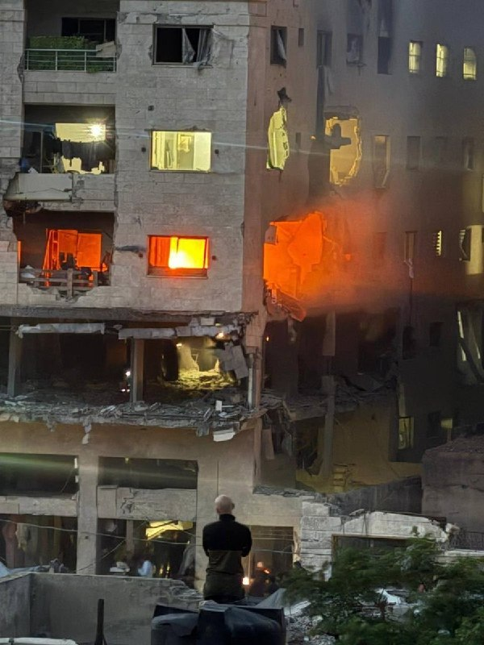

Waleed Gadban ✓ @GadbanWaleed
Fri, 15 May 2026 17:28:51 UTC

در تصویر: ترور تروریست ارشد حماس.

احمد وحیدی، داری نگاه می‌کنی؟

English

In the image: The assassination of a senior Hamas terrorist.

Ahmad Vahidi, are you watching?

𝕏 · @shin_persian

## ManotoTV — post 105502

  <a href="telegram/content/ManotoTV_105502_1778888703.mp4" target="_blank">🎬 Download video</a>

دادستان‌های آمریکا اعلام کردند یک شهروند عراقی به اتهام طراحی حمله تروریستی به یک کنیسه مشهور در نیویورک و حمایت از گروه‌های مورد حمایت جمهوری اسلامی بازداشت و متهم شده است.

محمد باقر سعد داوود الساعدی، ۳۲ ساله، روز جمعه در دادگاهی در منهتن حاضر شد و مقام‌های آمریکایی او را به «توطئه برای ارائه حمایت مادی به سازمان‌های تروریستی خارجی» از جمله سپاه پاسداران و گروه کتائب حزب‌الله عراق متهم کردند.

بر اساس اسناد دادگاه، الساعدی از فرماندهان کتائب حزب‌الله معرفی شده و متهم است از ماه مارس در طراحی، اجرا و تبلیغ حدود ۱۸ حمله علیه منافع آمریکا و اسرائیل در اروپا نقش داشته است.

دادستان‌ها می‌گویند او برای انجام حمله به یک کنیسه در نیویورک، با فردی که در واقع مامور مخفی اف‌بی‌آی بوده تماس گرفته و تصاویر، نقشه‌ها و اطلاعات مربوط به محل حمله را در اختیار او قرار داده است. به گفته مقام‌های آمریکایی، او همچنین تصاویری از مراکز یهودیان در لس‌آنجلس و اسکاتسدیل آریزونا ارسال کرده بود.

در یکی از مکالمات ضبط‌شده، الساعدی درباره هزینه «انجام عملیات بمب‌گذاری» در آمریکا پرس‌وجو کرده و گفته بود: «ما برایش یک معبد یهودیان یا یک مرکز یهودیان فراهم می‌کنیم.»

دادستان‌ها می‌گویند او با مامور مخفی بر سر پرداخت ۱۰ هزار دلار رمزارز برای اجرای حمله توافق کرده و سه هزار دلار به‌عنوان پیش‌پرداخت ارسال کرده بود. بر اساس این گزارش، الساعدی بعدتر در ترکیه بازداشت و به اف‌بی‌آی تحویل داده شد.

پلیس نیویورک اعلام کرد این پرونده «تهدیدهای جهانی ناشی از جمهوری اسلامی و گروه‌های نیابتی‌اش» را آشکار می‌کند. مقام‌های آمریکایی همچنین گفتند با همکاری نهادهای امنیتی، طرح حمله به کنیسه‌ای در منهتن خنثی شده است.

در اسناد دادگاه همچنین تصاویری از دیدار الساعدی با قاسم سلیمانی، فرمانده پیشین نیروی قدس سپاه پاسداران، منتشر شده است.

## FarsiVOA — post 217864

⚡️طرح ممنوعیت اقامت بستگان مقام‌های جمهوری اسلامی در خاک آمریکا؛ گفت‌وگو با کیانوش رزاقی
@FarsiVOA

## FarsiVOA — post 217863

⚡️موضع‌گیری شش کشور عربی علیه جمهوری اسلامی در نامه‌ای به شورای امنیت؛ گفت‌وگو با مجید گلپور
@FarsiVOA

## FarsiVOA — post 217862

🔺ترامپ: مقامات جمهوری اسلامی دیوانه‌‌اند و به‌همین دلیل نباید سلاح هسته‌ای داشته باشند؛ پس از هر توافقی وانمود می‌کنند هیچ مذاکره‌ای نشده است

◾️دونالد ترامپ، رئیس‌جمهوری آمریکا، در مصاحبه‌ای با فاکس‌نیوز گفت ایالات متحده می‌تواند پل‌ها و نیروگاه‌ها در ایران را «در دو روز» منهدم کند.

⬇️ بیشتر بخوانید:
https://ir.voanews.com/a/8150501.html
@FarsiVOA

## FarsiVOA — post 217861

⚡️گزارش صدای آمریکا از نشست امنیتی نشریه پولیتیکو
@FarsiVOA

## FarsiVOA — post 217860

🔺وزارت دادگستری آمریکا برای فرد متهم به قتل دو کارمند سفارت اسرائيل در واشنگتن درخواست مجازات اعدام می‌کند

◾️دادستان‌ها در آمریکا روز جمعه اعلام کردند که وزارت دادگستری ایالات متحده برای مردی که متهم است دو کارمند سفارت اسرائیل در واشنگتن را در بیرون یک موزه یهودیان با شلیک گلوله کشت، درخواست مجازات اعدام خواهد کرد.

⬇️ بیشتر بخوانید:
https://ir.voanews.com/a/8150497.html
@FarsiVOA

## FarsiVOA — post 217859

🔺یک رهبر کتائب الحزب‌الله به اتهامات تروریستی در آمریکا محاکمه می‌شود؛ یار عراقی «قاسم سلیمانی» خارج از ایالات متحده دستگیر شد

◾️وزارت دادگستری ایالات متحده روز جمعه ۲۵ اردیبهشت از آغاز محاکمه محمد‌باقر سعد داوود السعدی، تبعه عراقی و عضو ارشد کتائب حزب‌الله خبر داد و او را به همکاری با سازمان‌های تروریستی تحت حمایت رژیم ایران و هدایت حملات علیه شهروندان و منافع ایالات متحده متهم کرد.

⬇️ بیشتر بخوانید:
https://ir.voanews.com/a/8150492.html
@FarsiVOA

## Persian_Trend_Official — post 14225

  <a href="telegram/content/Persian_Trend_Official_14225_1778888704.mp4" target="_blank">🎬 Download video</a>

شبتون بخیر ❤️🔥

📝 Nick
📌 @persian_trend_official
پرشین ترند | متفاوت‌ترین کانال نظامی

## Persian_Trend_Official — post 14224

  

🔴محمدباقر السعدی، رهبر حزب‌الله عراق توسط FBI دستگیر شد

🔹السعدی به دلیل فعالیت‌هایش با گردان‌های حزب‌الله عراق و سپاه پاسداران ایران با شش اتهام روبرو است

💢اداره تحقیقات فدرال آمریکا اعلام کرد «محمد السعدی» که از او به‌عنوان یک هدف باارزش مرتبط با تروریسم بین‌المللی یاد شده، بازداشت و به آمریکا منتقل شده است.

🔻بر اساس بیانیه اف‌بی‌آی:

▪️ السعدی و همدستانش متهم به برنامه‌ریزی، هماهنگی و پذیرش مسئولیت دست‌کم ۲۰ حمله تروریستی در اروپا و کانادا هستند
▪️ مقام‌های آمریکایی مدعی‌اند این شبکه در حال برنامه‌ریزی حملات آینده علیه آمریکا نیز بوده است
▪️ از جمله اهداف احتمالی، مراکز و نهادهای یهودی در نیویورک، کالیفرنیا و آریزونا عنوان شده‌اند

💢اف‌بی‌آی این بازداشت را بخشی از اقدامات دولت ترامپ برای مقابله با تروریسم توصیف کرده است.

🫆:Tony

📌 @persian_trend_official
پرشین ترند | متفاوت‌ترین کانال نظامی

## Persian_Trend_Official — post 14223

  

واقعا احمدی نژاد چه شد ؟!

## IranianMinds — post 20219

  <a href="telegram/content/IranianMinds_20219_1778888706.mp4" target="_blank">🎬 Download video</a>

عباس یه بار فقط بگو بله مامان 😭

🔴 جاوید نام عباس کشاورز ۳۹ ساله اهل روستای لفمجان لاهیجان پدر ارشا ۱۲ ساله …

او در شب ۱۹ دی ۱۴۰۴ در جریان اعتراضات در شهر رشت، در محدوده میدان صیقلان، با شلیک مستقیم گلوله کشته شد.

جاویدنامان فراموش نمیشوند.

@IranianMinds

## IranianMinds — post 20218

فقط کافیه مرغ از خیابون رد کنی و‌پولت چند برابر کنی
💵👌

## IranianMinds — post 20217

  <a href="telegram/content/IranianMinds_20217_1778888707.mp4" target="_blank">🎬 Download video</a>

بچه ها اسم این بازی عبور مرغ از خیابون  هست ویدئو نگاه کنید خیلی راحت 8 میلیون ازش سود گرفتیم😍

😤اگ توم دوس داری خیلی راحت از بازی های انلاین پول در بیاری حتما عضو کازینو شبانه شو
✅

توی کازینو شبانه بهت اموزش میدیم از بازی های انلاین پول دربیاری👌

کازینو شبانه راهی برای چند برابر کردن سرمایت 🤷‍♂

کسب درامد انلاین با یه ادم حرفه ای یاد بگیر و‌ پول دربیار 
💵
ae25
🎯همین حالا عضو شو و شروع کن👇
https://t.me/+OS-QBvyDO4M2ZGY0
https://t.me/+OS-QBvyDO4M2ZGY0

## IranianMinds — post 20216

🔴 کانال ۱۳ اسرائیل:

برآوردها حاکی از آن است که ترامپ چراغ سبز برای حمله محدود به مواضع رژیم ملاها را خواهد داد

@IranianMinds

## IranianMinds — post 20215

🔴 سازمان ملل: نگرانیم، چون ممکنه منطقه بازم دچار تنش و درگیری بشه

@IranianMinds

## IranianMinds — post 20214

  

🔴جلد جدید مجله تایم:

چگونه دیدار ترامپ و شی، یک نظم نوین جهانی را به نمایش گذاشت.

@IranianMinds

## IranianMinds — post 20213

  

🔴 نیویورک تایمز :

ترامپ پس از بازگشت از چین، در حالی که مشاوران ارشد و مقامات پنتاگون برنامه‌های احتمالی برای حملات مجدد به ایران در صورت شکست مذاکرات صلح را نهایی می‌کردند، وارد آمریکا شد.

اگرچه ترامپ هنوز تصمیم نهایی نگرفته است، گزارش‌ها حاکی از آن است که مقامات آمریکایی و اسرائیلی برای حملاتی که ممکن است طی روزهای آینده آغاز شوند، آماده می‌شوند.

برنامه‌ریزان نظامی درباره گسترش کمپین‌های بمباران و حتی مأموریت‌های عملیات ویژه برای هدف قرار دادن تأسیسات هسته‌ای زیرزمینی ایران بحث کرده‌اند!

@IranianMinds

## BBCPersian — post 281157

  

‌ ‌ ‌ ‌
دولت ایالات متحده به دنبال مجازات اعدام برای مظنونی است که سال گذشته به قتل دو نفر از کارکنان سفارت اسرائیل در واشنگتن متهم شده است.

جینین پیرو، دادستان ناحیه کلمبیا، روز جمعه درخواست مجازات اعدام برای سه مورد از مجموع ۱۳ اتهام علیه الیاس رودریگز ۳۱ ساله را ارائه کرد. پس از محدودیت‌های اعمال‌شده در دوره جو بایدن، رئیس جمهور سابق آمریکا، دونالد ترامپ، از مجازات اعدام فدرال حمایت کرد.

مقام‌های قضایی آمریکا ادعا می‌کنند که رودریگز پیش از شلیک در خارج از موزه یهودیان پایتخت به سمت زوج یارون لیشینسکی، ۳۰ ساله، و سارا لین میلگریم، ۲۶ ساله، فریاد زده بود «فلسطین را آزاد کنید.»

آقای رودریگز پس از این حمله دستگیر شد و در دادگاه خود را بی‌گناه دانسته است.

اگر رودریگز به اتهام قتل یک مقام خارجی، شلیک با اسلحه گرم در حین جرم خشونت‌آمیز و قتل از طریق استفاده از اسلحه گرم مجرم شناخته شود، دادستان ناحیه کلمبیا برای او درخواست اعدام خواهد کرد.

https://bbc.in/496s8el
📷 X/Reuters
@BBCPersian

## BBCPersian — post 281156

  

‌ ‌ ‌ ‌
نخست‌وزیر و وزیر دفاع اسرائیل با صدور بیانیه‌ای اعلام کردند که عزالدین حداد، فرمانده گردان‌‌های عزالدین قسام، شاخه نظامی حماس در غزه را کشته‌اند.

در بیانیه بنیامین نتانیاهو، و اسرائیل کاتس که در رسانه‌های اسرائیلی منتشر شده، آمده است که حداد یکی از «معماران حملات ۷ اکتبر ۲۰۲۳» به اسرائیل بوده است.

طبق این بیانیه، عزالدین حداد از اجرای توافق دونالد ترامپ، رئیس‌جمهور آمریکا، برای خلع سلاح حماس خودداری کرده بود.

یک مقام ارشد امنیتی گفت که نشانه‌های اولیه حاکیست که او کشته شده است.

شاهدان عینی در غزه به بی‌بی‌سی گفتند که یک آپارتمان هدف حمله موشکی قرار گرفت و سپس خودرویی که گفته می‌شود محل را ترک کرده بود، در حمله‌ای دیگر هدف قرار گرفت؛ حمله‌ای که به کشته شدن سه نفر انجامید.

حماس تاکنون کشته شدن عزالدین حداد را نه تایید کرده و نه رد کرده است.

https://bbc.in/4uPJdl1
📷Reuters
@BBCPersian

## BBCPersian — post 281155

🔻 افزایش قیمت نفت و تنش در تنگه هرمز، سود اوراق آمریکا را به بالاترین سطح یک‌سال اخیر رساند

بازده اوراق خزانه‌داری ایالات متحده آمریکا یا سودی که سرمایه‌گذاران برای خرید اوراق بدهی دولت آمریکا مطالبه می‌کنند، روز جمعه به بالاترین سطح یک سال گذشته رسید.

به گزارش رویترز، افزایش قیمت نفت، نگرانی‌ها درباره تورم و انتظار برای قوی‌تر شدن اقتصاد آمریکا باعث شد بازارها پیش‌بینی کنند که نرخ‌های بهره ممکن است برای مدت طولانی‌تری بالا بماند.

قیمت نفت نیز روز جمعه بیش از سه درصد افزایش یافت؛ پس از آن‌که اظهارات دونالد ترامپ و عباس عراقچی، امیدها به توافقی برای پایان دادن به حملات و توقیف کشتی‌ها در اطراف تنگه هرمز را کاهش داد.

دونالد ترامپ گفت که صبرش در قبال ایران رو به پایان است و شی جین‌پینگ، رئیس جمهور چین نیز در دیدار با آقای ترامپ در پکن موافقت کرد که تهران باید تنگه هرمز را بازگشایی کند.

وزیر خارجه ایران هم گفت که تهران به آمریکا «اعتماد ندارد» و تنها در صورتی به مذاکره علاقه‌مند است که واشنگتن جدیت خود را نشان دهد.

https://bbc.in/3PJL9ww
@BBCPersian

## Dirty_Kids — post 389538

  <a href="telegram/content/Dirty_Kids_389538_1778888711.webm" target="_blank">🎬 Download video</a>

☢️خفن ترین و‌ قدیمی ترین  انالیزور  ایران ینی دکتر بت 
👍 
🔴هیچ سایت بتی دوست نداره شما کانال دکتر بت رو پیدا کنین چون خیلی سود میکنید🤷‍♂ رایگان بهترین شرط هارو براتون میذاره حتی هزار تومن هم دریافت نمیکنه روزانه میتونی از پیش بینی فوتبال باهاش پول در بیاری…

## Dirty_Kids — post 389537

  <a href="telegram/content/Dirty_Kids_389537_1778888711.webm" target="_blank">🎬 Download video</a>

☢️خفن ترین و‌ قدیمی ترین  انالیزور  ایران ینی دکتر بت 
👍

🔴هیچ سایت بتی دوست نداره شما کانال دکتر بت رو پیدا کنین چون خیلی سود میکنید🤷‍♂

رایگان بهترین شرط هارو براتون میذاره
حتی هزار تومن هم دریافت نمیکنه
روزانه میتونی از پیش بینی فوتبال باهاش پول در بیاری 👌
A25
اگ اهل پیش بینی فوتبالی این کانال اصلا از دست ندین👇

✅https://t.me/+4_ADqwB9e-QwYjlk

✅https://t.me/+4_ADqwB9e-QwYjlk

## Dirty_Kids — post 389536

  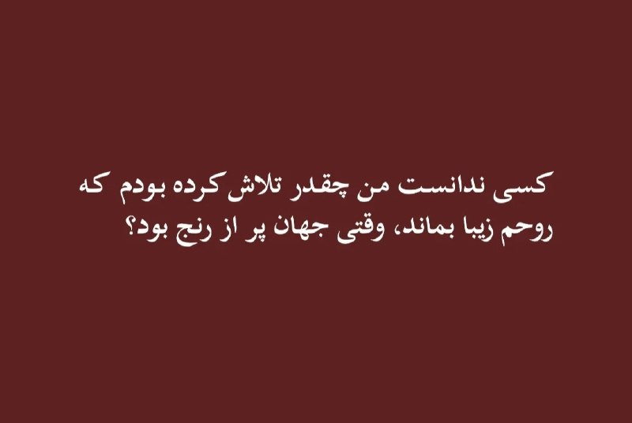

#بخوابیم

@Dirty_Kids 👻

## Dirty_Kids — post 389535

  

بانو ناتالیا بیش از ۲۰ نفر از اعضای حماس رو به هلاکت رسونده تو غزه

@Dirty_Kids 👻

## Dirty_Kids — post 389534

  <a href="telegram/content/Dirty_Kids_389534_1778888712.mp4" target="_blank">🎬 Download video</a>

عمو مانوک؛ اخلاق رضاشاه

@Dirty_Kids 👻

## Dirty_Kids — post 389533

  

پاتو لیس بزن گه اضافه نخور 😂😂

@Dirty_Kids 👻

## Dirty_Kids — post 389532

  <a href="telegram/content/Dirty_Kids_389532_1778888714.mp4" target="_blank">🎬 Download video</a>

املاکی در مصاحبه با Bret Baier مجری برنامه Special Report شبکه فاکس نیوز در خصوص خواری که رژیم کسمغز روافض در مذاکرات ازش گاییدن فرموده که:

«ما واقعاً به نوعی از پایه‌های یک توافق رسیده بودیم. بدون سلاح هسته‌ای.

اون‌هزارپدرای قحبه‌ قرار بود غبار هسته‌ای رو به ما تحویل بدن، همه چیو، هر چیزی که ما می‌خواستیم.

و هر بار که توافقی می‌کنن، این پدرخرابا روز بعدش به جوری رفتار می‌کنن که انگار ما از اساس همچی گفتگویی نداشتیم، و این اتفاق حدود پنج بار رخ داده.

یک مشکلی در این مادرقحبه‌های رافضی وجود داره، در واقع این حرومیا دیونه میوونه‌اند. [علاوه بر کسمغزی،خدعه‌زاده‌ان شیر خدا. اما خب دو بار گاییدی‌شون و فهمیدن اون ممه رو لولو خورد]

و می‌دونید چیه؟ به همین دلیل، این جاکش‌پدرا‌ نباید سلاح هسته‌ای داشته باشن»



@Dirty_Kids 👻

## Dirty_Kids — post 389529

این بانو که یکم حشری‌طور میزنه امروز حاشیه ساز بوده

یه عده دفاع میکنن ازش
یه عده هیت میدن

@Dirty_Kids 👻

## Dirty_Kids — post 389528

  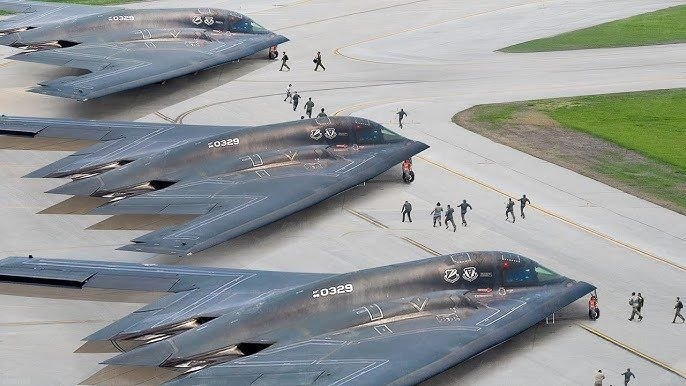

🔴 طبق گفته دو مقام خاورمیانه‌ای، آمریکا و اسرائیل دارن آماده‌سازی خیلی گسترده‌ای انجام می‌دن. (بزرگ‌ترین سطح از وقتی که آتش‌بس برقرار شده)

این آماده‌سازی‌ها انقدر جدیه که ممکنه از هفته آینده دوباره حملات شروع بشه.

@Dirty_Kids 👻

## Dirty_Kids — post 389526

  <a href="telegram/content/Dirty_Kids_389526_1778888715.mp4" target="_blank">🎬 Download video</a>

امروز یکی تو فضای مجازی با هوش مصنوعی یه عکس از ترامپ و ایلان ماسک زیر پرچم داس و چکشِ کمونیست ساخت؛

بعد تو صداوسیما، خانعلی زاده (کارشناس روابط خارجی و همراه تیم مذاکره کننده تو سفر به پاکستان) خیلی جدی تحلیل کرد که این عکس خروجی سفر ترامپه و این یعنی آمریکا همیشه زیرخوابِ چینه...

@Dirty_Kids 👻

## manototv — post 105502

  <a href="telegram/content/manototv_105502_1778888716.mp4" target="_blank">🎬 Download video</a>

دادستان‌های آمریکا اعلام کردند یک شهروند عراقی به اتهام طراحی حمله تروریستی به یک کنیسه مشهور در نیویورک و حمایت از گروه‌های مورد حمایت جمهوری اسلامی بازداشت و متهم شده است.

محمد باقر سعد داوود الساعدی، ۳۲ ساله، روز جمعه در دادگاهی در منهتن حاضر شد و مقام‌های آمریکایی او را به «توطئه برای ارائه حمایت مادی به سازمان‌های تروریستی خارجی» از جمله سپاه پاسداران و گروه کتائب حزب‌الله عراق متهم کردند.

بر اساس اسناد دادگاه، الساعدی از فرماندهان کتائب حزب‌الله معرفی شده و متهم است از ماه مارس در طراحی، اجرا و تبلیغ حدود ۱۸ حمله علیه منافع آمریکا و اسرائیل در اروپا نقش داشته است.

دادستان‌ها می‌گویند او برای انجام حمله به یک کنیسه در نیویورک، با فردی که در واقع مامور مخفی اف‌بی‌آی بوده تماس گرفته و تصاویر، نقشه‌ها و اطلاعات مربوط به محل حمله را در اختیار او قرار داده است. به گفته مقام‌های آمریکایی، او همچنین تصاویری از مراکز یهودیان در لس‌آنجلس و اسکاتسدیل آریزونا ارسال کرده بود.

در یکی از مکالمات ضبط‌شده، الساعدی درباره هزینه «انجام عملیات بمب‌گذاری» در آمریکا پرس‌وجو کرده و گفته بود: «ما برایش یک معبد یهودیان یا یک مرکز یهودیان فراهم می‌کنیم.»

دادستان‌ها می‌گویند او با مامور مخفی بر سر پرداخت ۱۰ هزار دلار رمزارز برای اجرای حمله توافق کرده و سه هزار دلار به‌عنوان پیش‌پرداخت ارسال کرده بود. بر اساس این گزارش، الساعدی بعدتر در ترکیه بازداشت و به اف‌بی‌آی تحویل داده شد.

پلیس نیویورک اعلام کرد این پرونده «تهدیدهای جهانی ناشی از جمهوری اسلامی و گروه‌های نیابتی‌اش» را آشکار می‌کند. مقام‌های آمریکایی همچنین گفتند با همکاری نهادهای امنیتی، طرح حمله به کنیسه‌ای در منهتن خنثی شده است.

در اسناد دادگاه همچنین تصاویری از دیدار الساعدی با قاسم سلیمانی، فرمانده پیشین نیروی قدس سپاه پاسداران، منتشر شده است.

## alonews — post 120300

  <a href="telegram/content/alonews_120300_1778888717.mp4" target="_blank">🎬 Download video</a>

👈رئیس جمهور ترامپ در مورد ایران:
ما نه تا دوربین مختلف توی اون سایت داریم و دقت به قدری بالاست که ما می توانیم نام یک شخص را هم بخوانیم.

🔴اگر اسمش محمد است ، بیشترشان محمد هستند ؛ شما می توانید حدود 50 درصد درست حدس بزنید.

🔴هر کسي که به اون فضا نزديک بشه ، ما میفهمیم

✅ @AloNews خبر جنگ

## alonews — post 120299

  <a href="telegram/content/alonews_120299_1778888718.mp4" target="_blank">🎬 Download video</a>

👈ترامپ: گفتم گرد و غبار هسته ای را می گیریم ایران گفت: "شما می توانید آن را داشته باشید. اونا گفتن ، " ما نمیتونیم تحملش کنیم. ما توانایی مصرف آن را نداریم. گفتم: "چرا؟ اونا گفتن چون خيلي ضربه خورده"

🔴برت بایر فاکس: چرا این کافی نیست اگر هدف شما این بود که آنها را عقب بیندازید ؟

🔴ترامپ: از نظر روابط عمومی به اندازه کافی خوب نیست‌‌

✅ @AloNews خبر جنگ

## alonews — post 120298

  <a href="telegram/content/alonews_120298_1778888719.mp4" target="_blank">🎬 Download video</a>

👈برت بایر از فاکس: فکر می کنید ایران به زودی تسلیم خواهد شد ؟

🔴ترامپ: بله ، من هیچ شکی ندارم.‌‌

✅ @AloNews خبر جنگ

## alonews — post 120297

  <a href="telegram/content/alonews_120297_1778888720.mp4" target="_blank">🎬 Download video</a>

👈رئیس جمهور ترامپ در مورد ایران:
ایران سالهاست که جهان را با تنگه هرمز نگه داشته است. اونا در گذشته تنگه رو بسته بودن اونا ازش به عنوان سلاح استفاده ميکنن اونا ازش به عنوان سلاح با من استفاده نميکنن

🔴رئیس جمهور شی دیشب با لبخند گفت: "خب ، آنها تنگه را می بندند ، و بعد شما آنها را می بندید."‌‌

✅ @AloNews خبر جنگ

## alonews — post 120296

  <a href="telegram/content/alonews_120296_1778888722.mp4" target="_blank">🎬 Download video</a>

👈برت بایر از فاکس: آیا تاب آوری ایران را دست کم گرفتید ؟

🔴ترامپ: چیزی را دست کم نگرفتم ما می توانیم پل ها و ظرفیت برق آنها را در دو روز از بین ببریم.‌‌

✅ @AloNews خبر جنگ

## alonews — post 120295

  <a href="telegram/content/alonews_120295_1778888723.mp4" target="_blank">🎬 Download video</a>

👈ترامپ : ویتنام ۱۹ سال طول کشید، عراق حدود ۱۰ سال، کره ۷ سال، یکی دیگه ۱۴ سال، یکی ۱۲ سال، یکی هم ۹ سال
- ما فقط دو ماه و نیم اونجا بودیم
- چین هم این هفته سه تا نفتکش پر از نفت ایران رو برد، چون ما اجازه دادیم این اتفاق بیفته،شما اجازه دادید

✅ @AloNews خبر جنگ

## alonews — post 120294

  <a href="telegram/content/alonews_120294_1778888725.webm" target="_blank">🎬 Download video</a>

👈ترامپ به فاکس نیوز: چین جرات اقدام علیه تایوان را در دوران قدرت من نخواهد داشت‌‌

🔴پکن از عدم نیاز واشنگتن به هیچ کمکی در پرونده ایران یا ایمن سازی ناوبری در تنگه هرمز خبر داد‌‌

🔴چین برای تامین 40 درصد منابع نفتی خود به تنگه هرمز تکیه می کند‌‌

🔴خب، به هر حال ما به یک راه‌حل خواهیم رسید. بنابراین یا این مسئله به‌صورت خشونت‌آمیز حل می‌شود یا بدون خشونت. و من خیلی ترجیح می‌دهم که بدون خشونت باشد

✅ @AloNews خبر جنگ

## alonews — post 120293

  <a href="telegram/content/alonews_120293_1778888725.webm" target="_blank">🎬 Download video</a>

👈پک ۱۰عددی کاندوم با افزایش قیمت به ۴۸۰هزار تومان رسیده!

🔴دولت باید به اینجور چیزا سوبسید بده تا همه بتونن استفاده کنن اما.....

✅ @AloNews خبر جنگ

## alonews — post 120290

  <a href="telegram/content/alonews_120290_1778888725.mp4" target="_blank">🎬 Download video</a>

👈مجریان بیسواد صدا و سیما برداشتن یه تصویر هوش مصنوعی رو گذاشتن و دارن تحلیلش میکنن!

✅ @AloNews خبر جنگ

## alonews — post 120289

  <a href="telegram/content/alonews_120289_1778888726.mp4" target="_blank">🎬 Download video</a>

👈مصاحبه‌گر : قبول دارید عامل گرانی‌ها محاصره آمریکا علیه ماست؟

🔴حامی حکومت : نه، قبول ندارم!

✅ @AloNews خبر جنگ

## alonews — post 120288

  <a href="telegram/content/alonews_120288_1778888727.webm" target="_blank">🎬 Download video</a>

👈نیویورک تایمز: گزینه‌های ترامپ در ایران شامل نیروهای ویژه زمینی برای کنترل اورانیوم است

✅ @AloNews خبر جنگ

## alonews — post 120287

  <a href="telegram/content/alonews_120287_1778888727.mp4" target="_blank">🎬 Download video</a>

👈گلایه مخاطب ایران اینترنشنال از قیمت نجومی عرق سگی

🔴قبل جنگ لیتری ۲۵۰بود و با دوستام میخوردم اما الان لیتری ۱۵۰۰ و تنها میخورم

✅ @AloNews خبر جنگ

---
📅 بروزرسانی: 1405/02/26 00:15
---

## VahidOOnLine — post 240379

  <a href="telegram/content/VahidOOnLine_240379_1778877922.mp4" target="_blank">🎬 Download video</a>

‌
شیخ خالد بن محمد بن زاید، ولیعهد ابوظبی، اعلام کرد پروژه «خط لوله غرب به شرق» با هدف افزایش صادرات نفت از بندر فجیره و «پاسخ به تقاضای جهانی» با سرعت بیشتری اجرا خواهد شد.

بر اساس اعلام مقام‌های امارات، این پروژه ظرفیت صادرات نفت از مسیر فجیره را دو برابر می‌کند و قرار است تا سال ۲۰۲۷ به بهره‌برداری برسد.

پس از جنگ آمریکا و اسرائیل با جمهوری اسلامی و افزایش تنش‌ها در تنگه هرمز، کشورهای خلیج فارس به دنبال مسیرهای جایگزین برای صادرات نفت و گاز هستند. حدود یک‌پنجم نفت جهان پیش‌تر از تنگه هرمز عبور می‌کرد.
‌🏁 🇬🇧 ManotoTV

🤖 @VahidOOnLine

## VahidOOnLine — post 240378

  <a href="telegram/content/VahidOOnLine_240378_1778877923.mp4" target="_blank">🎬 Download video</a>

یکی از مخاطبان ایران‌اینترنشنال در پیامی می‌گوید وضعیت برگزاری امتحانات دانش‌آموزان پایه‌های هفتم تا دهم در کرمانشاه هنوز مشخص نیست و این بلاتکلیفی باعث نگرانی و فشار روانی شده است. او خواستار تعیین هرچه سریع‌تر وضعیت امتحان‌هاست.

این پیام با هوش مصنوعی خوانده شده است
‌🏁 🇬🇧 IranintlTV

🤖 @VahidOOnLine

## VahidOOnLine — post 240377

  

رسانه‌های ایران از افزایش نجومی قیمت کولر آبی خبر دادند و افزودند در حال حاضر، قیمت کولرهای آبی از حدود ۲۰ میلیون تومان شروع می‌شود و برخی مدل‌های سلولزی و کم‌مصرف به بالای ۵۰ میلیون تومان رسیده‌اند.
بنا بر این گزارش، بسیاری از خریداران به سمت تعمیر کولرهای قدیمی و خرید مدل‌های دست‌دوم رفته‌اند.

این در حالی است که در سال ۱۴۰۱، ارزانترین کولر آبی در بازار یک میلیون و ۵۰۰ تومان و ارزانترین کولر گازی دیواری نیز ۹ میلیون تومان بوده است.
‌🏁 🇬🇧 IranintlTV

🤖 @VahidOOnLine

## VahidOOnLine — post 240376

🗣روایت شما از بحران اقتصادی و زندگی در آتش‌بس- جمعه ۲۵ اردیبهشت:

🔹روز ۲۰ اردیبهشت رفتم در ملایر دیسک صفحه ماشین بگیرم، قیمت گفت ۶ میلیون تومان، فردایش برای خرید قطعی مراجعه کردم؛ همان را گفت ۱۲ میلیون شده است. قیمت یک قلم جنس در یک روز دو برابر شد.

🔹یک کیلو قهوه گلد را که تا هفته قبل در تهران می‌خریدیم یک میلیون و ۷۰۰ هزار تومان، می‌خریدم امروز خریدم ۵ میلیون و ۳۰۰ هزار تومان!

🔹من یک نقاشم و تنها دلخوشی‌ام نقاشی بود. الان توان خرید بوم ندارم که هیچ، حتی مقوایی که هفته پیش خریدم ۲۵۰ هزار تومان هم این هفته شده ۳۲۰ هزار تومن! مدام باید با ترس خراب‌نکردن و هدر ندادن ابزار و مواد اولیه، نقاشی کنم.

🔹کشاورز هستم. سهمیه کود نسبت به پارسال تقریبا نصف شده و وقتی سهمیه جدید می‌آید کلا دو سه روز مهلت خرید دارد. اگر کسی توانایی خرید نداشته باشد، سهمش می‌سوزد. دولت هم سهم کود دولتی آن فرد را به صورت آزاد می‌فروشد.

🔹بنزین کارت آزاد ۵ هزار تومنی، از ساعت ۹ صبح به بعد دیگر موجود نیست.

🔹یک شانه تخم‌مرغ خریدم ۶۰۰ هزار تومان. دیگر حتی نمی‌شود یک وعده غذای ساده خورد.

🔹قبض برق که هر دوره برای ما ۱۲۰ هزار تومان صادر می‌شد این بار شده یک میلیون و ۲۰۰ هزار تومان، تازه همراه با تهدید قطع فوری!
‌🏁 🇬🇧 IranintlTV

🤖 @VahidOOnLine

## VahidOOnLine — post 240375

  

♦️ نواف سلام، نخست‌وزیر لبنان، روز جمعه ۲۵ اردیبهشت، با انتقاد از «ماجراجویی‌های بی‌پروا» در جهت منافع قدرت‌های خارجی، تصریح کرد که کشورش دیگر توان تحمل جنگ‌هایی را که در خدمت پروژه‌های بیگانگان است، ندارد. او همچنین خواستار حمایت کشورهای عربی و جامعه بین‌المللی از بیروت در مذاکرات با اسرائیل شد.

نواف سلام که در یک ضیافت شام سخن می‌گفت، ابراز امیدواری کرد که «تمام حمایت‌های عربی و بین‌المللی برای تقویت موضع لبنان در مذاکرات» بسیج شود. این سخنان مدت کوتاهی پس از پایان دور اخیر گفتگوها و تمدید ۴۵ روزه آتش‌بس فعلی ایراد شد.

نخست‌وزیر لبنان در سرزنشی تلویحی علیه حزب‌الله که در حمایت از جمهوری اسلامی وارد جنگ شد، تاکید کرد که کشورش از این‌گونه «ماجراجویی‌های نسنجیده» به ستوه آمده است. او خاطرنشان کرد که ارتش لبنان باید تنها نهاد مسلح در این کشور باشد و حاکمیت کامل نظامی را در اختیار بگیرد.
‌🇸🇦 Indypersian

🤖 @VahidOOnLine

## VahidOOnLine — post 240374

  

فرزند عبدالرحیم موسوی، رییس ستاد کل نیروهای مسلح جمهوری اسلامی، گفت که جنازه پدرش که در نخستین روز حملات اسرائیل و آمریکا به دفتر خامنه‌ای کشته شد، نزدیک به ۳۰ روز زیر آوار مانده بود.

موسوی پس از کشته شدن محمد باقری در جنگ ۱۲ روزه، به‌عنوان رییس ستاد کل نیروهای مسلح منصوب شد.

‌🏁 🇬🇧 IranintlTV

🤖 @VahidOOnLine

## VahidOOnLine — post 240373

  

به گزارش فرانس۲۴، مقام‌های آمریکایی محمد باقر سعد داوود الساعدی، شهروند عراقی را به اتهام طراحی دست‌کم ۱۸ حمله «تروریستی» در اروپا در واکنش به جنگ آمریکا علیه جمهوری اسلامی بازداشت و متهم کردند.

براساس این گزارش، او متهم است در حملاتی از جمله آتش‌زدن یک بانک در آمستردام و حمله با چاقو به چند مرد یهودی در لندن نقش داشته و ماه گذشته قصد حمله به یک کنیسه در نیویورک را داشته است. همچنین او تصاویر و نقشه‌هایی از مراکز یهودی در لس‌آنجلس و اسکاتسدیل آریزونا را در اختیار یک مامور مخفی قرار داده است.

بر اساس این گزارش، او همچنین به مشارکت در دو حمله اخیر در کانادا، شامل حمله به یک کنیسه و تیراندازی به کنسولگری آمریکا در تورنتو در ماه مارس، متهم شده است.
‌🏁 🇬🇧 IranintlTV

🤖 @VahidOOnLine

## VahidOOnLine — post 240372

  

♦️ وزارت دادگستری ایالات متحده روز جمعه ۲۵ اردیبهشت، اعلام کرد که یک شهروند عراقی به نام «محمد باقر سعد داود الساعدی» را به اتهام طراحی حملات تروریستی در خاک آمریکا، از جمله هدف قرار دادن یک نهاد یهودی در نیویورک، بازداشت و متهم کرده است.

بر اساس کیفرخواست صادر شده، الساعدی که از فرماندهان گروه «کتائب حزب‌الله» (گردان‌های حزب‌الله عراق) معرفی شده، متهم است که برای ارائه حمایت‌های لجستیکی و مادی به سازمان‌های تروریستی تحت حمایت جمهوری اسلامی، از جمله سپاه پاسداران و کتائب حزب‌الله، توطئه کرده است. دادستان‌ها می‌گویند که او در برنامه‌ریزی و اجرای حدود ۱۸ حمله تروریستی علیه منافع آمریکا و اسرائیل در اروپا از ماه مارس گذشته نقش داشته است.

الساعدی متهم است که تلاش کرده یک مامور مخفی را برای مشارکت در حمله به یک کنیسه برجسته در نیویورک جذب کند و نقشه‌ها و تصاویر هدف را نیز در اختیار او قرار داده است. گزارش‌ها حاکی از آن است که سرویس اطلاعاتی بریتانیا نیز پیش از این در حال تحقیق روی این گروه بوده و از برنامه‌های آن‌ها برای گسترش حملات به خاک ایالات متحده آگاهی داشته است.
‌🇸🇦 Indypersian

🤖 @VahidOOnLine

## VahidOOnLine — post 240371

  

جعفر قادری، نماینده شیراز در مجلس گفت: «امارات متحده عربی در جنگ نشان داده که به لانه‌ای برای اسرائیل تبدیل شده و در این راستا نیز هیچ کوتاهی نکرده است.»

او افزود: «این کشور در آینده جایی در مناسبات ما نخواهد داشت و نباید اجازه دهیم سرمایه‌گذاری‌های جدیدی در این کشور رقم بخورد.»

او ادامه داد: «امارات متحده عربی دارد مسیر اسرائیل را می‌رود و در دامن آن‌ها افتاده که این خطرناک است، البته در زمان خودش پاسخ خوش خدمتی‌هایش را به گونه‌ای خواهد گرفت که در اذهان باقی بماند.»
‌🏁 🇬🇧 IranintlTV

🤖 @VahidOOnLine

## VahidOOnLine — post 240370

  <a href="telegram/content/VahidOOnLine_240370_1778877928.mp4" target="_blank">🎬 Download video</a>

یکی از مخاطبان ایران‌اینترنشنال که از مشهد پیام داده می‌گوید برای کار روی پایان‌نامه خود ناچار به تهیه اینترنت پرسرعت شده که با احتساب مالیات حدود ۲ میلیون و ۱۷۰ هزار تومان هزینه داشته است. او می‌گوید برای چیزی که «حقمان است» هزینه سنگین پرداخت می‌کنند، اما دسترسی و کیفیت خدمات پاسخگوی نیاز او نیست. این پیام با هوش مصنوعی خوانده شده است.

بازخوانی این پیام و ساخت تصویر برای آن با هوش مصنوعی انجام گرفته است.
‌🏁 🇬🇧 IranintlTV

🤖 @VahidOOnLine

## VahidOOnLine — post 240369

  

گلرخ ایرایی، زندانی سیاسی، در پیامی از بند زنان زندان اوین به مناسبت اعطای جایزه «آزادی نوشتن» از سوی انجمن قلم آمریکا، نوشت: «می‌نویسیم حتی اگر آزادی‌مان به بند کشیده شود؛ حتا اگر مورد تهدید و تحدید قرار بگیریم و وادار به تبعید یا فدای جان شویم.»

ایرایی در این پیام نوشت، «اینجا بی‌پروا نوشتن از رنج مردمانی که ستم را به پیکار برمی‌خیزند، مجرمانه است و آنان که با قلم تباهی درد را به چشم جهانیان پدیدار می‌کنند، در سکوت فرسوده می‌شوند و مجرم‌اند و سزاوار محاکمه!»
او به فقر، نابرابری، سرکوب و «کشتار سیستماتیک» در ایران اشاره کرد و نوشت نوشتن از رنج مردم «تحت ستم»، با همه هزینه‌ها و محدودیت‌ها، «روزنه امیدی» برای ادامه مبارزه است.

این زندانی سیاسی همچنین نوشت «ارتجاع حاکم، آزادی اندیشه و جسارت بیان را برنمی‌تابد، آنگاه که قلم بر چوبه‌های دار افراشته حمله می‌برد و از فقر و نابرابری روایت می‌کند و بازتابی می‌شود از سفره‌های خالی و قیام گرسنگان را نوید می‌دهد.»

او در پایان تاکید کرد: «ما از خفگی رها خواهیم شد و می‌دانیم این جز در حرکتی مشترک میسر نخواهد بود.»
‌🏁 🇬🇧 IranintlTV

🤖 @VahidOOnLine

## VahidOOnLine — post 240368

  

♦️ تامی پیگات، سخنگوی وزارت امور خارجه آمریکا، روز جمعه ۲۵ اردیبهشت، اعلام کرد که در پی دو روز مذاکرات «بسیار سازنده» میان اسرائیل و لبنان با میانجی‌گری ایالات متحده، دو طرف بر سر تمدید ۴۵ روزه آتش‌بس به توافق رسیدند.

پیگات گفت که این وزارتخانه مذاکرات در «مسیر سیاسی» را در روزهای دوم و سوم ژوئن (۱۲ و ۱۳ خرداد) از سر خواهد گرفت و هم‌زمان، یک «مسیر امنیتی» نیز با حضور هیئت‌های نظامی اسرائیل و لبنان در تاریخ ۲۹ مه (هشتم خرداد) در پنتاگون آغاز خواهد شد.

او افزود: «امیدواریم این گفتگوها گامی به سوی صلح پایدار میان دو کشور، شناسایی کامل حاکمیت و تمامیت ارضی یکدیگر و برقراری امنیت واقعی در امتداد مرزهای مشترک باشد.»
‌🇸🇦 Indypersian

🤖 @VahidOOnLine

## VahidOOnLine — post 240367

  

آموزشکده توانا در گزارشی نوشت برخی وکلا با هماهنگی نهادهای امنیتی و قضات دادگاه‌های انقلاب، در پرونده‌های امنیتی به‌جای دفاع از متهمان، با درخواست عفو و «اقرار ضمنی» به اتهام‌ها، مسیر صدور و اجرای احکام سنگین از جمله اعدام را هموار می‌کنند.

بر اساس این گزارش، این وکلا با تجدیدنظرخواهی فوری، فرصت قانونی اعتراض را نیز از متهمان سلب می‌کنند.
این گزارش از «مهدی محرابی» به‌عنوان یکی از این وکلا نام برده و نوشته او در پرونده آتش‌سوزی پایگاه بسیج خیابان نامجو، مربوط به محمدامین بیگلری، امیرحسین حاتمی، علی فهیم و شاهین واحدپرست کلور، چهار معترض اعدام‌شده، نقش داشته است.

در این گزارش همچنین آمده خانواده برخی متهمان امنیتی تحت فشار قرار می‌گیرند تا به‌جای وکلای مستقل، از «وکلای مورد تایید» استفاده کنند؛ اقدامی که به نوشته توانا، در مواردی به صدور احکام اعدام یا حبس‌های طولانی‌مدت منجر شده است.
‌🏁 🇬🇧 IranintlTV

🤖 @VahidOOnLine

## VahidOOnLine — post 240366

  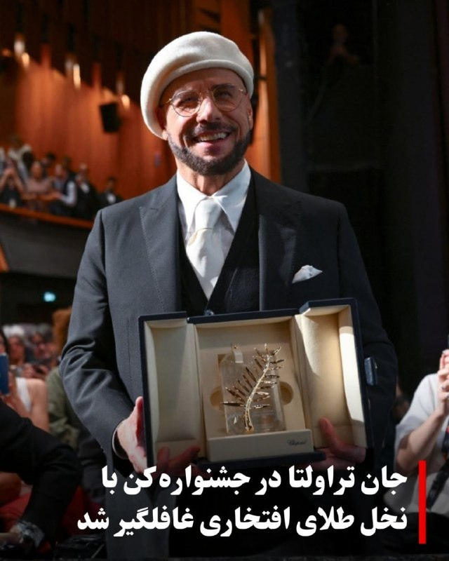

♦️جان تراولتا شامگاه جمعه در جشنواره فیلم کن ۲۰۲۶ با دریافت نخل طلای افتخاری غافلگیر شد؛ مراسمی که هم‌زمان با نمایش نخستین فیلم بلند او در مقام کارگردان برگزار شد.
تیری فرمو، مدیر هنری جشنواره کن، درست پیش از آغاز نمایش فیلم «پراپلر؛ قطار شبانه یک‌طرفه» روی صحنه آمد و نخل طلای افتخاری را به تراولتا اهدا کرد. بازیگر آمریکایی که آشکارا تحت تاثیر قرار گرفته بود، هنگام دریافت جایزه دستش را روی سینه گذاشت و از حاضران تشکر کرد.
تراولتا روی فرش قرمز کن با دختر ۲۶ ساله‌اش الا بلو تراولتا ظاهر شد. این فیلم نخستین تجربه کارگردانی بلند جان تراولتا به شمار می‌رود. او علاوه بر کارگردانی، نویسندگی و تهیه‌کنندگی مشترک این پروژه را نیز بر عهده داشته است. داستان فیلم بر اساس کتاب کودکانه‌ای ساخته شده که خود تراولتا در سال ۱۹۹۷ منتشر کرده بود و درباره نوجوانی علاقه‌مند به هوانوردی است.
جشنواره کن پیش‌تر نیز چند بار مهمانانش را با اهدای ناگهانی نخل طلای افتخاری غافلگیر کرده بود. تام کروز در سال ۲۰۲۲ چنین جایزه‌ای دریافت کرد.
‌🇸🇦 Indypersian

🤖 @VahidOOnLine

## VahidOOnLine — post 240365

  <a href="telegram/content/VahidOOnLine_240365_1778877931.mp4" target="_blank">🎬 Download video</a>

‌
وزارت خارجه آمریکا اعلام کرد آتش‌بس میان اسرائیل و لبنان برای ۴۵ روز دیگر تمدید شده تا فرصت بیشتری برای ادامه مذاکرات فراهم شود.
‌🏁 🇬🇧 ManotoTV

🤖 @VahidOOnLine

## VahidOOnLine — post 240364

  <a href="telegram/content/VahidOOnLine_240364_1778877931.mp4" target="_blank">🎬 Download video</a>

‌
اسرائیل اعلام کرد در حمله‌ای هوایی، عزالدین الحداد، ارشدترین فرمانده گروه تروریستی حماس در نوار غزه را هدف قرار داده است.

هنوز گزارشی از وضعیت او منتشر نشده و حماس هم واکنشی نشان نداده است.

الحداد در فهرست افراد تحت تعقیب اسرائیل قرار دارد و از سوی اسرائیل به عنوان یکی از «طراحان» حمله تروریستی هفت اکتبر معرفی شده است.
‌🏁 🇬🇧 ManotoTV

🤖 @VahidOOnLine

## VahidOOnLine — post 240363

  

♦️ شبکه ۱۳ تلویزیون اسرائیل در گزارشی اختصاصی فاش کرد که علاوه بر بنیامین نتانیاهو، ارتشبد ایال زمیر، رئیس ستاد کل ارتش و شماری از افسران ارشد این کشور نیز در جریان درگیری‌های اخیر با ایران به امارات متحده عربی سفر کرده‌اند. این افشاگری در حالی صورت می‌گیرد که پیش‌تر گزارش‌هایی درباره دو سفر مخفیانه دیوید بارنئا، رئیس موساد، به ابوظبی با هدف هماهنگی عملیاتی موسوم به «غرش شیران» علیه تهران منتشر شده بود.

دفتر نخست‌وزیری اسرائیل با تایید سفر نتانیاهو که گفته می‌شود در هفته اول فروردین انجام شده، آن را یک «گشایش تاریخی» در روابط دو کشور توصیف کرد، در حالی که وزارت امور خارجه امارات با صدور بیانیه‌ای تند، وقوع هرگونه دیدار یا میزبانی از هیئت‌های نظامی اسرائیلی را به کلی تکذیب کرد و آن را بی‌اساس خواند. وبسایت خبری یدیعوت آحرانوت اسرائیل نیز به نقل از یک مقام اماراتی، نوشت که طرفین توافق کرده بودند این سفر «محرمانه» باقی بماند و تایید خبر از سوی دفتر نخست‌وزیر اسرائیل، نقش تعهد محسوب می‌شود.
‌🇸🇦 Indypersian

🤖 @VahidOOnLine

## VahidOOnLine — post 240362

  

وزارت خارجه آمریکا اعلام کرد آتش‌بس میان اسرائیل و لبنان برای ۴۵ روز دیگر تمدید خواهد شد تا زمینه برای پیشرفت بیشتر در مذاکرات فراهم شود.
این وزارتخانه همچنین اعلام کرد روند سیاسی مذاکرات در روزهای ۱۲ و ۱۳ خرداد از سر گرفته خواهد شد.
‌🏁 🇬🇧 IranintlTV

🤖 @VahidOOnLine

## VahidOOnLine — post 240361

  

شاهزاده رضا پهلوی در پیامی ویدیویی، گفت که بر اساس نظر مشورتی «کمیته تدوین مقررات عدالت انتقالی ایران»، همکاری آگاهانه و داوطلبانه با ساختارهای سرکوبگر جمهوری اسلامی، از جمله خبرچینی، مشارکت در ایست‌های بازرسی، همکاری در سرکوب معترضان، به‌کارگیری کودکان و نوجوانان در سرکوب و همچنین خرید و فروش اموال مصادره‌شده معترضان، می‌تواند مصداق «یاری‌رسانی به جنایت علیه بشریت» باشد و مسئولیت کیفری به همراه داشته باشد.

او گفت هیچ مقام، دستور یا بهانه‌ای مانع مسئولیت فردی نخواهد بود و افرادی که با دستگاه‌های سرکوب همکاری کنند، چه در داخل و چه خارج از ایران، در معرض پیگرد قرار خواهند گرفت. به گفته او، افرادی که در مصادره یا معامله اموال توقیف‌شده معترضان نقش داشته باشند نیز ممکن است ملزم به جبران خسارت شوند.

شاهزاده رضا پهلوی همچنین هشدار داد کسانی که امروز با نهادهای امنیتی و سرکوبگر جمهوری اسلامی همکاری می‌کنند، باید به آینده خود و خانواده‌شان فکر کنند، زیرا به گفته او، در آینده عاملان سرکوب در برابر قانون پاسخگو خواهند شد.
‌🏁 🇬🇧 IranintlTV

🤖 @VahidOOnLine

## VahidOOnLine — post 240360

  

♦️گردنبند کریس مارتین در ویدئوی معرفی برنامه بین دونیمه بازی نهایی جام جهانی، بار دیگر توجه کاربران شبکه‌های اجتماعی را به زیورآلات این خواننده مشهور جلب کرد. خواننده گروه «کولدپلی» این بار گردنبندی با کلمه عشق درون یک دایره نقره ای به گردن داشت.
کریس مارتین پیش‌تر نیز در جریان اعتراضات پس از کشته‌شدن مهسا امینی از نشانه‌های نمادین برای ابراز همدلی با معترضان ایرانی استفاده کرده و گردنبندی با اشاره به ترانه «برای» اثر شروین حاجی‌پور به گردن انداخته بود.
بر اساس اعلام فیفا، کریس مارتین مدیریت هنری برنامه‌ای را به عهده خواهد داشت که در آن مدونا، شکیرا و گروه کره‌ای بی‌تی‌اس در ۱۹ ژوئیه در ورزشگاه نیویورک–نیوجرسی برای تماشاگران فوتبال خواهند خواند.
‌🇸🇦 Indypersian

🤖 @VahidOOnLine

## WithYashar — post 11340

  

صدا و سیما هم میدونه چی میشه داره آموزش کار با سلاح رو میده 😂 اینا رفتنین شک نکنید 👋🏾👋🏾
@withyashar

## WithYashar — post 11339

اگه امشب شب‌زیبایی‌نبود و امید نبود الان رد میدادم ! با این پیغام هایی که دایرکت میاد

## WithYashar — post 11338

عمو یاشار ما امشب منتظر اومدم اومدمیم😂🫡

## WithYashar — post 11337

یاشار یچی خواستم بگم روم نشد ولی کلاهبرداریه اگه امکانش بود اطلاع رسانی کن ما پیوی ینفر رفتیم برامون خاله جور کنه واسه معرفی ۲۰۰ از ما گرفت بعد شماره طرفو داد گفت یک میلیون ۳۰۰ دیه برامون بزن گرفتیم براش زدیم بعد اومد گفت برای تضمین ۱۳ میلیون بزنید بعد اینکه…

## WithYashar — post 11336

یاشار یچی خواستم بگم روم نشد ولی کلاهبرداریه اگه امکانش بود اطلاع رسانی کن
ما پیوی ینفر رفتیم برامون خاله جور کنه واسه معرفی ۲۰۰ از ما گرفت بعد شماره طرفو داد گفت یک میلیون ۳۰۰ دیه برامون بزن گرفتیم براش زدیم بعد اومد گفت برای تضمین ۱۳ میلیون بزنید بعد اینکه کارتون تموم شد برش میگردونم حالا ما بهش گفتیم ۱۳ میلیون از کجا بیارم گفتم کنسلش کن ۱۳۰۰ بهمون برگردون اومده میگه اون مهریه بوده دیگه میره برا خالهه
ولله به این پفیوزا اعتماد نکنید اگه امکانش هست بزار چنلت بقیه هم در جریان باشن

## WithYashar — post 11335

ترامپ رسید آمریکا
@withyashar

## WithYashar — post 11334

نیویورک تایمز: آمریکا محمد بکر سعید داود السعدی، فرمانده ارشد شبه‌نظامی گردان‌های حزب‌الله درعراق، رو دستگیر کرد و علیه‌اش کیفرخواست صادر کرد.

او متهم به طراحی حداقل 18 حمله در اروپا، آمریکا و کانادا از پایان فوریه شده؛ این حملات به عنوان انتقام از حملات آمریکا و اسرائیل علیه جمهوری اسلامی برنامه‌ریزی شده بودن.
@withyashar

## WithYashar — post 11333

  <a href="telegram/content/WithYashar_11333_1778877934.mp4" target="_blank">🎬 Download video</a>

لحظه خداحافظی ترامپ با شی و خوشحالی او از سفر موفقیت آمیزش
@withyashar

## WithYashar — post 11332

  <a href="telegram/content/WithYashar_11332_1778877935.mp4" target="_blank">🎬 Download video</a>

‏مایک والتز، سفیر آمریکا در سازمان ملل ، می‌گوید که یکی از «نتایج بزرگ» سفر ترامپ به چین این بود که چین موافقت کرده از ایران فاصله بگیرد.
@withyashar

## WithYashar — post 11331

منابع عبری :

گویا ترامپ با یک حمله محدود جهت فشار بر سر تسلیم شدن موافقت کرده است
@withyashar

## WithYashar — post 11330

واشنگتن پست: جمهوری اسلامی واضح‌ترین بازنده دیدار ترامپ از پکن است، با مخالفت علنی پکن با اختلال در هرمز، تعهد به عدم ارسال تجهیزات نظامی به تهران و توافق بر اینکه تنگه «باید باز بماند.»
@withyashar

## WithYashar — post 11328

l وزارت خارجه آمریکا اعلام کرد آتش‌بس میان لبنان و اسرائیل به مدت ۴۵ روز دیگر تمدید شد.
@withyashar

## WithYashar — post 11327

@withyashar

## WithYashar — post 11326

  <a href="telegram/content/WithYashar_11326_1778877937.mp4" target="_blank">🎬 Download video</a>

@withyashar

## WithYashar — post 11325

میگم فالورایه شاهزاده داره کم میشه قبله جنگ ۹.۹ بود الان ۹.۷ شده

## WithYashar — post 11324

میگم فالورایه شاهزاده داره کم میشه قبله جنگ ۹.۹ بود الان ۹.۷ شده

## WithYashar — post 11323

## WithYashar — post 11322

  

قیمت جهانی استارلینک مینی با تخفیف به زیر ۲۰۰دلار (۳۶میلیون تومن) رسیده و پایین‌تر هم میاد. سایز دیشش هم اندازه‌ی یه کاغذ آ۴ هست!

واقعیت اینکه شاید الان بشه جلوی اتصال به اینترنت رو گرفت ولی تا چند سال آینده عملا غیرممکن میشه!
@withyashar

## WithYashar — post 11321

هادی چوپان، در یک مسابقه استعدادیابی که از صدا و سیمای رژیم پخش می‌شود، گفت: «ما با زحمت و هزار دردسر به قله رسیدیم، نباید بازیچه دلقکان مجازی شویم.»
@withyashar

## WithYashar — post 11320

شاهزاده رضا پهلوی : هم‌میهنان عزیزم،

در روزهایی که شما با شجاعت در برابر رژیم اشغالگر ایران ایستاده‌اید، این نظام منفور و منزوی، همچنان به تجاوز به جان و مال مردم ادامه می‌دهد تا سرنگونی حتمی خود را اندکی به تعویق اندازد. در چنین شرایطی، وظیفه خود می‌دانم که تصویر عدالت در فردای ایران را برای کسانی که با جنایتکاران همکاری کنند، روشن‌تر ترسیم کنم.

در این راستا، از «کمیته‌ تدوین مقررات عدالت انتقالی ایران» خواستم درباره‌ دو موضوع مهم، نظر مشورتی خود را ارائه کند: نخست، موضوع مسئولیت کیفری افرادی که با ساختارهای سرکوبگر جمهوری اسلامی همکاری می‌کنند؛ و دوم، موضوع مصادره‌ اموال معترضان و خانواده‌های آنان.
@withyashar
این کمیته اکنون نخستین نظر مشورتی خود را صادر کرده و پیام آن روشن است: این اقدامات، همکاری‌های ساده یا بی‌اهمیت نیستند؛ بلکه «یاری‌رسانی به جنایت علیه بشریت» محسوب می‌شوند. هیچ مقام، هیچ دستور و هیچ بهانه‌ای نمی‌تواند مسئولیت کیفری فردی را از میان ببرد. بنابراین، هر فردی که آگاهانه و داوطلبانه با ساختارهای سرکوبگر رژیم همکاری کند، چه در داخل و چه در خارج از ایران، باید بداند که در معرض مسئولیت کیفری قرار خواهد گرفت:

خواه این همکاری از نوع گزارش‌دهی یا خبرچینی باشد؛
خواه از نوع مشارکت در ایست‌های بازرسی‌ باشد؛
خواه از نوع به‌کارگیری کودکان و نوجوانان در سرکوب معترضان باشد؛
و خواه از نوع تحصیل، انتقال یا خرید و فروش اموالی باشد که در جریان سرکوب از معترضان و خانواده‌های آنان مصادره شده‌ است.
@withyashar
از این رو، نه‌تنها افرادی که در صدور دستور، اجرای آن، یا تسهیل این مصادره‌ها نقش دارند در معرض مسئولیت قرار خواهند گرفت، بلکه کسانی که آگاهانه و داوطلبانه به خرید و فروش این اموال می‌پردازند نیز باید پاسخگو باشند. این مسئولیت، استفاده از اموال یا دارایی‌های آنان برای جبران خسارت واردشده به مالکان اصلی را نیز شامل می‌‌شود.

بنابراین، به همه‌ کسانی که امروز در صدد همکاری با دستگاه سرکوب رژیم هستند هشدار می‌دهم: پیش از آن‌که دست به اقدامی بزنید که به مردم ایران آسیب جانی، مالی و یا اجتماعی برساند، به آینده‌ خود و خانواده‌تان بیندیشید. به آن روز بیندیشید که ایران آزاد خواهد شد؛ روزی که حقیقت پنهان نخواهد ماند؛ روزی که اسامی آشکار خواهد شد؛ روزی که هیچ متجاوز و جنایتکاری از پاسخ‌گویی در برابر قانون در امان نخواهد ماند.

آن روز، ملت ایران حکومتی خواهد داشت که حقوق ایرانیان را محترم می‌دارد و ایران را به سرزمینی آزاد و آباد بدل می‌کند.

پاینده ایران،
رضا پهلوی
@withyashar

## mwarmonitor — post 9146

  <a href="telegram/content/mwarmonitor_9146_1778877938.mp4" target="_blank">🎬 Download video</a>

📝 تحلیل این گزارش یعنی تماشای نمایش حماسه با اعمال شاقه؛ جایی که صداوسیما با ذوق‌زدگی زایدالوصفی از دکترین پشه علیه غول رونمایی می‌کند. استراتژی محوری این است که «ما آنقدر ارزانیم که کشتنمان هم صرفه اقتصادی ندارد!» گزارش با افتخار قایق‌های تندرو را به پشه‌هایی تشبیه می‌کند که قرار است خواب را از چشمان ناوهای ۲ میلیارد دلاری بربایند، اما این قیاس دقیقاً نیمه‌ی تاریک ماجرا را لو می‌دهد: پذیرش رسمی این واقعیت که در یک نبرد کلاسیک، این قایق‌ها چیزی فراتر از سیبل‌های متحرک نیستند.
🔸اوج این کمدی، استناد به رسانه‌های غربی برای اثبات قدرت است؛ یعنی همان رسانه‌هایی که همیشه «دروغ‌پرداز» نامیده می‌شوند، حالا چون از واژه «خطرناک» استفاده کرده‌اند، به سند حقانیت تبدیل می‌شوند. در واقع، پیام استراتژیک نهفته در لایه‌های این گزارش برای مخاطب هوشمند این است: ما با تکنولوژی پراید دریایی و به قیمت جان سرنشینان، قصد داریم چنان اختلالی در جهان ایجاد کنیم که دنیا مجبور شود برای آرام کردن این پشه‌ها، به ما باج بدهد. این نه یک پیروزی ، بلکه روایتِ فقرِ استراتژیکی است که سعی دارد از انتحار به عنوان افتخار رونمایی کند.

@mwarmonitor

## mwarmonitor — post 9145

  <a href="telegram/content/mwarmonitor_9145_1778877940.mp4" target="_blank">🎬 Download video</a>

📝این غولِ بیابانِ تزویر که تمام هیکلاش از سرنگ و سوزن به ارث رسیده، تهوع‌آورترین تصویر از سقوط یک انسان است. موجودی که با آن ریختِ کریه و مغزِ گنجشکی، خیال کرده با باد کردنِ عضلاتِ عاریه‌ای می‌تواند رویِ خونِ جوانانِ این مرز و بوم موج‌سواری کند. این انترِ قلاده‌به‌گردن، که بوی گندِ استروئید و تملق از سر و رویش می‌بارد، چیزی نیست جز یک ماله بدستِ حقیر که برای خوش‌خدمتی به اربابانش، حتی شرافتِ نداشته‌اش را هم به حراج گذاشته است.

🔸تماشای این پهلوان‌پنبه‌یِ دوزاری که با ناله‌های تصنعی از «دردسر» حرف می‌زند، تهوع‌آور است؛ دردسر را آن‌هایی کشیدند که زیر چرخ‌دنده‌هایِ همان سیستمی که تو برایش دم تکان می‌دهی له شدند، نه تو که تمامِ همّ و غمت جابه‌جا کردنِ چند کیلو گوشتِ تلخ و تزریقی است. تو نه قهرمانی و نه مایه افتخار؛ تو صرفاً یک بازیچهٔ کرایه‌ای هستی که تاریخ به عنوانِ لکهٔ ننگی از آن یاد خواهد کرد؛ موجودی که حجمِ حماقتش از حجمِ بازوهایِ متعفنش فراتر رفته است. ننگ بر آن مدالی که رویِ سینهٔ لرزان و بی‌غیرتِ تو سنگینی کند.

@mwarmonitor

## mwarmonitor — post 9144

  

✈️جنگنده‌های F-35B تفنگداران دریایی ایالات متحده از عرشه ناو USS Tripoli (LHA-7) در حالی که این کشتی در دریای عرب در حال حرکت است، به پرواز درمی‌آیند.
🔸نسخه F-35B دارای قابلیت برخاست کوتاه و فرود عمودی است که به این جنگنده پنهانکار امکان می‌دهد از بزرگ‌ترین ناوهای آبی–خاکی نیروی دریایی آمریکا عملیات انجام دهد.

@mwarmonitor

## mwarmonitor — post 9143

🛰تصاویر ماهواره‌ای Landsat-8 وضعیت ترمینال‌های جزیره خارگ امروز: خالی. هیچ نفتکشی برای بارگیری نفت خام وجود ندارد . @mwarmonitor

## mwarmonitor — post 9142

🔴فایننشال تایمز (گزارش اختصاصی):
یک گروه مالی که با خانواده دونالد ترامپ ارتباط دارد، یک شرکت با هدف خاص (SPV) ایجاد کرده است که قصد دارد ۲۰۰ میلیون دلار سرمایه جذب کند تا یک کسب‌وکار در ونزوئلا را خریداری کند.

@mwarmonitor

## mwarmonitor — post 9141

  

🛰تصاویر ماهواره‌ای Landsat-8 وضعیت ترمینال‌های جزیره خارگ امروز: خالی. هیچ نفتکشی برای بارگیری نفت خام وجود ندارد .

@mwarmonitor

## mwarmonitor — post 9140

🔴این یک پرونده مهم است—یک «گنجینه اطلاعاتی» و یک دستاورد بزرگ برای نیروهای مجری قانون. یکی از فرماندهان گروه کتائب حزب‌الله وابسته به ایران به نام محمد باقر سعد داوود الساعدی بازداشت شده و قرار است امروز در دادگاه فدرال حاضر شود. او به طراحی حمله به اهداف یهودی در آمریکا، از جمله یک کنیسه در نیویورک، متهم است.

🔸در «شکایت کیفری» که روز جمعه از حالت محرمانه خارج شد، این فرمانده متهم شده که از اواخر فوریه حداقل ۱۸ حمله در اروپا و کانادا را برنامه‌ریزی کرده است؛ حملاتی که گفته می‌شود در واکنش به اقدامات آمریکا و اسرائیل علیه ایران بوده‌اند.

🔸نکته قابل توجه این است که گفته می‌شود تهران اکنون از گروه کتائب حزب‌الله عراق برای طراحی حملات تروریستی در خارج از کشور، از جمله در آمریکا و سراسر اروپا، استفاده می‌کند. به طور سنتی، این گروه بیشتر در عراق و منطقه فعال بوده و در آنجا حملاتی انجام می‌داده است. نیویورک تایمز

@mwarmonitor

## mwarmonitor — post 9139

🛰تصاویر ماهواره‌ای نشان می‌دهد که مرکز تحقیقاتی شهید میثمی ، واقع در غرب تهران، نزدیک کرج، در مارس ۲۰۲۶ دو بار هدف حمله قرار گرفته است.

📍این سایت پیش‌تر نیز در ژوئن ۲۰۲۵ به‌شدت مورد حمله قرار گرفته بود؛ حمله‌ای که اسرائیل آن را به برنامه توسعه سلاح‌های شیمیایی و بیولوژیکی ایران مرتبط دانسته بود، اما همچنین گفته شده بود که این مرکز تجهیزات مرتبط با سلاح‌های هسته‌ای را نیز در خود داشته است.

📌تصاویر مربوط به ۱۴ مارس ۲۰۲۶ نشان می‌دهد که در حمله اول مارس، چندین ساختمان پشتیبانی عملیاتی و همچنین محل‌های اقامت کارکنان رده‌بالا هدف قرار گرفته‌اند.

🔸سپس در یا پیش از ۲۴ مارس ۲۰۲۶، تصاویر نشان می‌دهد که حمله دوم انجام شده و یک تأسیسات احتمالی تولید مواد شیمیایی در بخش جنوبی مجموعه و همچنین چندین ساختمان دیگر مربوط به اقامت پرسنل نابود شده‌اند.

🔹تاکنون اطلاعات جدیدی از سوی ارتش اسرائیل (IDF) درباره دلیل این حملات منتشر نشده است، اما فعالیت‌های اخیر در این سایت می‌تواند یکی از دلایل باشد. پس از حملات ژوئن، فعالیت‌های گسترده پاک‌سازی و جمع‌آوری آوار در برخی ساختمان‌های تخریب‌شده مشاهده شد که احتمالاً مقدمه‌ای برای بازسازی بوده است. در واقع، یک ساختمان کوچک که در مارس ۲۰۲۶ تخریب شد، تنها چند ماه قبل از آن (پس از نوامبر ۲۰۲۵) در محل یک ساختمان تخریب‌شده در ژوئن ساخته شده بود.

🗂در گزارشی که در سپتامبر ۲۰۲۵ به شورای امنیت سازمان ملل ارائه شد، اسرائیل اعلام کرده بود:
«این سایت شامل مقدار زیادی تجهیزات متالورژی بوده که به مرکز مواد پیشرفته تحت گروه شهید میثمی، شاخه شیمی SPND، تعلق داشته است. این تجهیزات می‌توانند با تغییراتی در فرآیند متالورژی برای ساخت هسته شکافت‌پذیر به کار روند.»

📂همچنین در این گزارش آمده است که سایت شهید میثمی «یکی از مراکز اصلی برنامه سلاح‌های شیمیایی و بیولوژیکی ایران بوده که برای تحقیق و توسعه مواد شیمیایی مبتنی بر داروها مورد استفاده قرار می‌گرفته است.»

@mwarmonitor

## mwarmonitor — post 9138

  

🇮🇱اسرائیل اعلام کرد که در نوار غزه یک حمله انجام داده که هدف آن عزالدین الحداد، رئیس شاخه نظامی حماس بوده است. اسرائیل او را یکی از طراحان حمله ۷ اکتبر معرفی کرده است. 🇮🇱بنیامین نتانیاهو، نخست‌وزیر، و اسرائیل کاتس، وزیر دفاع، اعلام کردند که اسرائیل «به اقدامات…

## mwarmonitor — post 9137

  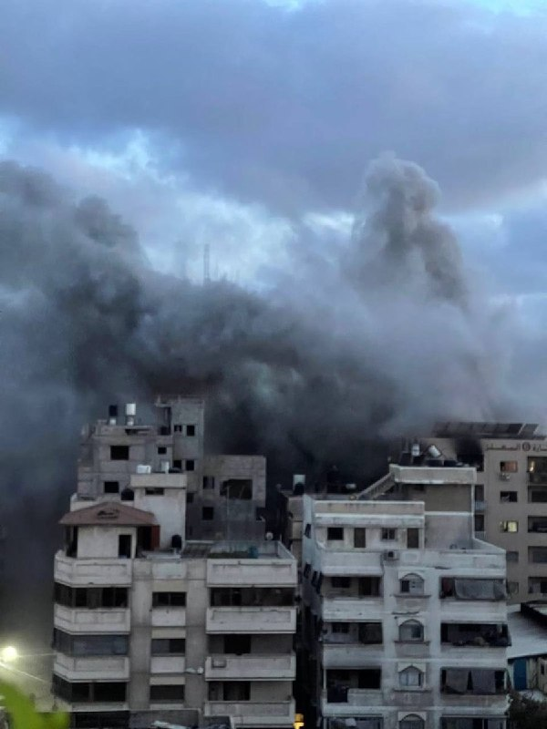

🇮🇱اسرائیل اعلام کرد که در نوار غزه یک حمله انجام داده که هدف آن عزالدین الحداد، رئیس شاخه نظامی حماس بوده است. اسرائیل او را یکی از طراحان حمله ۷ اکتبر معرفی کرده است.

🇮🇱بنیامین نتانیاهو، نخست‌وزیر، و اسرائیل کاتس، وزیر دفاع، اعلام کردند که اسرائیل «به اقدامات خود علیه همه افراد دخیل ادامه خواهد داد».

@mwarmonitor

## mwarmonitor — post 9136

  

✈️ هم‌اکنون یک فروند هواپیمای Boeing E-3B Sentry در حال گشت زنی برفراز خلیج فارس

@mwarmonitor

## FoxNewsTwitter — post 341798

  <a href="telegram/content/FoxNewsTwitter_341798_1778877943.mp4" target="_blank">🎬 Download video</a>

Fox News (Twitter/X)

🍷Cheers to savings! Take $25 OFF any order on the Fox News Wine Shop. Use code CHEERS25 at checkout. bit.ly/4ueKKkV

## FoxNewsTwitter — post 341797

  <a href="telegram/content/FoxNewsTwitter_341797_1778877945.mp4" target="_blank">🎬 Download video</a>

Fox News (Twitter/X)

WATCH: President Trump tells @BretBaier that he is signaling a “neutral” stance on Taiwan security following high-stakes meetings with President Xi, emphasizing his desire to avoid military conflict.

The President confirmed that U.S. policy remains unchanged but expressed hesitation regarding billions of dollars in pending weapons approvals for the island.

"I haven't approved it yet. We're going to see what happens. I may do it. I may not do it... We're not looking to have wars."

Watch the full interview at 6 p.m. ET on @SpecialReport

## FoxNewsTwitter — post 341796

  <a href="telegram/content/FoxNewsTwitter_341796_1778877946.mp4" target="_blank">🎬 Download video</a>

Fox News (Twitter/X)

RT @TheStoryFNC: EXCLUSIVE: @DAGToddBlanche responds as feds charge Iraqi national with plotting to ‘terrorize’ Americans and Jews in retaliation for military action against Iran

## FoxNewsTwitter — post 341795

‌Fox News (Twitter/X)

Read more:

## FoxNewsTwitter — post 341792

Fox News (Twitter/X)

BREAKING: An Iraqi national and senior member of a U.S.-designated terror organization was arrested and brought to New York to face trial on federal terrorism charges.

Mohammad Baqer Saad Dawood al-Saadi is accused of coordinating nearly 20 terror attacks in Europe and plotting additional attacks on U.S. soil.

The suspect is accused of directing strikes on behalf of Iran-backed Islamist group Ashab al-Yamin since March.

The FBI said it took action after learning that al-Saadi was planning to expand Ashab al-Yamin’s operations to the U.S., allegedly directing individuals to coordinate American terror attacks against synagogues and other Jewish institutions across the country.

## FoxNewsTwitter — post 341791

  <a href="telegram/content/FoxNewsTwitter_341791_1778877948.mp4" target="_blank">🎬 Download video</a>

Fox News (Twitter/X)

A hero cop in Tennessee kicks down the door of a burning apartment building to rescue a mom and her two children from a blazing inferno – carrying out the four-year-old daughter in his arms.

Newly released Ring camera footage shows the officer during the daring rescue.

According to the Chattanooga Police Department, Officer Rogers rushed into the second-floor home after neighbors reported that people were trapped inside.

No injuries were reported, and the fire was brought under control within 20 minutes as the family now raises money for relocation costs through a GoFundMe campaign.

## FoxNewsTwitter — post 341790

  <a href="telegram/content/FoxNewsTwitter_341790_1778877950.mp4" target="_blank">🎬 Download video</a>

Fox News (Twitter/X)

WATCH: Vice President JD Vance delivers a powerful tribute at the 45th Annual National Peace Officers' Memorial Service on Capitol Hill, honoring the "selflessness" of fallen heroes.

Addressing the families and colleagues of the fallen, Vance characterized the life of a peace officer as one defined by an unwavering sense of duty.

"We gather this afternoon to honor men and women who heard the exact same call, men and women whose selflessness led them toward danger when others fled. People who said, send me, not send somebody else, but send me. People whom service was a way of life, not a burden."

## FoxNewsTwitter — post 341789

  <a href="telegram/content/FoxNewsTwitter_341789_1778877951.mp4" target="_blank">🎬 Download video</a>

Fox News (Twitter/X)

RT @SpecialReport: TONIGHT at 6 PM ET: @BretBaier sits down with @POTUS for a full interview on @FoxNews during #SpecialReport. Watch live. #Trump #Interview

## FoxNewsTwitter — post 341788

  <a href="telegram/content/FoxNewsTwitter_341788_1778877953.mp4" target="_blank">🎬 Download video</a>

Fox News (Twitter/X)

BREAKING: U.S. Attorney Jeanine Pirro announces a major crackdown on parents who let their children take part in teen takeovers that have been causing chaos throughout Washington, D.C.

Pirro vows to prosecute parents who fail to supervise their children, threatening the adults with fines and even jail times.

"If the evidence shows the parent knew or should have known or permitted or failed to prevent participation, we're going to charge them."

"If you drop your kid off and you fail to supervise them, or you let them skip school to join the chaos, you are going to face fines, court ordered classes, and possible jail time"

## pm_afshaa — post 90813

  <a href="telegram/content/pm_afshaa_90813_1778877954.webm" target="_blank">🎬 Download video</a>

‏
🔴مایک والتز، سفیر آمریکا در سازمان ملل: یکی از نتایج بزرگ سفر ترامپ به چین این بود که چین موافقت کرده از ایران فاصله بگیره.

💧 Rainbet.com the #1 Non-KYC Crypto Casino & Sportsbook @rainbetcom

😁 @Pm_Afshaa

## pm_afshaa — post 90812

  <a href="telegram/content/pm_afshaa_90812_1778877955.webm" target="_blank">🎬 Download video</a>

🔴نیویورک تایمز: آمریکا محمد بکر سعید داود السعدی، فرمانده ارشد شبه‌نظامی گردان‌های حزب‌الله درعراق، رو دستگیر کرد و علیه‌اش کیفرخواست صادر کرد.

او متهم به طراحی حداقل 18 حمله در اروپا، آمریکا و کانادا از پایان فوریه شده؛ این حملات به عنوان انتقام از حملات آمریکا و اسرائیل علیه جمهوری اسلامی برنامه‌ریزی شده بودن.

💧 Rainbet.com the #1 Non-KYC Crypto Casino & Sportsbook @rainbetcom

😁 @Pm_Afshaa

## pm_afshaa — post 90811

  <a href="telegram/content/pm_afshaa_90811_1778877955.webm" target="_blank">🎬 Download video</a>

🔴سپهوند، عضو کمیسیون انرژی مجلس:
روزانه 30 میلیون لیتر کمبود بنزین داریم و چون در کوتاه‌مدت امکان افزایش تولید وجود نداره، باید مدیریت مصرف سوخت رو جدی گرفت.

💧 Rainbet.com the #1 Non-KYC Crypto Casino & Sportsbook @rainbetcom

😁 @Pm_Afshaa

## pm_afshaa — post 90810

  <a href="telegram/content/pm_afshaa_90810_1778877955.webm" target="_blank">🎬 Download video</a>

🔴کانال 12 به نقل از مقام ارشد اسرائیلی
اسرائیل خودش رو برای احتمال ازسرگیری قریب‌الوقوع جنگ با جمهوری اسلامی آماده میکنه. آمریکا به این نتیجه رسیده که مذاکرات با تهران به بن‌بست رسیده.

💧 Rainbet.com the #1 Non-KYC Crypto Casino & Sportsbook @rainbetcom

😁 @Pm_Afshaa

## pm_afshaa — post 90809

🔴آخرین رهبران تروریست باقی مانده از ستاد کل شاخه نظامی رضوان و حماس محمد عوده، رئیس اداره اطلاعات، و عماد آکل، رئیس ستاد جبهه داخلی توسط جنگنده های اسراییل به هلاکت رسیدن

💧 Rainbet.com the #1 Non-KYC Crypto Casino & Sportsbook @rainbetcom

😁 @Pm_Afshaa

## pm_afshaa — post 90806

🔴وزارت خارجه آمریکا : ونزوئلا 7340 کیلوگرم اورانیوم غنی‌شده‌‌‌ش رو به آمریکا منتقل کرد

💧 Rainbet.com the #1 Non-KYC Crypto Casino & Sportsbook @rainbetcom

😁 @Pm_Afshaa

## pm_afshaa — post 90805

  <a href="telegram/content/pm_afshaa_90805_1778877956.mp4" target="_blank">🎬 Download video</a>

هم‌میهنان عزیزم،

در روزهایی که شما با شجاعت در برابر رژیم اشغالگر ایران ایستاده‌اید، این نظام منفور و منزوی، همچنان به تجاوز به جان و مال مردم ادامه می‌دهد تا سرنگونی حتمی خود را اندکی به تعویق اندازد. در چنین شرایطی، وظیفه خود می‌دانم که تصویر عدالت در فردای ایران را برای کسانی که با جنایتکاران همکاری کنند، روشن‌تر ترسیم کنم.

در این راستا، از «کمیته‌ تدوین مقررات عدالت انتقالی ایران» خواستم درباره‌ دو موضوع مهم، نظر مشورتی خود را ارائه کند: نخست، موضوع مسئولیت کیفری افرادی که با ساختارهای سرکوبگر جمهوری اسلامی همکاری می‌کنند؛ و دوم، موضوع مصادره‌ اموال معترضان و خانواده‌های آنان.

این کمیته اکنون نخستین نظر مشورتی خود را صادر کرده و پیام آن روشن است: این اقدامات، همکاری‌های ساده یا بی‌اهمیت نیستند؛ بلکه «یاری‌رسانی به جنایت علیه بشریت» محسوب می‌شوند. هیچ مقام، هیچ دستور و هیچ بهانه‌ای نمی‌تواند مسئولیت کیفری فردی را از میان ببرد. بنابراین، هر فردی که آگاهانه و داوطلبانه با ساختارهای سرکوبگر رژیم همکاری کند، چه در داخل و چه در خارج از ایران، باید بداند که در معرض مسئولیت کیفری قرار خواهد گرفت:

خواه این همکاری از نوع گزارش‌دهی یا خبرچینی باشد؛
خواه از نوع مشارکت در ایست‌های بازرسی‌ باشد؛
خواه از نوع به‌کارگیری کودکان و نوجوانان در سرکوب معترضان باشد؛
و خواه از نوع تحصیل، انتقال یا خرید و فروش اموالی باشد که در جریان سرکوب از معترضان و خانواده‌های آنان مصادره شده‌ است.

از این رو، نه‌تنها افرادی که در صدور دستور، اجرای آن، یا تسهیل این مصادره‌ها نقش دارند در معرض مسئولیت قرار خواهند گرفت، بلکه کسانی که آگاهانه و داوطلبانه به خرید و فروش این اموال می‌پردازند نیز باید پاسخگو باشند. این مسئولیت، استفاده از اموال یا دارایی‌های آنان برای جبران خسارت واردشده به مالکان اصلی را نیز شامل می‌‌شود.

بنابراین، به همه‌ کسانی که امروز در صدد همکاری با دستگاه سرکوب رژیم هستند هشدار می‌دهم: پیش از آن‌که دست به اقدامی بزنید که به مردم ایران آسیب جانی، مالی و یا اجتماعی برساند، به آینده‌ خود و خانواده‌تان بیندیشید. به آن روز بیندیشید که ایران آزاد خواهد شد؛ روزی که حقیقت پنهان نخواهد ماند؛ روزی که اسامی آشکار خواهد شد؛ روزی که هیچ متجاوز و جنایتکاری از پاسخ‌گویی در برابر قانون در امان نخواهد ماند.

آن روز، ملت ایران حکومتی خواهد داشت که حقوق ایرانیان را محترم می‌دارد و ایران را به سرزمینی آزاد و آباد بدل می‌کند.

پاینده ایران،
رضا پهلوی
-----------------------------
متن کامل نظر مشورتی «کمیته‌ تدوین مقررات عدالت انتقالی ایران»:

https://iranopasmigirim.com/fa/transitional-justice

@OfficialRezaPahlavi

## pm_afshaa — post 90804

🔴نخست‌وزیر و وزیر دفاع اسرائیل در بیانیه‌ای اعلام کردند ارتش اسراییل عزالدین حداد، فرمانده شاخه نظامی حماس، را در یک حمله هوایی هدف قرار داده 
💧 Rainbet.com the #1 Non-KYC Crypto Casino & Sportsbook @rainbetcom 
😁 @Pm_Afshaa

## pm_afshaa — post 90803

🔴کانال 13 اسرائیل: سیستم امنیتی معتقد است که ترامپ با حمله‌ای محدود به ایران موافقت خواهد کرد

💧 Rainbet.com the #1 Non-KYC Crypto Casino & Sportsbook @rainbetcom

😁 @Pm_Afshaa

## pm_afshaa — post 90802

🔴نخست‌وزیر و وزیر دفاع اسرائیل در بیانیه‌ای اعلام کردند ارتش اسراییل عزالدین حداد، فرمانده شاخه نظامی حماس، را در یک حمله هوایی هدف قرار داده

💧 Rainbet.com the #1 Non-KYC Crypto Casino & Sportsbook @rainbetcom

😁 @Pm_Afshaa

## pm_afshaa — post 90801

🔴سفارت آمریکا در اسرائیل در حال بررسی صدور دستورالعمل برای خروج فوری شهروندان آمریکایی از تل‌آویو است

💧 Rainbet.com the #1 Non-KYC Crypto Casino & Sportsbook @rainbetcom

😁 @Pm_Afshaa

## pm_afshaa — post 90800

🔴مارکو روبیو: اگر جمهوری اسلامی تصور می‌کند که ما برای رسیدن به یک توافق امتیازاتی خواهيم داد، سخت در اشتباه است؛ تحت هیچ شرایطی یک توافق بد با ایران را نخواهیم پذیرفت

💧 Rainbet.com the #1 Non-KYC Crypto Casino & Sportsbook @rainbetcom

😁 @Pm_Afshaa

## iaghapour — post 2613

  

⚠️ حرف‌زدن درباره‌ی قطعی #اینترنت شاید فوری اینترنت را برنگرداند؛ اما #سکوت دقیقاً همان چیزی است که ادامه‌ی این وضعیت به آن نیاز دارد.

🆔 @iaghapour

## DEJradio — post 4656

  

هم‌میهنان عزیزم، در روزهایی که شما با شجاعت در برابر رژیم اشغالگر ایران ایستاده‌اید، این نظام منفور و منزوی، همچنان به تجاوز به جان و مال مردم ادامه می‌دهد تا سرنگونی حتمی خود را اندکی به تعویق اندازد. در چنین شرایطی، وظیفه خود می‌دانم که تصویر عدالت در فردای…

## DEJradio — post 4655

  <a href="telegram/content/DEJradio_4655_1778877957.mp4" target="_blank">🎬 Download video</a>

📡📢 دژ هم‌صدای شما

ملیکا رضاپور
مجری

#دژ
@DEJradio

## DEJradio — post 4654

  <a href="telegram/content/DEJradio_4654_1778877959.mp4" target="_blank">🎬 Download video</a>

💀
🚨 عزالدین حداد از فرماندهان ارشد حـ.ـماس جمعه ۲۵ اردیبهشت ۱۴۰۵ در غزه کشته شد.

یسرائیل کاتز، وزیر دفاع اسرائیل اعلام کرد ارتش این کشور به دستور بنیامین نتانیاهو و با همکاری شاباک، حداد را که از طراحان حمله مرگبار ۷ اکتبر بود هدف قرار داده است. کاتز گفت حداد مسئول قتل، ربایش و حملات علیه شهروندان و نیروهای اسرائیلی بوده و در نگهداری گروگان‌ها نیز نقش داشته است. وزیر دفاع اسرائیل همچنین تأکید کرد تل‌آویو هر فردی را که در حمله ۷ اکتبر نقش داشته باشد، دیر یا زود پیدا خواهد کرد.

#حماس #حذف_هدفمند
@DEJradio

## DEJradio — post 4653

  <a href="telegram/content/DEJradio_4653_1778877960.mp4" target="_blank">🎬 Download video</a>

هم‌میهنان عزیزم،

در روزهایی که شما با شجاعت در برابر رژیم اشغالگر ایران ایستاده‌اید، این نظام منفور و منزوی، همچنان به تجاوز به جان و مال مردم ادامه می‌دهد تا سرنگونی حتمی خود را اندکی به تعویق اندازد. در چنین شرایطی، وظیفه خود می‌دانم که تصویر عدالت در فردای ایران را برای کسانی که با جنایتکاران همکاری کنند، روشن‌تر ترسیم کنم.

در این راستا، از «کمیته‌ تدوین مقررات عدالت انتقالی ایران» خواستم درباره‌ دو موضوع مهم، نظر مشورتی خود را ارائه کند: نخست، موضوع مسئولیت کیفری افرادی که با ساختارهای سرکوبگر جمهوری اسلامی همکاری می‌کنند؛ و دوم، موضوع مصادره‌ اموال معترضان و خانواده‌های آنان.

این کمیته اکنون نخستین نظر مشورتی خود را صادر کرده و پیام آن روشن است: این اقدامات، همکاری‌های ساده یا بی‌اهمیت نیستند؛ بلکه «یاری‌رسانی به جنایت علیه بشریت» محسوب می‌شوند. هیچ مقام، هیچ دستور و هیچ بهانه‌ای نمی‌تواند مسئولیت کیفری فردی را از میان ببرد. بنابراین، هر فردی که آگاهانه و داوطلبانه با ساختارهای سرکوبگر رژیم همکاری کند، چه در داخل و چه در خارج از ایران، باید بداند که در معرض مسئولیت کیفری قرار خواهد گرفت:

خواه این همکاری از نوع گزارش‌دهی یا خبرچینی باشد؛
خواه از نوع مشارکت در ایست‌های بازرسی‌ باشد؛
خواه از نوع به‌کارگیری کودکان و نوجوانان در سرکوب معترضان باشد؛
و خواه از نوع تحصیل، انتقال یا خرید و فروش اموالی باشد که در جریان سرکوب از معترضان و خانواده‌های آنان مصادره شده‌ است.

از این رو، نه‌تنها افرادی که در صدور دستور، اجرای آن، یا تسهیل این مصادره‌ها نقش دارند در معرض مسئولیت قرار خواهند گرفت، بلکه کسانی که آگاهانه و داوطلبانه به خرید و فروش این اموال می‌پردازند نیز باید پاسخگو باشند. این مسئولیت، استفاده از اموال یا دارایی‌های آنان برای جبران خسارت واردشده به مالکان اصلی را نیز شامل می‌‌شود.

بنابراین، به همه‌ کسانی که امروز در صدد همکاری با دستگاه سرکوب رژیم هستند هشدار می‌دهم: پیش از آن‌که دست به اقدامی بزنید که به مردم ایران آسیب جانی، مالی و یا اجتماعی برساند، به آینده‌ خود و خانواده‌تان بیندیشید. به آن روز بیندیشید که ایران آزاد خواهد شد؛ روزی که حقیقت پنهان نخواهد ماند؛ روزی که اسامی آشکار خواهد شد؛ روزی که هیچ متجاوز و جنایتکاری از پاسخ‌گویی در برابر قانون در امان نخواهد ماند.

آن روز، ملت ایران حکومتی خواهد داشت که حقوق ایرانیان را محترم می‌دارد و ایران را به سرزمینی آزاد و آباد بدل می‌کند.

پاینده ایران،
رضا پهلوی
-----------------------------
متن کامل نظر مشورتی «کمیته‌ تدوین مقررات عدالت انتقالی ایران»:

https://iranopasmigirim.com/fa/transitional-justice

@OfficialRezaPahlavi

## VahidOnline — post 75491

  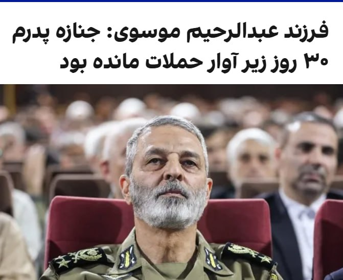

فرزند عبدالرحیم موسوی، رییس ستاد کل نیروهای مسلح جمهوری اسلامی، گفت که جنازه پدرش که در نخستین روز حملات اسرائیل و آمریکا به دفتر خامنه‌ای کشته شد، نزدیک به ۳۰ روز زیر آوار مانده بود.
موسوی پس از کشته شدن محمد باقری در جنگ ۱۲ روزه، به‌عنوان رییس ستاد کل نیروهای مسلح منصوب شد.
@VahidOOnLine

📡 @VahidOnline

## VahidOnline — post 75488

  <a href="telegram/content/VahidOnline_75488_1778877961.mp4" target="_blank">🎬 Download video</a>

بنیامین نتانیاهو، نخست‌وزیر و یسرائیل کاتز، وزیر دفاع اسرائیل در بیانیه‌ای اعلام کردند ارتش این کشور، عزالدین حداد، فرمانده شاخه نظامی حماس، را در یک حمله هوایی هدف قرار داده است.
عزالدین حداد، از فرماندهان ارشد گردان‌های عزالدین قسام، شاخه نظامی حماس است.
@VahidOOnLine

📡 @VahidOnline

## VahidOnline — post 75487

  

رضا سپهوند، عضو کمیسیون انرژی مجلس شورای اسلامی از کمبود روزانه دست‌کم «۲۰ میلیون لیتر بنزین» در ایران خبر داد.

به نوشته خبرگزاری تسنیم، این نماینده گفته که تولید روزانه بنزین در ایران بین « ۱۱۰ تا ۱۱۵ میلیون لیتر» و مصرف روزانه بین «۱۳۰ تا ۱۳۵ میلیون لیتر» است.
سپهوند با بیان اینکه «در کوتاه‌مدت امکان افزایش تولید وجود ندارد»، خواستار جدی‌گرفتن «مدیریت مصرف سوخت» شد.
پیش از این وزیر خزانه‌داری ایالات متحده گفته بود ایران به‌زودی با «کمبود بنزین» مواجه خواهد شد.

اسکات بسنت با انتشار مطلبی کوتاه در شبکۀ ایکس، نوشته بود: «در حالی‌که باقی‌ماندۀ سران سپاه پاسداران، مثل موش‌هایی که در لوله‌های فاضلاب غرق می‌شوند، گیر افتاده‌اند، به لطف محاصرۀ دریایی ایالات متحده، صنایع نفتی آسیب‌دیدۀ ایران، در حال از کار افتادن و توقف تولید است. پمپاژ نفت به زودی متوقف خواهد شد».
او سپس پیامش را به سبک دونالد ترامپ، با جمله‌ای که به‌طور کامل با حروف بزرگ نوشته شده، به پایان برده بود؛ جمله‌ای با این مضمون هشدار آمیز: «مرحلۀ بعد،‌ کمبود بنزین در ایران!»
@VahidHeadline

📡 @VahidOnline

## VahidOnline — post 75486

  <a href="telegram/content/VahidOnline_75486_1778877962.mp4" target="_blank">🎬 Download video</a>

کاوه مدنی: وضعیت دردآور جزیره مارو (شیدور) ملقب به «مالدیو ایران»
نشت نفت به #خلیج_فارس پس از حمله به تأسیسات نفتی جزیره لاوان در فروردین ماه عامل این فاجعه بود.
#جزیره_مارو
[با کیفیت بیشتر: ۶۰ مگابایت]
KavehMadani
برشی از سی‌ثانیه سوم ویدیوی بالا درباره وضعیت ساحل بیشتر مورد توجه قرار گرفته: AzamBahrami

📡 @VahidOnline

## kianmeli1 — post 87423

‏🔴به گزارش فرانس ۲۴ مقام‌های آمریکایی محمد باقر سعد داوود الساعدی، شهروند عراقی را به اتهام طراحی دست‌کم ۱۸ حمله «تروریستی» در اروپا در واکنش به جنگ آمریکا علیه جمهوری اسلامی بازداشت و متهم کردند

‏براساس این گزارش او متهم است در حملاتی از جمله آتش‌زدن یک بانک در آمستردام و حمله با چاقو به چند مرد یهودی در لندن نقش داشته، او ماه گذشته قصد حمله به یک کنیسه در نیویورک را داشته و تصاویر و نقشه‌هایی از مراکز یهودی در لس‌آنجلس و اسکاتسدیل آریزونا را در اختیار یک مامور مخفی قرار داده است.او همچنین به مشارکت در دو حمله اخیر در کانادا، شامل حمله به یک کنیسه و تیراندازی به کنسولگری آمریکا در تورنتو در ماه مارس، متهم شده است
https://t.me/kianmeli1

## kianmeli1 — post 87422

‏🔴آلیس روفو، معاون وزیر نیروهای مسلح فرانسه اعلام کرد که «شارل دوگل» ناو هواپیمابر فرانسه برای مداخله در صورت تشکیل یک ماموریت «بی‌طرف» جهت بازگرداندن آزادی کشتیرانی در تنگه هرمز ‌مستقر شده است
https://t.me/kianmeli1

## kianmeli1 — post 87421

🔴دقایقی پیش فرمانده حماس کشته شد ‏ نخست‌وزیر و وزیر دفاع اسرائیل در بیانیه‌ای اعلام کردند ارتش این کشور عزالدین حداد، فرمانده شاخه نظامی حماس، را در یک حمله هوایی هدف قرار داده است https://t.me/kianmeli1

## kianmeli1 — post 87420

‏🔴روابط عمومی هیات کوهنوردی استان همدان اعلام کرد که پس از گذشت چهار ماه از مفقود شدن چهار کوهنورد در ارتفاعات الوند، پیکر چهارمین کوهنورد در روز جمعه ۲۵ اردیبهشت پیدا شد
https://t.me/kianmeli1

## kianmeli1 — post 87419

‏🔴مدیر جهاد کشاورزی کازرون اعلام کرد که در پی آتش‌سوزی در مزارع گندم روستای علی‌آباد دوتو در بخش مرکزی این شهرستان، ۲۰ هکتار از مزارع خسارت دید
https://t.me/kianmeli1

## kianmeli1 — post 87418

  

🔴سی ان‌ ان
هکرهای ایرانی با سوءاستفاده از یک نقص جزئی: بدون رمز عبور، به مانیتورهای سوخت پمپ بنزین‌های ایالات متحده نفوذ کردند.

آنها خوانش‌ها را جعل کردند اما نتوانستند به سطح واقعی سوخت دست بزنند.
https://t.me/kianmeli1

## kianmeli1 — post 87417

  

🔴توئیت عجیب ترامپ
https://t.me/kianmeli1

## kianmeli1 — post 87416

  <a href="telegram/content/kianmeli1_87416_1778877963.mp4" target="_blank">🎬 Download video</a>

🔴 ترامپ اعلام کرد که یک دور دیگر از عملیات نظامی آمریکا در ایران در راه است:
‏​
‏ما از نظر نظامی در ایران تقریباً کار را تمام کردیم. حدود ۷۵٪ کار را. (البته) ما همه چیز را تمام نکردیم. برمی‌گردیم و آن را تکمیل می‌کنیم. حتی شاید بیشتر.
‏​
‏ممکن است مجبور شویم کمی کارِ پاکسازی انجام دهیم، چون یک آتش‌بسِ حدوداً یک‌ماهه داشتیم.
‏​
‏ما در حقیقت آتش‌بس را به درخواست کشورهای دیگر انجام دادیم.
‏​
‏من خودم چندان موافق آن نبودم، اما این کار را به عنوان لطفی به پاکستان انجام دادیم، آدم‌های فوق‌العاده‌ای هستند، فیلد مارشال و نخست‌وزیر.»
https://t.me/kianmeli1

## kianmeli1 — post 87415

  <a href="telegram/content/kianmeli1_87415_1778877964.mp4" target="_blank">🎬 Download video</a>

🔴۳۰ روز طول کشید تا جنازه عبدالرحیم موسوی، رئیس سابق ستاد کل نیروهای مسلح، پیدا شود
https://t.me/kianmeli1

## kianmeli1 — post 87414

  <a href="telegram/content/kianmeli1_87414_1778877966.mp4" target="_blank">🎬 Download video</a>

🔴تصاویری از پایان سفر پرزیدنت ترامپ به چین
https://t.me/kianmeli1

## kianmeli1 — post 87413

🔴شبکه 13 اسرائیل: ساختار امنیتی [در اسرائیل] بر این ارزیابی است که ترامپ با انجام حمله‌ای محدود به ایران موافقت خواهد کرد.
https://t.me/kianmeli1

## kianmeli1 — post 87412

  <a href="telegram/content/kianmeli1_87412_1778877967.mp4" target="_blank">🎬 Download video</a>

🔴دقایقی پیش فرمانده حماس کشته شد
‏
نخست‌وزیر و وزیر دفاع اسرائیل در بیانیه‌ای اعلام کردند ارتش این کشور عزالدین حداد، فرمانده شاخه نظامی حماس، را در یک حمله هوایی هدف قرار داده است
https://t.me/kianmeli1

## IranIntlTV — post 337389

اسرائیل از هدف قرار دادن رهبر شاخه نظامی حماس در غزه خبر داد

اسرائیل اعلام کرد جمعه ۲۵ اردیبهشت در حمله‌ای در غزه، عزالدین حداد، رهبر شاخه نظامی حماس را هدف قرار داده است.

بنیامین نتانیاهو، نخست‌وزیر اسرائیل، و اسرائیل کاتس، وزیر دفاع، در بیانیه‌ای مشترک اعلام کردند حداد «مسئول قتل، ربایش و آسیب رساندن به هزاران غیرنظامی و نظامی اسرائیلی» بوده است.

آنها اعلام نکردند که آیا معتقدند حداد کشته شده است یا نه. حماس هنوز درباره سرنوشت حداد اظهار نظر نکرده است.

اسرائیل حداد را از طراحان حملات ۷ اکتبر ۲۰۲۳ توصیف کرده است. عزالدین حداد پس از کشته شدن محمد سنوار، برادر یحیی سینوار و فرمانده این گروه در مه ۲۰۲۵، به فرماندهی نظامی حماس در نوار غزه رسید.

حداد بالاترین مقام حماس است که از زمان توافق مورد حمایت آمریکا در ماه اکتبر که قرار بود درگیری‌ها در غزه را متوقف کند، هدف حمله اسرائیل قرار گرفته است.

مذاکرات اسرائیل و حماس برای پیشبرد طرح پساجنگ دونالد ترامپ برای غزه همچنان در بن‌بست باقی مانده است.

گفته شده است که این حمله به‌دستور مستقیم بنیامین نتانیاهو، نخست‌وزیر اسرائیل، انجام گرفته است.

به‌گزارش رویترز، امدادگران در غزه اعلام کردند که در حملات هوایی به یک آپارتمان و یک خودرو دست‌کم سه نفر کشته و ۲۰ نفر زخمی شده‌اند. هنوز مشخص نیست که حداد در میان کشته‌شدگان بوده یا نه.

اسرائیل می‌گوید: «حداد مسئول کشتار اسرائیلی‌ها بوده است»

امدادگران و شاهدان در غزه گفتند یک حمله هوایی، آپارتمانی را در منطقه ریمال در شهر غزه هدف قرار داده که دست‌کم یک نفر را کشته و چندین نفر دیگر را زخمی کرده است. هویت فرد کشته‌شده هنوز مشخص نیست.

به گفته امدادگران و شاهدان، اندکی بعد حمله هوایی دیگری یک خودرو را در خیابانی نزدیک هدف قرار داد. گزارشی فوری از تلفات این حمله دوم منتشر نشده است.

اسرائیل در پنج هفته‌ای که از توقف جنگ مشترک با آمریکا علیه جمهوری اسلامی می‌گذرد، حملات خود به غزه را تشدید کرده و تمرکز آتش خود را دوباره بر این منطقه معطوف کرده است؛ جایی که ارتش معتقد است نیروهای حماس در حال تقویت کنترل خود هستند.

توافقی که در ماه اکتبر به دست آمد، پس از دو سال جنگ میان اسرائیل و حماس، درگیری‌های گسترده را متوقف کرد اما تلاش‌ها برای دستیابی به یک راه‌حل دائمی، شامل خروج نیروهای اسرائیلی، خلع سلاح شبه‌نظامیان و بازسازی این منطقه، با مشکل مواجه شده است.

نیروهای اسرائیلی همچنان بیش از نیمی از خاک غزه را در اشغال دارند؛ جایی که بیشتر ساختمان‌های باقی‌مانده را تخریب کرده و به ساکنان دستور تخلیه داده‌اند.

اکنون بیش از دو میلیون نفر در نوار باریکی در امتداد ساحل عمدتا در ساختمان‌های آسیب‌دیده یا چادرهای موقت زندگی می‌کنند، در حالی که نیروهای حماس عملا کنترل این منطقه را در دست دارند.

بر اساس آمارهایی که میان نیروهای نظامی و غیرنظامیان تفکیک قائل نمی‌شود، از زمان آتش‌بس اکتبر تاکنون حدود ۸۵۰ فلسطینی در حملات اسرائیل کشته شده‌اند. در همین مدت، چهار سرباز اسرائیلی نیز به‌دست شبه‌نظامیان کشته شده‌اند. حماس آمار تلفات نیروهای خود را اعلام نمی‌کند.

🔗وب‌سایت ایران‌اینترنشنال
@iranintltv

## IranIntlTV — post 337388

  <a href="https://t.me/IranintlTV/337388" target="_blank">📎 Download file</a>

🎧نسخه صوتی ۲۴ با فرداد فرحزاد: ترامپ: توقف ۲۰ ساله غنی‌سازی ایران قابل بررسی است
@iranintlTV

## IranIntlTV — post 337387

  <a href="telegram/content/IranIntlTV_337387_1778877968.mp4" target="_blank">🎬 Download video</a>

ابراهیم حامدی، ابی، و شاهین نجفی ترانه جدیدی با نام «شاهراه» منتشر کرده‌اند؛ اثری که به گفته آن‌ها از امید و ایستادگی می‌گوید.

گفت‌وگو با ابراهیم حامدی و شاهین نجفی، خواننده
@iranintltv

## IranIntlTV — post 337386

  <a href="telegram/content/IranIntlTV_337386_1778877970.mp4" target="_blank">🎬 Download video</a>

عباس عراقچی گفت در روزهای اخیر پیام‌هایی از سوی آمریکا دریافت شده که نشان‌دهنده تمایل واشینگتن به ادامه مذاکرات است.

همزمان محمدعلی جعفری، فرمانده قرارگاه بقیه‌الله سپاه، گفت آغاز دوباره جنگ به ضرر آمریکا خواهد بود.

گفت‌وگو با جابر رجبی، تحلیل‌گر سیاسی
@iranintltv

## IranIntlTV — post 337385

یکی از فرماندهان کتائب حزب‌الله عراق در آمریکا محاکمه می‌شود

مقام‌های فدرال در آمریکا اعلام کردند که محمد باقر سعد داوود الساعدی، از فرماندهان کتائب حزب‌الله عراق، از گروه‌های نیابتی تحت حمایت جمهوری اسلامی متهم شده است که دیگران را به حمله به منافع آمریکایی و اسرائیلی هدایت و تشویق کرده است.

به‌گفته این مقام‌ها، او به اتهام برنامه‌ریزی برای حمله به اماکن یهودی در ایالات متحده، از جمله یک کنیسه در شهر نیویورک، تحت پیگرد قرار گرفته است.

قرار است الساعدی جمعه در دادگاه فدرال منهتن حاضر شود. هنوز مشخص نیست او چگونه بازداشت و به ایالات متحده منتقل شده است.
الیزابت تسورکوف، پژوهشگر روسی-اسرائیلی که در مارس ۲۰۲۳ هنگام انجام تحقیقات دکترا در عراق تسورکوف به مدت ۹۰۳ روز گروگان گروه کتائب حزب‌الله گروگان بود و در سپتامبر ۲۰۲۵ آزاد شد.

بر اساس شکایتی کیفری که جمعه ۲۵ اردیبهشت علنی شد، محمد باقر سعد داوود الساعدی متهم است که از اواخر فوریه تاکنون دست‌کم ۱۸ حمله در اروپا و کانادا را در واکنش به حملات آمریکا و اسرائیل علیه جمهوری اسلامی برنامه‌ریزی کرده است.

طبق این شکایت، الساعدی یکی از فرماندهان کتائب حزب‌الله است؛ گروهی شبه‌نظامی در عراق که به‌عنوان نیروی نیابتی سپاه پاسداران عمل می‌کند و به تهران در گسترش نفوذ خود در منطقه، از جمله از طریق حمله به نیروهای آمریکایی و اهداف دیپلماتیک، کمک کرده است.

در این شکایت آمده است که الساعدی قصد داشته آمریکایی‌ها و یهودیان را در لس‌آنجلس و نیویورک به قتل برساند و برنامه‌ریزی برای حمله به یک کنیسه در نیویورک را آغاز کرده بود.

در شکایت آمده است که الساعدی و همدستانش دست‌کم ۱۸ حمله تروریستی در اروپا و دو حمله دیگر در کانادا را برنامه‌ریزی و هماهنگ کرده‌اند و مسئولیت آنها را بر عهده گرفته‌اند. همچنین او متهم شده که دیگران را برای انجام حملات در داخل آمریکا، از جمله در نیویورک، هدایت و هماهنگ کرده است.

در کیفرخواست همچنین گفته شده که او به‌عنوان یکی از رهبران کتائب حزب‌الله، قاسم سلیمانی، فرمانده پیشین نیروی قدس سپاه پاسداران را می‌شناخت. سلیمانی در سال ۲۰۲۰ در حمله نظامی آمریکا کشته شد.

دولت آمریکا همچنین اعلام کرده که الساعدی با ابومهدی المهندس، رهبر وقت کتائب حزب‌الله که او نیز در همان حمله سال ۲۰۲۰ کشته شد، همکاری نزدیک داشته است.

کتائب حزب‌الله به حمله به پایگاه‌های ارتش آمریکا در عراق و سوریه متهم شده و از سوی ایالات متحده به‌عنوان یک سازمان تروریستی خارجی شناخته می‌شود. این گروه مدت‌ها یکی از مهم‌ترین اجزای شبکه نیروهای نیابتی جمهوری اسلامی در منطقه بوده است.

کتائب حزب‌الله که پس از حمله آمریکا به عراق در سال ۲۰۰۳ شکل گرفت، به یکی از مهم‌ترین گروه‌های تشکیل‌دهنده نیروهای موسوم به بسیج مردمی تبدیل شد؛ ائتلافی از گروه‌های شبه‌نظامی که بعدها در ساختار امنیتی عراق ادغام شد.

با وجود این، مقام‌های آمریکایی می‌گویند این گروه همچنان به‌طور نزدیک از سپاه پاسداران دستور می‌گیرد و در پیشبرد نفوذ منطقه‌ای تهران،‌از جمله از طریق حمله به نیروهای آمریکایی و اهداف دیپلماتیک، نقش دارد.

دامنه فعالیت این گروه فراتر از خاورمیانه چندان روشن نیست و سابقه مستندی از عملیات‌های گسترده جهانی ندارد. در مقایسه با برخی دیگر از متحدان جمهوری اسلامی، از جمله حزب‌الله لبنان و حماس در غزه، کتائب حزب‌الله در جنگ‌های دو سال گذشته در خاورمیانه تا حد زیادی دست‌نخورده باقی مانده است.

مارکو روبیو، وزیر امور خارجه آمریکا، در ماه مارس اعلام کرد که این گروه یک خبرنگار آمریکایی به نام شلی کیتلسون را در بغداد ربوده و بعدا آزاد کرده است.
 
🔗وب‌سایت ایران‌اینترنشنال
@iranintltv

## IranIntlTV — post 337384

  <a href="telegram/content/IranIntlTV_337384_1778877972.mp4" target="_blank">🎬 Download video</a>

با گذشت چند ماه از اعتراضات دی و ناامیدی بخشی از مردم از بهبود اوضاع در ایران، شماری از هنرمندان، تلاش کرده‌اند در حمایت از معترضان و همینطور زنده نگهداشتن امید مردم، نقش داشته باشند. در یکی از تازه‌ترین این تلاش‌‎ها، ابراهیم حامدی، ابی، این بار با شاهین نجفی، ترانه جدیدی به نام شاهراه، منتشر کرده‎‌اند تا از امید و ایستادگی بگویند.
@iranintltv

## IranIntlTV — post 337383

  

🔻پیمان حدادی، مدیرعامل باشگاه پرسپولیس، در یک برنامه تلویزیونی مدعی شد افشین پیروانی برای سفر به کشوری غیر از آمریکا با او هماهنگ کرده بود. او گفت: «تصمیم پیروانی برای سفر به آمریکا شخصی بود. او قبلاً هم به این کشور سفر کرده بود، اما به نظر من در این شرایط سفر به آمریکا درست نبود.»

🔹حدادی گفت: «پیروانی با من هماهنگ کرده بود که برای دیدن خانواده‌اش به کشور دیگری برود. خانواده او به دلیل شرایط جنگی نگران بودند، اما درباره سفر به آمریکا به من چیزی نگفته بود.»

🔹باشگاه پرسپولیس هفته گذشته از اخراج افشین پیروانی، مدیر تیم فوتبال بزرگسالان این باشگاه، به دلیل «سفر به آمریکا» هم‌زمان با عملیات نظامی آمریکا و اسرائیل علیه جمهوری اسلامی خبر داد و اعلام کرد این سفر «مورد تأیید ارکان مدیریتی باشگاه نبوده است.»

🔹با این حال، حدادی امروز گفت دلیل اخراج پیروانی حاضر نشدن او در تمرینات بوده، نه سفر به آمریکا: «تمرینات ما آغاز شد و او در تمرینات حضور پیدا نکرد. در باشگاه کمیته انضباطی داریم که درباره او تصمیم گرفت؛ همان‌طور که درباره سروش رفیعی و میلاد محمدی تصمیم گرفته شد و جریمه شدند.»

@iranintltvsport

## IranIntlTV — post 337382

  <a href="telegram/content/IranIntlTV_337382_1778877974.mp4" target="_blank">🎬 Download video</a>

دونالد ترامپ گفت اگر لازم باشد آمریکا برای گرفتن ذخایر اورانیوم غنی‌شده مستقیما وارد ایران می‌شود. ترامپ گفته در صورت تعهد واقعی تهران، واشینگتن شاید با تعلیق ۲۰ ساله برنامه هسته‌ای موافقت کند، اما ادامه هر برنامه مرتبط با سلاح هسته‌ای توافق را منتفی می‌کند.
@iranintltv

## IranIntlTV — post 337381

  <a href="telegram/content/IranIntlTV_337381_1778877975.mp4" target="_blank">🎬 Download video</a>

یکی از مخاطبان ایران‌اینترنشنال در پیامی می‌گوید وضعیت برگزاری امتحانات دانش‌آموزان پایه‌های هفتم تا دهم در کرمانشاه هنوز مشخص نیست و این بلاتکلیفی باعث نگرانی و فشار روانی شده است. او خواستار تعیین هرچه سریع‌تر وضعیت امتحان‌هاست.

این پیام با هوش مصنوعی خوانده شده است

## IranIntlTV — post 337380

  

رسانه‌های ایران از افزایش نجومی قیمت کولر آبی خبر دادند و افزودند در حال حاضر، قیمت کولرهای آبی از حدود ۲۰ میلیون تومان شروع می‌شود و برخی مدل‌های سلولزی و کم‌مصرف به بالای ۵۰ میلیون تومان رسیده‌اند.
بنا بر این گزارش، بسیاری از خریداران به سمت تعمیر کولرهای قدیمی و خرید مدل‌های دست‌دوم رفته‌اند.

این در حالی است که در سال ۱۴۰۱، ارزانترین کولر آبی در بازار یک میلیون و ۵۰۰ تومان و ارزانترین کولر گازی دیواری نیز ۹ میلیون تومان بوده است.
https://iranintl.com/202605156933

## IranIntlTV — post 337379

🗣روایت شما از بحران اقتصادی و زندگی در آتش‌بس- جمعه ۲۵ اردیبهشت:

🔹روز ۲۰ اردیبهشت رفتم در ملایر دیسک صفحه ماشین بگیرم، قیمت گفت ۶ میلیون تومان، فردایش برای خرید قطعی مراجعه کردم؛ همان را گفت ۱۲ میلیون شده است. قیمت یک قلم جنس در یک روز دو برابر شد.

🔹یک کیلو قهوه گلد را که تا هفته قبل در تهران می‌خریدیم یک میلیون و ۷۰۰ هزار تومان، می‌خریدم امروز خریدم ۵ میلیون و ۳۰۰ هزار تومان!

🔹من یک نقاشم و تنها دلخوشی‌ام نقاشی بود. الان توان خرید بوم ندارم که هیچ، حتی مقوایی که هفته پیش خریدم ۲۵۰ هزار تومان هم این هفته شده ۳۲۰ هزار تومن! مدام باید با ترس خراب‌نکردن و هدر ندادن ابزار و مواد اولیه، نقاشی کنم.

🔹کشاورز هستم. سهمیه کود نسبت به پارسال تقریبا نصف شده و وقتی سهمیه جدید می‌آید کلا دو سه روز مهلت خرید دارد. اگر کسی توانایی خرید نداشته باشد، سهمش می‌سوزد. دولت هم سهم کود دولتی آن فرد را به صورت آزاد می‌فروشد.

🔹بنزین کارت آزاد ۵ هزار تومنی، از ساعت ۹ صبح به بعد دیگر موجود نیست.

🔹یک شانه تخم‌مرغ خریدم ۶۰۰ هزار تومان. دیگر حتی نمی‌شود یک وعده غذای ساده خورد.

🔹قبض برق که هر دوره برای ما ۱۲۰ هزار تومان صادر می‌شد این بار شده یک میلیون و ۲۰۰ هزار تومان، تازه همراه با تهدید قطع فوری!

## IranIntlTV — post 337378

  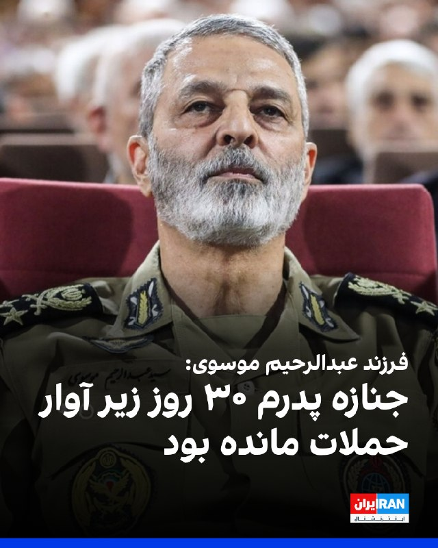

فرزند عبدالرحیم موسوی، رییس ستاد کل نیروهای مسلح جمهوری اسلامی، گفت که جنازه پدرش که در نخستین روز حملات اسرائیل و آمریکا به دفتر خامنه‌ای کشته شد، نزدیک به ۳۰ روز زیر آوار مانده بود.

موسوی پس از کشته شدن محمد باقری در جنگ ۱۲ روزه، به‌عنوان رییس ستاد کل نیروهای مسلح منصوب شد.

https://iranintl.com/202605151477

## IranIntlTV — post 337377

  

به گزارش فرانس۲۴، مقام‌های آمریکایی محمد باقر سعد داوود الساعدی، شهروند عراقی را به اتهام طراحی دست‌کم ۱۸ حمله «تروریستی» در اروپا در واکنش به جنگ آمریکا علیه جمهوری اسلامی بازداشت و متهم کردند.

براساس این گزارش، او متهم است در حملاتی از جمله آتش‌زدن یک بانک در آمستردام و حمله با چاقو به چند مرد یهودی در لندن نقش داشته و ماه گذشته قصد حمله به یک کنیسه در نیویورک را داشته است. همچنین او تصاویر و نقشه‌هایی از مراکز یهودی در لس‌آنجلس و اسکاتسدیل آریزونا را در اختیار یک مامور مخفی قرار داده است.

بر اساس این گزارش، او همچنین به مشارکت در دو حمله اخیر در کانادا، شامل حمله به یک کنیسه و تیراندازی به کنسولگری آمریکا در تورنتو در ماه مارس، متهم شده است.
https://iranintl.com/202605155558

## IranIntlTV — post 337376

  <a href="https://t.me/IranintlTV/337376" target="_blank">📎 Download file</a>

🎧نسخه صوتی حرف آخر با پوریا زراعتی - بزودی: عملیات 'پاکسازی' در ایران
@iranintlTV

## IranIntlTV — post 337375

  

جعفر قادری، نماینده شیراز در مجلس گفت: «امارات متحده عربی در جنگ نشان داده که به لانه‌ای برای اسرائیل تبدیل شده و در این راستا نیز هیچ کوتاهی نکرده است.»

او افزود: «این کشور در آینده جایی در مناسبات ما نخواهد داشت و نباید اجازه دهیم سرمایه‌گذاری‌های جدیدی در این کشور رقم بخورد.»

او ادامه داد: «امارات متحده عربی دارد مسیر اسرائیل را می‌رود و در دامن آن‌ها افتاده که این خطرناک است، البته در زمان خودش پاسخ خوش خدمتی‌هایش را به گونه‌ای خواهد گرفت که در اذهان باقی بماند.»
https://iranintl.com/202605153473

## IranIntlTV — post 337374

  <a href="telegram/content/IranIntlTV_337374_1778877979.mp4" target="_blank">🎬 Download video</a>

یکی از مخاطبان ایران‌اینترنشنال که از مشهد پیام داده می‌گوید برای کار روی پایان‌نامه خود ناچار به تهیه اینترنت پرسرعت شده که با احتساب مالیات حدود ۲ میلیون و ۱۷۰ هزار تومان هزینه داشته است. او می‌گوید برای چیزی که «حقمان است» هزینه سنگین پرداخت می‌کنند، اما دسترسی و کیفیت خدمات پاسخگوی نیاز او نیست. این پیام با هوش مصنوعی خوانده شده است.

بازخوانی این پیام و ساخت تصویر برای آن با هوش مصنوعی انجام گرفته است.

## IranIntlTV — post 337373

در میانه تنش‌ها با تهران، ابوظبی روابط دفاعی و انرژی خود با هند را گسترش می‌دهد

وزارت امور خارجه هند اعلام کرد که این کشور و امارات متحده عربی بر سر چارچوب یک مشارکت راهبردی دفاعی به توافق رسیده‌اند. این توافق در جریان سفر نارندرا مودی به ابوظبی و در میانه تشدید تنش‌ها میان امارات و جمهوری اسلامی به دست آمده است.

وزارت امور خارجه هند، جمعه ۲۵اردیبهشت، افزود که دو کشور در جریان این سفر، همچنین توافق‌نامه‌هایی درباره ذخایر راهبردی نفت و تأمین گاز نفتی مایع (ال‌پی‌جی) امضا کرده‌اند.

در بیانیه وزارت امور خارجه هند آمده است: «دو طرف بر تعمیق همکاری‌های صنعتی دفاعی و همکاری در زمینه نوآوری و فناوری پیشرفته، آموزش، رزمایش‌ها، امنیت دریایی، دفاع سایبری، ارتباطات امن و تبادل اطلاعات توافق کرده‌اند.»

پیش از این سفر، منابع هندی به رویترز گفته بودند که مودی احتمالا درباره قراردادهای بلندمدت تامین انرژی گفت‌وگو خواهد کرد و همچنین به‌دنبال جلب حمایت برای گسترش ذخایر راهبردی نفت هند خواهد بود.

تقویت روابط دفاعی و انرژی امارات و هند در شرایطی صورت می‌گیرد که در جریان جنگ اخیر، روابط تهران و ابوظبی به شدت تیره شد و جمهوری اسلامی حملات پهپادی و موشکی را علیه تاسیسات نفت و انرژی امارات انجام داد.

همچنین روزنامه وال‌استریت ژٰورنال ۲۱ اردیبهشت به‌نقل از منابع آگاه خبر داد که امارات متحده عربی به‌طور مخفیانه حملاتی علیه جمهوری اسلامی انجام و در یکی از این حملات در ماه آوریل پالایشگاه نفتی جزیره لاوان ایران را هدف قرار داده است.

در حالی که هند، امارات و جمهوری اسلامی عضو بریکس هستند، وزارت امور خارجه هند جمعه در پایان نشست سالانه وزیران امور خارجه این گروه در دهلی نو به جای انتشار بیانیه مشترک، بیانیه‌ای به عنوان رییس نشست صادر کرد و اعلام کرد میان برخی اعضا درباره وضعیت خاورمیانه اختلاف نظر وجود دارد.

بسته شدن تنگه هرمز از سوی جمهوری اسلامی بازارهای جهانی انرژی را متلاطم و حمل‌ونقل و تجارت در سراسر منطقه را مختل کرده است.

تاثیر خروج امارات از اوپک بر کمک به هند
با تصمیم امارات برای خروج از اوپک در ماه گذشته، انتظار می‌رود ظرفیت تولید این کشور افزایش یابد و به واردکنندگانی مانند هند کمک کند.

طبق توافق نفتی اعلام‌شده در روز جمعه، احتمال افزایش ذخیره‌سازی نفت خام شرکت دولتی نفت ابوظبی «ادنوک» در هند تا سقف ۳۰ میلیون بشکه وجود دارد. این شرکت در بیانیه‌ای جداگانه اعلام کرد که این توافق همچنین امکان ذخیره‌سازی نفت خام در فجیره امارات را به‌عنوان بخشی از ذخایر راهبردی هند بررسی می‌کند.

شرکت «ادنوک» همچنین اعلام کرد که گسترش تامین و فرصت‌های تجاری گاز نفتی مایع (ال‌پی‌جی) با شرکت «ایندین اویل کورپوریشن» را بررسی خواهد کرد.

سلطان احمد الجابر، مدیرعامل و مدیر اجرایی «ادنوک»، گفت: «مقیاس و مسیر رشد هند، آن را به یکی از تعیین‌کننده‌ترین بازارهای انرژی عصر ما تبدیل کرده است. با شتاب گرفتن تقاضا هم‌زمان با رشد سریع جمعیت، اهمیت مشارکت انرژی میان امارات و هند بیش از پیش حیاتی می‌شود.»

نگاه امارات و هند به روابط نزدیک‌ عربستان و پاکستان
امارات متحده عربی سومین شریک تجاری بزرگ هند است. دهلی نو و ابوظبی در ماه ژانویه قراردادی سه میلیارد دلاری برای خرید گاز طبیعی مایع (ال‌ان‌جی) امارات از سوی هند امضا کرده بودند. همچنین نامه‌ای برای همکاری در جهت شکل‌گیری یک مشارکت راهبردی دفاعی میان دو کشور امضا شد.

این توافق‌ها پس از آن صورت گرفت که پاکستان، رقیب دیرینه هند، سال گذشته توافق دفاعی متقابلی با عربستان سعودی امضا کرد.

پاکستان به میانجی اصلی میان واشینگتن و تهران برای پایان دادن به جنگی تبدیل شده که با حملات ایالات متحده و اسرائیل به جمهوری اسلامی در نهم اسفند آغاز شد. همچنین پاکستان برای تقویت دفاع عربستان سعودی پس از آنکه این کشور هدف صدها حمله موشکی و پهپادی جمهوری اسلامی قرار گرفت، اقدام کرده است.

ریاض ماه گذشته اعلام کرد که سه میلیارد دلار دیگر برای کمک به پاکستان در پوشش بازپرداخت بدهی اسلام‌آباد به امارات ارائه خواهد کرد.

وزارت امور خارجه هند همچنین جمعه از سرمایه‌گذاری‌های پنج میلیارد دلاری امارات متحده عربی خبر داد و به توافق‌های پیشین از جمله خرید ۶۰ درصد سهام بانک «آر‌بی‌ال» از سوی «امیراتس ان‌بی‌دی» به ارزش سه میلیارد دلار در سال گذشته، و سرمایه‌گذاری یک میلیارد دلاری شرکت «آی‌اچ‌سی» ابوظبی در پروژه «سمّان» اشاره کرد.
 
🔗وب‌سایت ایران‌اینترنشنال
@iranintltv

## IranIntlTV — post 337372

  

گلرخ ایرایی، زندانی سیاسی، در پیامی از بند زنان زندان اوین به مناسبت اعطای جایزه «آزادی نوشتن» از سوی انجمن قلم آمریکا، نوشت: «می‌نویسیم حتی اگر آزادی‌مان به بند کشیده شود؛ حتی اگر مورد تهدید و تحدید قرار بگیریم و وادار به تبعید یا فدای جان شویم.»

ایرایی در این پیام نوشت، «اینجا بی‌پروا نوشتن از رنج مردمانی که ستم را به پیکار برمی‌خیزند، مجرمانه است و آنان که با قلم تباهی درد را به چشم جهانیان پدیدار می‌کنند، در سکوت فرسوده می‌شوند و مجرم‌اند و سزاوار محاکمه!»
او به فقر، نابرابری، سرکوب و «کشتار سیستماتیک» در ایران اشاره کرد و نوشت نوشتن از رنج مردم «تحت ستم»، با همه هزینه‌ها و محدودیت‌ها، «روزنه امیدی» برای ادامه مبارزه است.

این زندانی سیاسی همچنین نوشت «ارتجاع حاکم، آزادی اندیشه و جسارت بیان را برنمی‌تابد، آنگاه که قلم بر چوبه‌های دار افراشته حمله می‌برد و از فقر و نابرابری روایت می‌کند و بازتابی می‌شود از سفره‌های خالی و قیام گرسنگان را نوید می‌دهد.»

او در پایان تاکید کرد: «ما از خفگی رها خواهیم شد و می‌دانیم این جز در حرکتی مشترک میسر نخواهد بود.»
https://iranintl.com/202605159393

## IranIntlTV — post 337371

  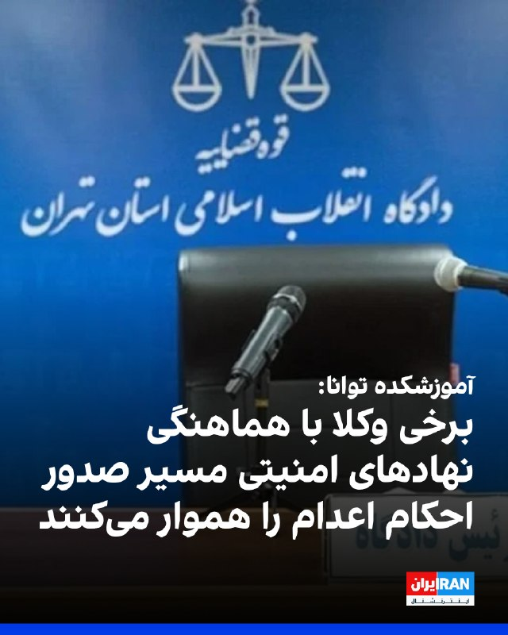

آموزشکده توانا در گزارشی نوشت برخی وکلا با هماهنگی نهادهای امنیتی و قضات دادگاه‌های انقلاب، در پرونده‌های امنیتی به‌جای دفاع از متهمان، با درخواست عفو و «اقرار ضمنی» به اتهام‌ها، مسیر صدور و اجرای احکام سنگین از جمله اعدام را هموار می‌کنند.

بر اساس این گزارش، این وکلا با تجدیدنظرخواهی فوری، فرصت قانونی اعتراض را نیز از متهمان سلب می‌کنند.
این گزارش از «مهدی محرابی» به‌عنوان یکی از این وکلا نام برده و نوشته او در پرونده آتش‌سوزی پایگاه بسیج خیابان نامجو، مربوط به محمدامین بیگلری، امیرحسین حاتمی، علی فهیم و شاهین واحدپرست کلور، چهار معترض اعدام‌شده، نقش داشته است.

در این گزارش همچنین آمده خانواده برخی متهمان امنیتی تحت فشار قرار می‌گیرند تا به‌جای وکلای مستقل، از «وکلای مورد تایید» استفاده کنند؛ اقدامی که به نوشته توانا، در مواردی به صدور احکام اعدام یا حبس‌های طولانی‌مدت منجر شده است.
https://iranintl.com/202605156524

## IranIntlTV — post 337370

  <a href="telegram/content/IranIntlTV_337370_1778877981.mp4" target="_blank">🎬 Download video</a>

🔻هادی چوپان، قهرمان پیشین مسترالمپیا در یک مسابقه استعدادیابی که از صدا و سیمای جمهوری اسلامی پخش می‌شود، گفت: «ما با زحمت و هزار دردسر به قله رسیدیم، نباید بازیچه دلقکان مجازی شویم.»

@iranintltvsport

## Shin_Persian — post 6019

↩️ Quoted tweet: Emanuel (Mannie) Fabian ✓ @manniefabian Fri, 15 May 2026 17:18:34 UTC A senior Israeli security official tells reporters that there are "initial indications" that Izz al-Din al-Haddad was killed in the airstrike in Gaza City a short while…

## Shin_Persian — post 6018

↩️ Quoted tweet:
Emanuel (Mannie) Fabian ✓ @manniefabian
Fri, 15 May 2026 17:18:34 UTC

A senior Israeli security official tells reporters that there are "initial indications" that Izz al-Din al-Haddad was killed in the airstrike in Gaza City a short while ago.

↩️ توییت نقل‌قول شده — برای پاسخ، پست زیر را ببینید.

فارسی

یک مقام ارشد امنیتی اسرائیل به خبرنگاران می‌گوید که «نشانه های اولیه» وجود دارد که نشان می‌دهد عزالدین الحداد در حمله هوایی اندکی پیش در شهر غزه کشته شده است.

𝕏 · @shin_persian

## Shin_Persian — post 6017

↩️ Quoted tweet: Shin ✓ @hey_itsmyturn Fri, 15 May 2026 17:04:22 UTC Gazans report a blitz airstrike on western Gaza, highly likely a targeted assassination. ↩️ توییت نقل‌قول شده — برای پاسخ، پست زیر را ببینید. فارسی ساکنان غزه از یک حمله هوایی برق‌آسا…

## Shin_Persian — post 6016

↩️ Quoted tweet:
Shin ✓ @hey_itsmyturn
Fri, 15 May 2026 17:04:22 UTC

Gazans report a blitz airstrike on western Gaza, highly likely a targeted assassination.

↩️ توییت نقل‌قول شده — برای پاسخ، پست زیر را ببینید.

فارسی

ساکنان غزه از یک حمله هوایی برق‌آسا به غرب غزه خبر می‌دهند که به احتمال بسیار زیاد یک ترور هدفمند است.

𝕏 · @shin_persian

## Shin_Persian — post 6015

Shin ✓ @hey_itsmyturn
Fri, 15 May 2026 17:04:22 UTC

Gazans report a blitz airstrike on western Gaza, highly likely a targeted assassination.

فارسی

ساکنان غزه از یک حمله هوایی برق‌آسا به غرب غزه خبر می‌دهند که به احتمال بسیار زیاد یک ترور هدفمند بوده است.

𝕏 · @shin_persian

## ManotoTV — post 105501

  <a href="telegram/content/ManotoTV_105501_1778877982.mp4" target="_blank">🎬 Download video</a>

‌
شیخ خالد بن محمد بن زاید، ولیعهد ابوظبی، اعلام کرد پروژه «خط لوله غرب به شرق» با هدف افزایش صادرات نفت از بندر فجیره و «پاسخ به تقاضای جهانی» با سرعت بیشتری اجرا خواهد شد.

بر اساس اعلام مقام‌های امارات، این پروژه ظرفیت صادرات نفت از مسیر فجیره را دو برابر می‌کند و قرار است تا سال ۲۰۲۷ به بهره‌برداری برسد.

پس از جنگ آمریکا و اسرائیل با جمهوری اسلامی و افزایش تنش‌ها در تنگه هرمز، کشورهای خلیج فارس به دنبال مسیرهای جایگزین برای صادرات نفت و گاز هستند. حدود یک‌پنجم نفت جهان پیش‌تر از تنگه هرمز عبور می‌کرد.

## ManotoTV — post 105500

  <a href="telegram/content/ManotoTV_105500_1778877983.mp4" target="_blank">🎬 Download video</a>

‌
وزارت خارجه آمریکا اعلام کرد آتش‌بس میان اسرائیل و لبنان برای ۴۵ روز دیگر تمدید شده تا فرصت بیشتری برای ادامه مذاکرات فراهم شود.

## ManotoTV — post 105499

  <a href="telegram/content/ManotoTV_105499_1778877983.mp4" target="_blank">🎬 Download video</a>

‌
شاهزاده رضا پهلوی در پیامی ویدیویی خطاب به ملت ایران، درباره همکاری با ساختارهای سرکوبگر جمهوری اسلامی هشدار داد و گفت افرادی که در داخل و خارج کشور آگاهانه در سرکوب معترضان، مصادره اموال شهروندان و همکاری با نهادهای حکومتی نقش داشته باشند، در آینده با «مسئولیت کیفری» روبه‌رو خواهند شد.

او اعلام کرد «کمیته تدوین مقررات عدالت انتقالی ایران» در نخستین نظر مشورتی خود، همکاری با نهادهای سرکوب جمهوری اسلامی را «یاری‌رسانی به جنایت علیه بشریت» دانسته است.

شاهزاده رضا پهلوی تاکید کرد مشارکت در خبرچینی، ایست‌های بازرسی، استفاده از کودکان در سرکوب و خرید و فروش اموال مصادره‌شده معترضان، می‌تواند موجب پیگرد و پاسخگویی قضایی شود.

او همچنین هشدار داد در ایران آزاد، «هیچ جنایتکاری از پاسخ‌گویی در برابر قانون در امان نخواهد بود.»

## ManotoTV — post 105498

  <a href="telegram/content/ManotoTV_105498_1778877985.mp4" target="_blank">🎬 Download video</a>

‌
اسرائیل اعلام کرد در حمله‌ای هوایی، عزالدین الحداد، ارشدترین فرمانده گروه تروریستی حماس در نوار غزه را هدف قرار داده است.

هنوز گزارشی از وضعیت او منتشر نشده و حماس هم واکنشی نشان نداده است.

الحداد در فهرست افراد تحت تعقیب اسرائیل قرار دارد و از سوی اسرائیل به عنوان یکی از «طراحان» حمله تروریستی هفت اکتبر معرفی شده است.

## ManotoTV — post 105497

  <a href="telegram/content/ManotoTV_105497_1778877985.mp4" target="_blank">🎬 Download video</a>

اداره تحقیقات فدرال آمریکا، اف‌بی‌آی، اعلام کرد برای اطلاعاتی که به بازداشت و محکومیت مونیکا ویت، افسر و مأمور سابق ضدجاسوسی ارتش آمریکا متهم به جاسوسی برای جمهوری اسلامی، منجر شود ۲۰۰ هزار دلار جایزه تعیین کرده است.

دفتر اف‌بی‌آی در واشنگتن اعلام کرد مونیکا ویت با وجود صدور کیفرخواست در سال ۲۰۱۹ همچنان متواری است.

او به اتهام جاسوسی و انتقال اطلاعات مرتبط با دفاع ملی آمریکا به ایران تحت پیگرد قرار دارد.

ویت بین سال‌های ۱۹۹۷ تا ۲۰۰۸ در نیروی هوایی آمریکا و دفتر تحقیقات ویژه این نیرو فعالیت می‌کرد و سپس تا سال ۲۰۱۰ به‌عنوان پیمانکار با دولت آمریکا همکاری داشت.

اف‌بی‌آی اعلام کرد او در دوران فعالیت خود به اطلاعات فوق‌محرمانه، از جمله هویت واقعی مأموران مخفی جامعه اطلاعاتی آمریکا، دسترسی داشته است.

بر اساس این بیانیه، ویت در سال ۲۰۱۳ به ایران پناهنده شد و سپس اطلاعات حساسی را در اختیار جمهوری اسلامی قرار داد که برنامه‌های محرمانه آمریکا و امنیت کارکنان آمریکایی را به خطر انداخت.

سی‌ان‌ان پیش‌تر گزارش داده بود مقام‌های آمریکایی معتقدند جمهوری اسلامی او را جذب کرده و ویت پس از فرار به ایران، هویت یک مأمور اطلاعاتی آمریکا و جزئیات یک برنامه فوق‌محرمانه اطلاعاتی را افشا کرده است.

کیفرخواست این پرونده همچنین نام چهار شهروند ایرانی را در ارتباط با اتهام‌هایی از جمله توطئه، تلاش برای هک رایانه‌ای و سرقت هویت ذکر کرده است.

## ManotoTV — post 105496

  <a href="telegram/content/ManotoTV_105496_1778877986.mp4" target="_blank">🎬 Download video</a>

ما صدای فاطمه سپهری هستیم

## ManotoTV — post 105495

  <a href="telegram/content/ManotoTV_105495_1778877988.mp4" target="_blank">🎬 Download video</a>

«صدای فاطمه سپهری و همه زندانیان سیاسی باشیم»

## ManotoTV — post 105494

  <a href="telegram/content/ManotoTV_105494_1778877989.mp4" target="_blank">🎬 Download video</a>

دونالد ترامپ در گفت‌وگو با برت بایر، خبرنگار و مجری فاکس‌نیوز از عملکرد آمریکا در جنگ با جمهوری اسلامی دفاع کرد و گفت واشینگتن با وجود توانایی نابودی کامل زیرساخت‌های ایران، خویشتنداری نشان داده است.

ترامپ در پاسخ به منتقدانی که می‌گویند او وضعیت جنگ را دست‌کم گرفته، گفت: «من هیچ چیزی را دست‌کم نگرفتم. ما ضربه‌ای فوق‌العاده سنگین به آن‌ها زدیم.»

رئیس‌جمهوری آمریکا افزود: «ما پل‌هایشان را باقی گذاشتیم. ظرفیت برقشان را باقی گذاشتیم. می‌توانیم همه آن را ظرف دو روز نابود کنیم. همه‌چیز.»

ترامپ همچنین گفت آمریکا جز بخش مربوط به شیرهای خروج نفت، جزیره خارگ را هدف قرار داده است.

## ManotoTV — post 105493

  <a href="telegram/content/ManotoTV_105493_1778877990.mp4" target="_blank">🎬 Download video</a>

«شما هم به کمپین حمایت از خانم سپهری بپیوندید»

## FarsiVOA — post 217857

🔺اسرائيل به رهبر شاخه نظامی حماس حمله کرد؛ عزالدین حداد یکی از طراحان «قتل‌عام ۷ اکتبر» بود

◾️وزیر دفاع اسرائیل، یسرائیل کاتز، روز جمعه ۲۵ اردیبهشت گفت ارتش اسرائیل به دستور او و نخست‌وزیر اسرائیل، عزالدین حداد، رهبر شاخه نظامی سازمان تروریستی حماس و یکی از طراحان قتل‌عام ۷ اکتبر ۲۰۲۳ را هدف قرار داده است.

⬇️ بیشتر بخوانید:
https://ir.voanews.com/a/iran-hamas-hezbollah-lebanon-october-7-/8150485.html
@FarsiVOA

## FarsiVOA — post 217856

⚡️از «اینترنت پرو» و «قلک» توصیف شده برای همراه اول، ایرانسل، و رایتل تا هشدارها درباره بنزین ۲۰ هزار تومانی؛ فشار اقتصادی و معیشتی بر مردم ایران ادامه دارد.
@FarsiVOA

## FarsiVOA — post 217855

⚡️پیام واشنگتن به زیدی: شراکت، مشروط به مهار گروه‌های وابسته به جمهوری اسلامی و نابودی تروریسم است
@FarsiVOA

## FarsiVOA — post 217854

🔺واکنش نماینده آمریکا در سازمان ملل به ویدیوی آلودگی نفتی در سواحل ایران؛ جمهوری اسلامی «به محیط زیست نیز حمله می‌کند»

◾️مایک والتز، نماینده آمریکا در سازمان ملل متحد، روز جمعه ویدیویی را که گفته می‌شود مربوط به آلودگی نفتی در سواحل ایران در خلیج فارس است، بازنشر کرد.

⬇️ بیشتر بخوانید:
https://ir.voanews.com/a/8150486.html
@FarsiVOA

## FarsiVOA — post 217853

⚡️الهه و الناز محمدی، برنده جایزه «شجاعت در روزنامه‌نگاری» شدند؛ گفت‌و‌گو با سجاد شهرابی، گوینده رادیو و فعال حوزه رسانه، درباره اهمیت این جایزه برای تداوم فعالیت خبرنگاران مستقل در داخل ایران
@FarsiVOA

## FarsiVOA — post 217852

⚡️بی‌اعتنایی جمهوری اسلامی به مصائب ایرانیان؛ وقتی مردم تاوان ماجراجویی‌های رژیم را می‌پردازند
@FarsiVOA

## FarsiVOA — post 217851

🔺تمدید آتش‌بس اسرائیل و لبنان؛ شکست کارزار رژیم ایران برای تخریب مذاکرات

◾️با برگزاری دور دوم گفت‌وگوهای اسرائیل و لبنان در واشنگتن در روز جمعه ۲۵ اردیبهشت، تلاش‌های رژیم ایران و گروه نیابتی لبنانی آن، حزب‌الله، ناکام ماند و آتش‌بس میان اسرائیل و لبنان به مدت ۴۵ روز تمدید شد.

⬇️ بیشتر بخوانید:
https://ir.voanews.com/a/extension-of-israel-lebanon-ceasefire-iran-regime-failure-campaign-undermine-talks/8150445.html
@FarsiVOA

## FarsiVOA — post 217850

⚡️توقف تجارت دریایی جمهوری اسلامی؛ روابط اسرائیل با امارات زیر سایه تهدیدهای رژیم ایران
@FarsiVOA

## FarsiVOA — post 217849

گزارشی از مایکل لیپین، ‌خبرنگار صدای آمریکا، از پکن درباره سفر تاریخی دونالد ترامپ، رئیس جمهوری آمریکا، به چین.

@FarsiVOA

## FarsiVOA — post 217848

🔺طرح سناتور کاتن: محرومیت بستگان تروریست‌ها از سفر و اقامت در آمریکا قانونی و قطعی می‌شود

◾️تام کاتن، سناتور جمهوری‌خواه، روز جمعه ۲۵ اردیبهشت گفت طرحی را ارائه کرده است که در صورت تصویب در کنگره، همه ویزاهای صادرشده برای اعضای «خانواده تروریست‌ها» لغو و صدور ویزاهای جدید برای آنها ممنوع می‌شود.

⬇️ بیشتر بخوانید:
https://ir.voanews.com/a/senator-cotton-tom-visa-immigration-terrorist-congress-iran/8150453.html
@FarsiVOA

## FarsiVOA — post 217847

🔺تسریع پروژه احداث خط لوله نفتی «غرب به شرق» امارات برای دور زدن تنگه هرمز

◾️دفتر رسانه‌ای دولت امارات متحده عربی در ابوظبی، روز جمعه ۲۵ اردیبهشت، اعلام کرد این کشور به منظور دو برابر کردن ظرفیت صادرات نفت خود از طریق فجیره، تا سال ۱۴۰۶، ساخت یک خط لوله جدید نفتی را شتاب می‌بخشد. این اقدام توانایی امارات را برای دور زدن تنگه هرمز به گونه‌ای چشمگیر افزایش می‌دهد.

⬇️ بیشتر بخوانید:
https://ir.voanews.com/a/iran-emirate-uae-oil-hormuz-opec/8150437.html
@FarsiVOA

## FarsiVOA — post 217846

⚡️گفت‌وگو با عسل عباسیان، عضو پیشین کمیته حمایت از روزنامه‌نگاران، در باره جایزه شجاعت برای خواهران محمدی و جایزه انجمن قلم برای دو نویسنده ایرانی گلرخ ایرایی و علی اسداللهی
@FarsiVOA

## FarsiVOA — post 217845

🔺ارتش اسرائیل: در یک هفته ۶۰ تروریست حزب‌الله کشته شدند

◾️ارتش اسرائیل می‌گوید در طول یک هفته حدود ۶۰ تروریست حزب‌الله کشته شدند و عملیات اسرائیل در جنوب لبنان ادامه دارد.

⬇️ بیشتر بخوانید:

https://ir.voanews.com/a/iran-israel-hezbollah-lebanon-washington/8150375.html

## FarsiVOA — post 217844

در گفت‌و‌گو با دامون محمدی، تحلیل‌گر سیاسی، لفاظی‌های بی‌پایان جمهوری اسلامی - از ادعای پس گرفتن بحرین تا وضع عوارض بر فیبر نوری عبوری از تنگه هرمز - را مورد گفت‌و‌گو قرار دادیم.

## FarsiVOA — post 217843

ایران در حالی وارد هفتاد و هفتمین روز از محدودیت‌ها و اختلال گسترده اینترنت بین‌المللی شده است که به گفته نت‌بلاکس، نهاد پایش دسترسی به اینترنت، مجموع ساعات قطعی یا اختلال شدید به بیش از هزار و ۸۲۴ ساعت رسیده است.

این وضعیت در ماه‌های اخیر باعث شکل‌‌گیری نوعی «انزوای دیجیتال» برای شهروندان ایرانی شده است؛ شرایطی که دسترسی به پلتفرم‌های آنلاین، ارتباطات بین‌المللی و تعاملات روزمره با دنیای بیرون را به ‌شدت محدود کرده است.

بر اساس داده‌های منتشرشده، در طول جنگ ۱۲ روزه، اینترنت در ایران ۹ روز قطع بوده است. همچنین در جریان اعتراضات دی‌ماه، این اختلال به ۲۱ روز رسیده و از ۹ اسفند تا امروز نیز ۷۷ روز محدودیت ثبت شده است.

گزارش کامل را در وب‌سایت صدای آمریکا بخوانید.

@FarsiVOA

## FarsiVOA — post 217842

  <a href="telegram/content/FarsiVOA_217842_1778877991.mp4" target="_blank">🎬 Download video</a>

مهدی قدسی در برنامه تفسیر خبر: چین ذخایر استراتژیک خود را پر کرده بود و در مقابل بحران تا چند ماه تاب‌آوری دارد

## FarsiVOA — post 217841

پوشش ویژه | بخشی از سخنرانی معاون رئیس جمهوری آمریکا در مراسم یادبود افسران صلح

## FarsiVOA — post 217840

در حالی که سفر پرزیدنت ترامپ به چین توجه جهان را جلب کرده است، مردم درباره تأثیر این دیدار بر روابط آمریکا و چین، اقتصاد جهانی، و نقش جمهوری اسلامی و خاورمیانه صحبت می‌کنند.

## FarsiVOA — post 217839

کامبیز غفوری در برنامه تفسیر خبر: جمهوری اسلامی اکنون دشمن اصلی اعراب است

## FarsiVOA — post 217838

گفت‌و‌گوی پرزیدنت ترامپ و مرتس همزمان با تشدید جنگ اوکراین و واکنش تند اروپا به روسیه

## DW_Farsi — post 124743

  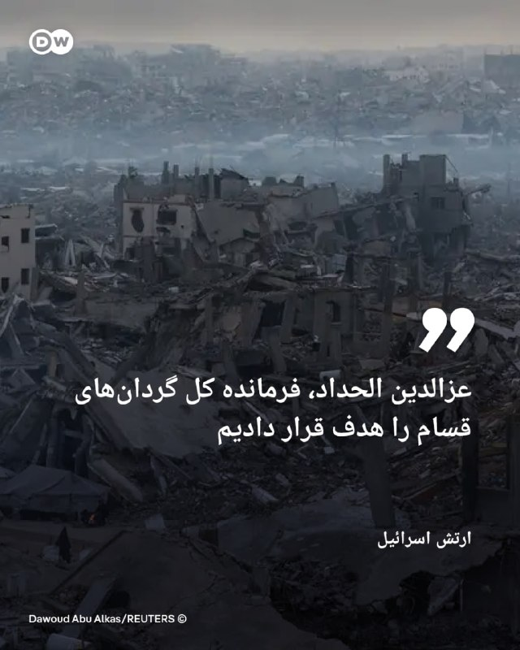

🔶 ارتش اسرائیل: عزالدین الحداد، فرمانده کل گردان‌های قسام را هدف قرار دادیم

اسرائیل از هدف قرار دادن عزالدین الحداد، فرمانده کل گردان‌های قسام خبر داد. یک مقام ارشد اسرائیلی گفته، الحداد یکی از طراحان حمله هفت اکتبر بوده و در ربودن شهروندان اسرائیلی و آمریکایی نقش داشته است.

ارتش اسرائیل روز جمعه ۱۵ مه (۲۵ اردیبهشت) اعلام کرد، عزالدین الحداد، فرمانده کل گردان‌های قسام (شاخه نظامی حماس) در طی حمله‌ای به غزه کشته شده است.

تایمز اسرائیل به نقل از یک مقام ارشد اسرائیلی نوشته است، " الحداد یکی از موانع اصلی اجرای طرح ۲۰ ماده‌ای دونالد ترامپ، رئیس‌جمهور آمریکا برای پایان دادن به جنگ غزه نیز بوده است".

این مقام ارشد اسرائیلی گفته است: «این تروریست ارشد به‌طور آشکار تلاش‌های ترامپ و هیئت صلح برای خلع سلاح حماس و غیرنظامی‌سازی نوار غزه به‌منظور ایجاد امنیت و رفاه برای اسرائیلی‌ها و مردم غزه را تضعیف کرده بود.»
@dw_farsi

## DW_Farsi — post 124741

  

🔶 ۲۰ ایرانی و ۱۱ پاکستانی گرفتار در کشتی‌های توقیف‌شده به کشورشان بازگشتند

در حالی که مذاکرات میان جمهوری اسلامی و ایالات متحده در بن‌بست است، پاکستان از بازگرداندن ملوانان ایرانی و پاکستانی که در کشتی‌های توقیف‌شده از سوی آمریکا حضور داشتند، خبر داده است.

دریانوردان ایرانی از طریق پاکستان به ایران منتقل خواهند شد.

محمد اسحاق دار، وزیر خارجه پاکستان با اعلام این خبر و با انتشار پیامی در شبکه اجتماعی ایکس نوشت: «۱۱ شهروند پاکستانی و ۲۰ شهروند ایرانی از سنگاپور به بانکوک رسیده‌اند و هم‌اکنون سوار پروازی هستند که امشب به اسلام‌آباد خواهد رسید. سپس بازگشت شهروندان ایران تسهیل خواهد شد.»

وزیر خارجه پاکستان با بیان اینکه این ۲۰ ایرانی و ۱۱ پاکستانی سوار بر کشتی‌هایی بوده‌اند که در آب‌های آزاد توسط ایالات متحده توقیف شده بود، افزود: «تمام افراد در سلامت کامل و با روحیه خوب هستند.»

پاکستان پیش‌تر در اوایل ماه مه نیز از بازگرداندن ملوانان ایرانی خبر داده بود.
@dw_farsi

## DW_Farsi — post 124740

  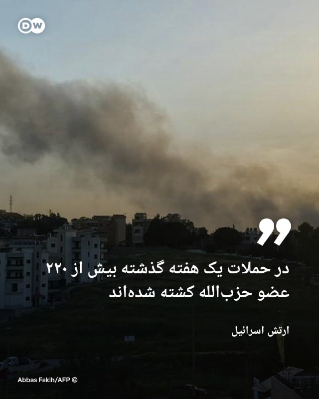

🔶 ارتش اسرائیل: در حملات یک هفته گذشته بیش از ۲۲۰ عضو حزب‌الله کشته شده‌اند

ارتش اسرائیل هم‌زمان با دومین روز گفت‌وگوهای صلح میان کشورش با لبنان اعلام کرد، در حملات یک هفته گذشته بیش از ۲۲۰ عضو حزب‌الله کشته شده‌اند.

بنا بر اعلام ارتش اسرائیل در همین مدت، نیروهای اسرائیلی همچنین بیش از ۴۴۰ هدف متعلق به حزب‌الله را در چندین منطقه در جنوب لبنان مورد حمله قرار داده‌اند.

اسرائیل و لبنان در ۱۷ آوریل (۲۸ فروردین) سال جاری بر سر آتش‌بس توافق کردند اما درگیری‌ها میان نیروهای اسرائیلی و حزب‌الله همچنان ادامه دارد، به‌طوری که گزارش‌ها از کشته شدن صدها تن در حملات حکایت دارد و دو طرف یکدیگر را به نقض آتش‌بس متهم می‌کنند.

در حال حاضر فرستادگان دو کشور در حال برگزاری سومین دور مذاکرات با هدف پایان دادن به درگیری‌ها هستند، هرچند با ادامه حملات، هیچ‌یک از طرفین به‌طور علنی اظهارنظری نکرده‌اند.

لبنان پس از آنکه حزب‌الله در پاسخ به کشته شدن علی خامنه‌ای، رهبر پیشین جمهوری اسلامی، اقدام به شلیک موشک به سوی اسرائیل کرد، به جنگ خاورمیانه کشیده شد.
@dw_farsi

## DW_Farsi — post 124739

  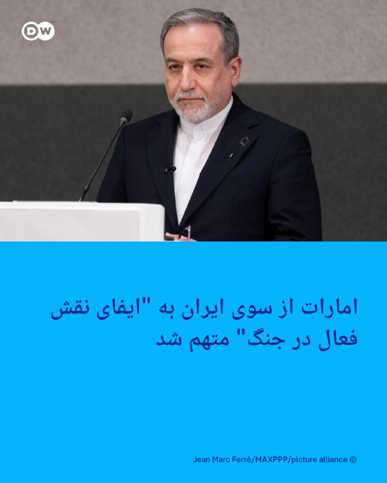

🔶 اصغر فرهادی: کشته شدن هر انسان چه با جنگ و چه کشتن معترضان جنایت است اصغر فرهادی، کارگردان برجسته ایرانی در جشنواره فیلم کن کشته شدن هزاران نفر در سرکوب اعتراضات دی ماه و همچنین جنگ آمریکا و اسرائیل علیه جمهوری اسلامی ایران را "عمیقا دردناک" توصیف کرد.…

## DW_Farsi — post 124738

  

🔶 اصغر فرهادی: کشته شدن هر انسان چه با جنگ و چه کشتن معترضان جنایت است

اصغر فرهادی، کارگردان برجسته ایرانی در جشنواره فیلم کن کشته شدن هزاران نفر در سرکوب اعتراضات دی ماه و همچنین جنگ آمریکا و اسرائیل علیه جمهوری اسلامی ایران را "عمیقا دردناک" توصیف کرد.

او روز جمعه ۱۵ مه (۲۵ اردیبهشت) به خبرنگاران در جشنواره فیلم کن گفت: «هفته گذشته در تهران بودم و هنوز تاثیر این اتفاقات را با خودم حمل می‌کنم. هر دوی اتفاقا اخیر در ایران عمیقا دردناک هستند و هیچ‌کدام هرگز فراموش نخواهند شد.»

او اضافه کرد: «مخالفت با کشته شدن بی‌گناهان و غیرنظامیان و انسان‎‌های عادی در جنگ به معنی موافقت با کشته شدن معترضان در خیابان‌ها نیست.»

فرهادی که از سال ۲۰۲۳ عمدتا خارج از ایران زندگی می‌کند، همچنین افزود، "کشته شدن هر انسانی، یک جنایت است و با هر دیدگاهی، کشتن انسان‌ها قابل پذیرش نیست، چه با جنگ، چه اعدام، چه کشتن معترضان."

این کارگردان برجسته ایرانی برنده جایزه اسکار برای اکران فیلم "داستان‌های موازی" در جشنواره کن حضور دارد و در یک کنفرانس مطبوعاتی در جشنواره کن این سخنان را گفت.
@dw_farsi

## DW_Farsi — post 124737

  

🔶 شکاف در گروه بریکس در پی جنگ ایران؛ عدم صدور بیانیه پایانی

جنگ آمریکا و اسرائیل علیه جمهوری اسلامی ایران، کشورهای غیرغربی را نیز دچار اختلاف کرده است.

نشست وزرای خارجه کشورهای عضو گروه بریکس در دهلی نو به خاطر اختلافات جدی میان ایران و امارات متحده عربی بدون صدور بیانیه مشترک، به پایان رسید.

در این راستا تنها هند، به عنوان کشور میزبان بیانیه‌ای منتشر و در آن به وجود "دیدگاه‌های متفاوت" درباره وضعیت خاورمیانه اشاره کرد.
ایران در این نشست خواستار محکومیت جنگ آمریکا و اسرائیل علیه کشور خود شد و همچنین امارات متحده عربی را به مشارکت مستقیم در عملیات نظامی متهم کرد.

عباس عراقچی، وزیر امور خارجه جمهوری اسلامی در یک نشست خبری مدعی شد، "یکی از اعضای بریکس که نامش فاش نشده، بخش‌هایی از بیانیه را مسدود کرده است".

عراقچی همچنین گفت: «ایران با این کشور خاص مشکلی ندارد بلکه صرفا پایگاه‌های نظامی ایالات متحده را هدف قرار می‌دهد که متاسفانه در خاک آن کشور واقع شده‌اند.»
@dw_farsi

## Persian_Trend_Official — post 14222

  

〰️در تازه‌ترین تحولات امنیتی در منطقه، فرماندهی مرکزی ایالات متحده (سنتکام) با انتشار تصاویری از برخاستن یک فروند بالگرد MH-60R Sea Hawk از عرشه ناوشکن آمریکایی USS Rafael Peralta (DDG-115) در دریای عرب، از ادامه عملیات گسترده دریایی آمریکا خبر داد. این عملیات که با هدف اعمال محدودیت‌ها و نظارت شدید بر خطوط کشتیرانی مرتبط با ایران انجام می‌شود،
بر اساس ادعای سنتکام، تاکنون ۷۵ کشتی تجاری مسیر حرکت خود را تغییر داده‌اند و ۴ شناور نیز برای اطمینان از اجرای قوانین و مقررات اعلام‌شده، متوقف یا غیرفعال شده‌اند. واشنگتن این اقدامات را بخشی از راهبرد «کنترل امنیت دریایی» عنوان می‌کند؛ اما ناظران معتقدند که چنین تحرکاتی می‌تواند فشار اقتصادی و روانی بر تجارت دریایی منطقه را افزایش دهد.

👑:☆Phantom☆

📮 persian_trend_official
پرشین ترند | متفاوت‌ترین کانال نظامی

## Persian_Trend_Official — post 14221

  <a href="telegram/content/Persian_Trend_Official_14221_1778877995.webm" target="_blank">🎬 Download video</a>

👑:☆Phantom☆

📮 persian_trend_official
پرشین ترند | متفاوت‌ترین کانال نظامی

## Persian_Trend_Official — post 14220

  

🔴نتانیاهو 💢نیروهای دفاعی اسرائیل (IDF) عزالدین الحدّاد، فرمانده نظامی حماس در غزه را هدف قرار داده‌اند. 🫆:Tony 📌 @persian_trend_official پرشین ترند | متفاوت‌ترین کانال نظامی

## Persian_Trend_Official — post 14219

  

🔹دستور مستقیم نخست وزیر عراق به کلیه گمرکات عراق به‌منظور عبور ترانزیت کالاهای مورد نیاز ایران از کشور عراق به ایران

🫆:Tony

📌 @persian_trend_official
پرشین ترند | متفاوت‌ترین کانال نظامی

## Persian_Trend_Official — post 14218

  <a href="telegram/content/Persian_Trend_Official_14218_1778877996.webm" target="_blank">🎬 Download video</a>

هم‌اکنون گزارش ها از بمباران شدید و غیر عادی در جنوب لبنان

👑:☆Phantom☆

📮 persian_trend_official
پرشین ترند | متفاوت‌ترین کانال نظامی

## Persian_Trend_Official — post 14216

  <a href="telegram/content/Persian_Trend_Official_14216_1778877996.webm" target="_blank">🎬 Download video</a>

🔴 سی‌ان‌ان: هکرهای جمهوری اسلامی سامانه پمپ‌بنزین‌های آمریکا را هدف قرار دادند

🔹شبکه سی‌ان‌ان مدعی شد هکرهای وابسته به جمهوری اسلامی موفق شده‌اند سامانه‌های خوانش مخازن سوخت در چند ایالت آمریکا را هک کنند.

💢بر اساس این گزارش:

▪️ حملات چندین جایگاه سوخت در ایالت‌های مختلف آمریکا را هدف قرار داده است

▪️ سامانه‌های مرتبط با مدیریت و پایش مخازن سوخت دچار اختلال شده‌اند

▪️ جزئیاتی درباره میزان خسارت یا اختلال گسترده منتشر نشده است

🫆:Tony

📌 @persian_trend_official
پرشین ترند | متفاوت‌ترین کانال نظامی

## Persian_Trend_Official — post 14215

  <a href="telegram/content/Persian_Trend_Official_14215_1778877997.mp4" target="_blank">🎬 Download video</a>

🇮🇷
🇺🇸
🇨🇳سفیر ایالات متحده مایک والتز ادعا می‌کند که «نتیجه بزرگ» سفر ترامپ به چین، موافقت چین با عقب‌نشینی از ایران بوده است

👑:☆Phantom☆

📮 persian_trend_official
پرشین ترند | متفاوت‌ترین کانال نظامی

## Persian_Trend_Official — post 14213

  <a href="telegram/content/Persian_Trend_Official_14213_1778877998.webm" target="_blank">🎬 Download video</a>

سرلشکر رضایی: قواعد نظم جدید جهان آمریکامحور نیست

🔺رئیس‌جمهور آمریکا نه از موضع قدرت، بلکه در سایه سنگین ناکامی در جنگ با ایران وارد پکن شد و آنجا را ترک کرد؛ وقتی او برای مهار بحران خودساخته به نفوذ چین چشم می‌دوزد، یعنی نظم جدید به سرعت در حال تنظیم قواعدی است که دیگر آمریکامحور نیست!

🫆:Tony

📌 @persian_trend_official
پرشین ترند | متفاوت‌ترین کانال نظامی

## Persian_Trend_Official — post 14212

https://youtube.com/live/MneL4ZkKs1A?feature=share

## Persian_Trend_Official — post 14211

  <a href="telegram/content/Persian_Trend_Official_14211_1778877998.webm" target="_blank">🎬 Download video</a>

🔹فرزند عبدالرحیم موسوی

💢جنازه پدرم که روز ا‌ول جنگ در دفتر خامنه ای کشته شد ،نزدیک به 30 روز زیر آوار حملات مانده بود

🫆:Tony

📌 @persian_trend_official
پرشین ترند | متفاوت‌ترین کانال نظامی

## Persian_Trend_Official — post 14210

  <a href="https://t.me/persian_trend_official/14210" target="_blank">📎 Download file</a>

فایل صوتی لایو اول
نسخه کم حجم - 7.07 مگابایت

اتاق جنگ جمعه 25 اردیبهشت | تلاش امارات برای دور بعدی جنگ با ایران

📝 Nick

📌 @persian_trend_official
پرشین ترند | متفاوت‌ترین کانال نظامی

## Persian_Trend_Official — post 14209

https://youtube.com/live/MneL4ZkKs1A?feature=share

## Persian_Trend_Official — post 14208

تا دقایقی دیگه لایو شروع میشه

## Persian_Trend_Official — post 14207

  

📌 @persian_trend_official
پرشین ترند | متفاوت‌ترین کانال نظامی

## Persian_Trend_Official — post 14204

🔴تصاویری از ساختمانی که عزالدین حداد، در آن حذف شده است.

پ ن : چقدر شبیه انفجار گاز های ایران تخریب شده ...

🫆:Tony

📌 @persian_trend_official
پرشین ترند | متفاوت‌ترین کانال نظامی

## Persian_Trend_Official — post 14203

  

🔴نتانیاهو

💢نیروهای دفاعی اسرائیل (IDF) عزالدین الحدّاد، فرمانده نظامی حماس در غزه را هدف قرار داده‌اند.

🫆:Tony

📌 @persian_trend_official
پرشین ترند | متفاوت‌ترین کانال نظامی

## Persian_Trend_Official — post 14202

## Persian_Trend_Official — post 14201

  <a href="telegram/content/Persian_Trend_Official_14201_1778878000.webm" target="_blank">🎬 Download video</a>

منابع آگاه روز جمعه به بلومبرگ گفتند، امارات متحده عربی تلاش کرد کشورهای همسایه خلیج فارس، از جمله عربستان سعودی و قطر، را متقاعد کند تا در جریان جنگ اخیر، واکنش نظامی هماهنگ به حملات موشکی، راکتی و پهپادی ایران داشته باشند، اما پاسخ آنها امارات را ناامید کرد !
چرا؟
امشب در لایو توضیح میدم ...

📌 @persian_trend_official
پرشین ترند | متفاوت‌ترین کانال نظامی

## RadioFarda — post 157238

🔸روزنامه آمریکایی «نیویورک تایمز» روز جمعه ۲۵ اردیبهشت به نقل از دو مقام خاورمیانه‌ای نوشت که ایالات متحده و اسرائیل در حال انجام تدارکات فشرده برای احتمال ازسرگیری حملات علیه ایران، حتی از اوایل هفته آینده، هستند. 🔸به گفتهٔ این دو که نخواستند نامشان فاش…

## RadioFarda — post 157237

  

🔸روزنامه آمریکایی «نیویورک تایمز» روز جمعه ۲۵ اردیبهشت به نقل از دو مقام خاورمیانه‌ای نوشت که ایالات متحده و اسرائیل در حال انجام تدارکات فشرده برای احتمال ازسرگیری حملات علیه ایران، حتی از اوایل هفته آینده، هستند.

🔸به گفتهٔ این دو که نخواستند نامشان فاش شود، این تدارکات گسترده‌ترین مورد از زمان اجرایی شدن آتش‌بس در ۱۹ فروردین است.

🔸دونالد ترامپ، رئیس‌جمهور آمریکا، روز ۲۲ اردیبهشت پیش از عزیمت به چین گفت: «یا توافق می‌کنند یا کاملاً نابود می‌شوند. لذا در هر صورت، ما برنده‌ایم».

🔸به گفته مقام‌های آمریکایی، اگر ترامپ تصمیم به ازسرگیری حملات نظامی بگیرد، گزینه‌ها شامل حملات به اهداف نظامی و زیرساخت‌های ایران خواهد بود.

🔸آن‌ها افزودند گزینهٔ دیگر شامل استقرار نیروهای عملیات ویژه در داخل خاک برای هدف قرار دادن مواد هسته‌ای مدفون در اعماق زمین است.

🔸به گفته این مقام‌ها، چند صد نیروی عملیات ویژه در ماه مارس به خاورمیانه اعزام شده‌اند تا چنین گزینه‌ای را در اختیار ترامپ قرار دهند.

@RadioFarda

## RadioFarda — post 157236

  

🔸اسرائیل اعلام کرد در حملات هوایی روز جمعه به نوار غزه، عزالدین الحداد، فرمانده شاخه نظامی حماس در غزه، را هدف قرار داده است.

🔸به گزارش رویترز، مقام‌های درمانی غزه گفتند در این حملات دست‌کم هفت فلسطینی، از جمله یک کودک و سه زن، کشته و حدود ۵۰ نفر زخمی شدند.

🔸اسرائیل و حماس هنوز درباره سرنوشت الحداد اظهارنظر قطعی نکرده‌اند. او پس از کشته شدن محمد سنوار در سال ۲۰۲۵، فرماندهی شاخه نظامی حماس در غزه را بر عهده گرفته بود.

🔸بنیامین نتانیاهو و اسرائیل کاتز، نخست‌وزیر و وزیر دفاع اسرائیل، در بیانیه‌ای مشترک، الحداد را از طراحان حمله ۱۵ مهر ۱۴۰۲ به اسرائیل معرفی کردند.

🔸به گفته منابع پزشکی در غزه، یکی از حملات ساختمانی مسکونی در منطقه الرمال شهر غزه را هدف قرار داد و حمله‌ای دیگر یک خودرو را در خیابانی نزدیک منهدم کرد.

🔸حملات جدید در حالی انجام شده که مذاکرات اسرائیل و حماس بر سر طرح پساجنگ آمریکا برای غزه همچنان بدون نتیجه مانده است.

@RadioFarda

## RadioFarda — post 157235

  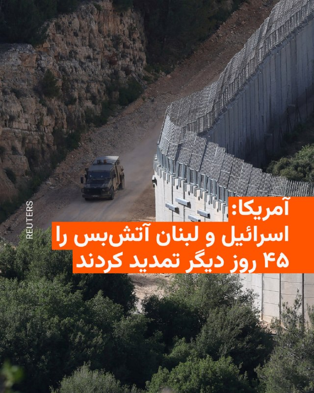

🔸وزارت خارجه آمریکا اعلام کرد اسرائیل و لبنان با تمدید ۴۵ روزه آتش‌بس میان دو کشور موافقت کرده‌اند.

🔸تامی پیگوت، سخنگوی وزارت خارجه آمریکا، روز جمعه ۲۵ اردیبهشت گفت آتش‌بسی که دونالد ترامپ در ۲۷ فروردین اعلام کرده بود، برای فراهم شدن زمینه «پیشرفت بیشتر» تمدید می‌شود.

🔸وزارت خارجه آمریکا مذاکرات دو طرف در واشینگتن را «بسیار سازنده» توصیف کرده و گفته است گفت‌وگوها روزهای ۱۲ و ۱۳ خرداد از سر گرفته خواهد شد.

🔸این سومین دور مذاکرات اسرائیل و لبنان از زمان تشدید حملات اسرائیل به لبنان است؛ حملاتی که پس از شلیک موشک‌های حزب‌الله به اسرائیل در اسفند سال گذشته شدت گرفت.

🔸با وجود اعلام آتش‌بس، درگیری‌ها و حملات پراکنده در جنوب لبنان ادامه داشته است.

📷شرح عکس: یک خودروی نظامی اسرائیل در نزدیکی مرز اسرائیل و لبنان، در شمال اسرائیل، ۲۴ اردیبهشت ۱۴۰۵

@RadioFarda

## RadioFarda — post 157234

  

🔸رضا سپهوند، عضو کمیسیون انرژی مجلس شورای اسلامی از کمبود روزانه دست‌کم «۲۰ میلیون لیتر بنزین» در ایران خبر داد.

🔸به نوشته خبرگزاری تسنیم، این نماینده گفته که تولید روزانه بنزین در ایران بین « ۱۱۰ تا ۱۱۵ میلیون لیتر» و مصرف روزانه بین «۱۳۰ تا ۱۳۵ میلیون لیتر» است.

🔸سپهوند با بیان اینکه «در کوتاه‌مدت امکان افزایش تولید وجود ندارد»، خواستار جدی‌گرفتن «مدیریت مصرف سوخت» شد.

🔸پیش از این وزیر خزانه‌داری ایالات متحده گفته بود ایران به‌زودی با «کمبود بنزین» مواجه خواهد شد.

🔸اسکات بسنت با انتشار مطلبی کوتاه در شبکۀ ایکس، نوشته بود: «در حالی‌که باقی‌ماندۀ سران سپاه پاسداران، مثل موش‌هایی که در لوله‌های فاضلاب غرق می‌شوند، گیر افتاده‌اند، به لطف محاصرۀ دریایی ایالات متحده، صنایع نفتی آسیب‌دیدۀ ایران، در حال از کار افتادن و توقف تولید است. پمپاژ نفت به زودی متوقف خواهد شد».

🔸او سپس پیامش را به سبک دونالد ترامپ، با جمله‌ای که به‌طور کامل با حروف بزرگ نوشته شده، به پایان برده بود؛ جمله‌ای با این مضمون هشدار آمیز: «مرحلۀ بعد،‌ کمبود بنزین در ایران!»

@RadioFarda

## RadioFarda — post 157233

  <a href="https://t.me/radiofarda/157233" target="_blank">📎 Download file</a>

📻بشنوید: ایستگاه ۱۹ با رادیوفردا، ۲۵ اردیبهشت ۱۴۰۵

@RadioFarda

## RadioFarda — post 157232

  <a href="https://t.me/radiofarda/157232" target="_blank">📎 Download file</a>

چگونه برای مقابله با شدت گرفتن «تنش آبی» آماده شویم؟ گفت‌وگو با نیک‌آهنگ کوثر

🔸در هفته‌های اخیر خصوصا با آغاز بهار، بسیار از شهروندان ایرانی از میزان بارش باران در شهرهای خود، خصوصا در نقاطی مانند پایتخت که ماه‌هایی بسیار خشک را پشت سر گذاشته بود ابراز خشنودی می‌کردند و آن را دلیلی بر امیدواری نسبت به وضعیت ذخایر آب در ماه‌های پیش رو قلمداد می‌کردند. اما آن‌طور که عباس علی‌آبادی وزیر نیرو در ایران می‌گوید وضعیت آبی تهران چندان مناسب نیست و «توزیع نابرابر بارش باعث شده که ۱۰ استان با جمعیت بیش از ۳۵ میلیون نفر همچنان در شرایط زیرنرمال قرار داشته باشند». سال ۱۴۰۴ سالی بسیار نگران‌کننده برای وضعیت دخایر آب ایران بود و تهران به وضعیت «روز صفر آبی» بسیار نزدیک شده بود. حالا این هشدار وزیر نیرو یادآور شرایطی مشابه است که شهروندان باید برای آن آماده باشند. چه باید کرد؟ نیک‌آهنگ کوثر، زمین‌شناس و روزنامه‌نگار حوزه آب که ساکن آمریکاست، پاسخ می‌دهد.

@RadioFarda

## RadioFarda — post 157231

🔸تصاویری از نشت نفت و آلودگی شدید زیست محیطی در اطراف جزیره مارو به دلیل حمله هوایی در جنگ اخیر به تاسیسات نفتی مستقر در جزیره لاوان در شبکه‌های اجتماعی منتشر شده است.

🔸 کاوه مدنی، دانشمند ایرانی و مدیر مؤسسه آب، محیط‌زیست و سلامت دانشگاه سازمان ملل، با انتشار این ویدئو در صفحه ایکس خود نوشته است: «‏وضعیت دردآور جزیره مارو (شیدور) ملقب به «مالدیو ایران»، نشت نفت به خلیج فارس پس از حمله به تأسیسات نفتی جزیره لاوان در فروردین ماه عامل این فاجعه بود.»

🔸جزیره لاوان دارای محیط زیستی ارزشمند و تنوع زیستی قابل‌توجهی در خلیج فارس است. سواحل بکر، آب‌های شفاف و زیستگاه گونه‌های دریایی و پرندگان مهاجر از ویژگی‌های طبیعی این جزیره به شمار می‌رود.

@RadioFarda

## IranianMinds — post 20212

🔴ترامپ به آمریکا رسید.

@IranianMinds

## IranianMinds — post 20211

فرزند عبدالرحیم موسوی، رییس ستاد کل نیروهای مسلح جمهوری اسلامی:

جنازه پدرم ۳۰ روز زیر آوار حملات مونده بود.

@IranianMinds

## IranianMinds — post 20210

اگه دنبال کانفیگی و میخای اینستا و تلگرام و گیم و حتی ترید رو برات مثل آب خوردن بیاره ربات زیر میتونه بهت کمک کنه👇

@Dayaconfigbot
@Dayaconfigbot
@Dayaconfigbot

هر گیگ فقط 225 هزارتومان با تضمین عودت وجه!

## IranianMinds — post 20208

شباهتو

@IranianMinds

## IranianMinds — post 20207

🔴وزارت خارجه آمریکا:

آتش‌بس بین اسرائیل و لبنان به مدت ۴۵ روز تمدید می‌شود تا پیشرفت‌های بیشتری حاصل شود.

@IranianMinds

## IranianMinds — post 20206

  <a href="telegram/content/IranianMinds_20206_1778878003.mp4" target="_blank">🎬 Download video</a>

هم‌میهنان عزیزم،

در روزهایی که شما با شجاعت در برابر رژیم اشغالگر ایران ایستاده‌اید، این نظام منفور و منزوی، همچنان به تجاوز به جان و مال مردم ادامه می‌دهد تا سرنگونی حتمی خود را اندکی به تعویق اندازد. در چنین شرایطی، وظیفه خود می‌دانم که تصویر عدالت در فردای ایران را برای کسانی که با جنایتکاران همکاری کنند، روشن‌تر ترسیم کنم.

در این راستا، از «کمیته‌ تدوین مقررات عدالت انتقالی ایران» خواستم درباره‌ دو موضوع مهم، نظر مشورتی خود را ارائه کند: نخست، موضوع مسئولیت کیفری افرادی که با ساختارهای سرکوبگر جمهوری اسلامی همکاری می‌کنند؛ و دوم، موضوع مصادره‌ اموال معترضان و خانواده‌های آنان.

این کمیته اکنون نخستین نظر مشورتی خود را صادر کرده و پیام آن روشن است: این اقدامات، همکاری‌های ساده یا بی‌اهمیت نیستند؛ بلکه «یاری‌رسانی به جنایت علیه بشریت» محسوب می‌شوند. هیچ مقام، هیچ دستور و هیچ بهانه‌ای نمی‌تواند مسئولیت کیفری فردی را از میان ببرد. بنابراین، هر فردی که آگاهانه و داوطلبانه با ساختارهای سرکوبگر رژیم همکاری کند، چه در داخل و چه در خارج از ایران، باید بداند که در معرض مسئولیت کیفری قرار خواهد گرفت:

خواه این همکاری از نوع گزارش‌دهی یا خبرچینی باشد؛
خواه از نوع مشارکت در ایست‌های بازرسی‌ باشد؛
خواه از نوع به‌کارگیری کودکان و نوجوانان در سرکوب معترضان باشد؛
و خواه از نوع تحصیل، انتقال یا خرید و فروش اموالی باشد که در جریان سرکوب از معترضان و خانواده‌های آنان مصادره شده‌ است.

از این رو، نه‌تنها افرادی که در صدور دستور، اجرای آن، یا تسهیل این مصادره‌ها نقش دارند در معرض مسئولیت قرار خواهند گرفت، بلکه کسانی که آگاهانه و داوطلبانه به خرید و فروش این اموال می‌پردازند نیز باید پاسخگو باشند. این مسئولیت، استفاده از اموال یا دارایی‌های آنان برای جبران خسارت واردشده به مالکان اصلی را نیز شامل می‌‌شود.

بنابراین، به همه‌ کسانی که امروز در صدد همکاری با دستگاه سرکوب رژیم هستند هشدار می‌دهم: پیش از آن‌که دست به اقدامی بزنید که به مردم ایران آسیب جانی، مالی و یا اجتماعی برساند، به آینده‌ خود و خانواده‌تان بیندیشید. به آن روز بیندیشید که ایران آزاد خواهد شد؛ روزی که حقیقت پنهان نخواهد ماند؛ روزی که اسامی آشکار خواهد شد؛ روزی که هیچ متجاوز و جنایتکاری از پاسخ‌گویی در برابر قانون در امان نخواهد ماند.

آن روز، ملت ایران حکومتی خواهد داشت که حقوق ایرانیان را محترم می‌دارد و ایران را به سرزمینی آزاد و آباد بدل می‌کند.

پاینده ایران،
رضا پهلوی
-----------------------------
متن کامل نظر مشورتی «کمیته‌ تدوین مقررات عدالت انتقالی ایران»:

https://iranopasmigirim.com/fa/transitional-justice

@OfficialRezaPahlavi

## IranianMinds — post 20205

  <a href="telegram/content/IranianMinds_20205_1778878004.mp4" target="_blank">🎬 Download video</a>

🔴دقایقی پیش فرمانده حماس کشته شد
‏
نخست‌وزیر و وزیر دفاع اسرائیل در بیانیه‌ای اعلام کردند ارتش این کشور عزالدین حداد، فرمانده شاخه نظامی حماس، را در یک حمله هوایی هدف قرار داده است

@IranianMinds

## IranianMinds — post 20204

🔴 امام جمعه کرج:

بر اساس توصیه قرآن باید تا پایان «فتنه»، جنگ رو ادامه بدیم؛ مجازات اسرائیل، محو کردن کامل اونه.

@IranianMinds

## BBCPersian — post 281154

  

🔻دونالد ترامپ، رئیس‌جمهوری آمریکا، روز جمعه سفر سه روزه خود به چین را در حالی به پایان رساند که هر دو ابر قدرت پیشرفت در رابطه‌شان را ستودند اما تحول بزرگی در زمینه مسائل عمده و مورد اختلاف، از جمله ایران و تایوان، اعلام نشد. همزمان پکن اعلام کرده است که شی جین‌پینگ، رئیس‌جمهور چین، دعوت دونالد ترامپ برای سفر به آمریکا در سال جاری را پذیرفته است.

دونالد ترامپ بعد از پایان سفرش و در راه بازگشت به آمریکا به خبرنگاران همراهش گفت که در مورد مساله باز کردن تنگه هرمز از چین تقاضای کمک نکرده است هرچند اضافه کرد که انتظار دارد پکن خودش در این مورد تهران را تحت فشار بگذارد. آقای ترامپ همچنین گفت که در دیدار با شی جین‌پینگ،‌ رئیس‌جمهور چین، «توافق‌های تجاری فوق‌العاده‌ای» حاصل شده است. اما هیچ یک از دو ابر قدرت جزئیات بیشتر یا بیانیه‌ای رسمی در این مورد منتشر نکرده‌اند.

ادامه خبر را از لینک زیر در وبسایت بی‌بی‌سی فارسی بخوانید.

📷 Anadolu via Getty Images
https://bbc.in/4dnZ3fx
@BBCPersian

## BBCPersian — post 281153

  <a href="telegram/content/BBCPersian_281153_1778878005.mp4" target="_blank">🎬 Download video</a>

🔻آخرین خبرهای مهم جمعه ۲۵ اردیبهشت ۱۴۰۵
@BBCPersian

## BBCPersian — post 281152

🔻وزارت خارجه آمریکا می‌گوید آتش‌بس میان لبنان و اسرائیل به مدت ۴۵ روز تمدید شده است

تامی پیگوت، سخنگوی وزارت خارجه آمریکا، می‌گوید تمدید آتش‌بس میان اسرائیل و لبنان پس از دو روز مذاکرات «بسیار سازنده» با میانجیگری ایالات متحده مورد توافق قرار گرفته است.

آقای پیگوت گفت که مذاکرات «راهبرد سیاسی» در تاریخ ۲ و ۳ ژوئن از سر گرفته خواهد شد، در حالی که «راهبرد امنیتی» در ۲۹ مه با حضور هیئت‌های نظامی اسرائیل و لبنان در پنتاگون آغاز خواهد شد.

او در پستی در شبکه اجتماعی ایکس نوشت: «ما امیدواریم که این مذاکرات به پیشبرد صلح پایدار بین دو کشور، به رسمیت شناختن کامل حاکمیت و تمامیت ارضی یکدیگر و ایجاد امنیت واقعی در امتداد مرز مشترک آنها منجر شود.»

https://bbc.in/3RHhJzE
@BBCPersian

## BBCPersian — post 281151

🔻ارتش اسرائیل برای بخش‌هایی از شهر صور لبنان دستور تخلیه صادر کرد

آویخای ادرعی، سخنگوی ارتش اسرائیل، از ساکنان بخش‌هایی از شهر صور در جنوب لبنان خواست تا خانه‌های خود را تخلیه کنند و تهدید به حمله به این شهر کرد.

او در پستی در شبکه اجتماعی ایکس با انتشار نقشه‌ای به ساکنان دستور داد منطقه نزدیک چندین ساختمان را تخلیه کنند و مدعی شد که این ساختمان‌ها توسط حزب‌الله مورد استفاده قرار می‌گیرند.
https://bbc.in/4uenEdV
@BBCPersian

## BBCPersian — post 281150

🔻پاکستان از آزاد شدن ۳۱ خدمه ایرانی و پاکستانی یک کشتی که به وسیله آمریکا توقیف شده بود، خبر داد

اسحاق دار، وزیر خارجه پاکستان روز جمعه از آزادی ۲۰ تبعه ایرانی و ۱۱ نفر از اتباع خود خبر داد. این افراد در کشتی‌هایی بودند که توسط آمریکا در آب‌های آزاد توقیف شده بودند.

مشخص نشده است که این افراد سرنشینان کدام کشتی‌ بودند.

وزیر خارجه پاکستان در شبکه ایکس نوشت که آنها جمعه شب از طریق سنگاپور به بانکوک رفتند و قرار است با هواپیما به اسلام‌آباد، پایتخت پاکستان منتقل شوند. او گفت که قرار است اتباع ایرانی از پاکستان به ایران منتقل شوند.

وزیر خارجه پاکستان گفت که همه افراد در «سلامت هستند و روحیه خوبی دارند.»

پاکستان نقش میانجی مذاکرات میان آمریکا و ایران را داشته است.

وزیر خارجه پاکستان از وزیر خارجه و نخست‌وزیر سنگاپور برای مشارکت در روند انتقال این افراد که به درخواست پاکستان انجام شده است و همچنین از عباس عراقچی،‌ وزیر خارجه ایران به خاطر «اعتماد به پاکستان» تشکر کرده است.

او همچنین از مارکو روبیو، وزیر خارجه آمریکا «برای هماهنگی نزدیک در تسهیل» روند بازگرداندن این ۳۱ تبعه ایرانی و پاکستانی تقدیر کرد.

https://bbc.in/4uenEdV
@BBCPersian

## BBCPersian — post 281149

  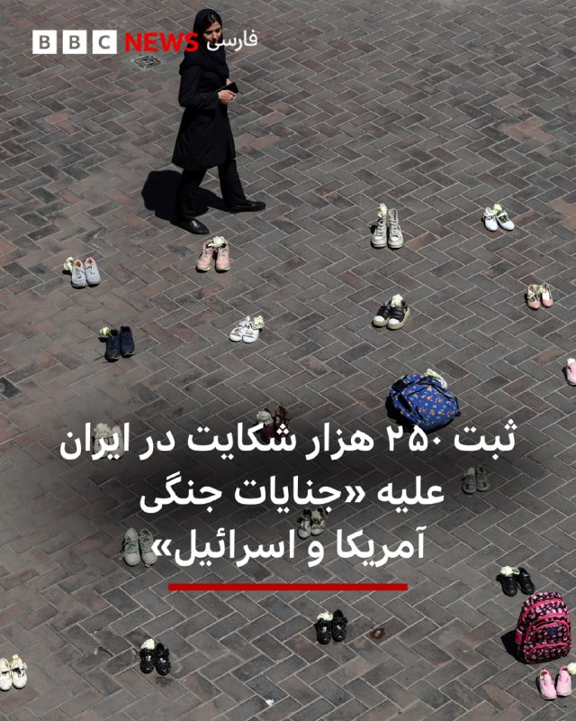

🔻مقام‌های قضائی جمهوری اسلامی ایران می‌گویند حدود ۲۵۰ هزار شکایت حقوقی و کیفری در ارتباط با آنچه «جنایات جنگی آمریکا و اسرائیل» توصیف کرده‌اند، در دستگاه قضایی این کشور ثبت شده و در مرحله رسیدگی قرار دارد.

عبدالصمد میرحسینی، معاون قضایی دادستان کل کشور، در گفت‌وگو با میزان، خبرگزاری قوه قضاییه ایران، گفته است این پرونده‌ها در «شعب ویژه دادسراها و دادگاه‌ها» در حال بررسی است و نهادهای مختلف حکومتی در جمع‌آوری اسناد و تکمیل ادله با دستگاه قضایی همکاری می‌کنند.

به گفته آقای میرحسینی، مقام‌های قضایی امیدوارند این روند در آینده نزدیک به صدور حکم منجر شود و جمهوری اسلامی تلاش می‌کند مستندات این پرونده‌ها «منطبق با ضوابط بین‌المللی» تنظیم کند تا احکام صادرشده قابلیت اجرا در خارج از ایران را نیز داشته باشد.

ادامه خبر را از لینک زیر در وبسایت بی‌بی‌سی فارسی بخوانید.

📷 AFP via Getty Images
https://bbc.in/49wGvIY
@BBCPersian

## BBCPersian — post 281148

  <a href="https://t.me/bbcpersian/281148" target="_blank">📎 Download file</a>

پادکست جام جهان‌نما جمعه جمعه ۲۵ اردیبهشت ۱۴۰۵

در این برنامه می‌شنوید:
پایان سفر ترامپ به چین،
پکن برای توافق صلح ایران و آمریکا قول کمک داد
سایه جنگ خاورمیانه بر نشست بریکس ...
بدنبال اختلاف ایران و امارات، نشست امسال بدون بیانیه مشترک پایان یافت
توافق‌های دفاعی و اقتصادی در سفر نخست‌وزیر هند به ابوظبی
مودی حملات ایران به امارات را به‌شدت محکوم کرد
و در روز فردوسی و زبان فارسی، نگاهی میکنیم به رابطه جمهوری اسلامی با نمادهای ملی، احترام واقعی یا نیاز سیاسی؟
این برنامه رادیویی را می‌توانید هر شب ساعت ۲۰ به وقت ایران، روی موج متوسط ۷۰۲ کیلوهرتز و موج کوتاه ۹۴۶۵ کیلوهرتز بشنوید.
تکرار برنامه را هم می‌توانید ساعت ۲۱:۳۰ روی موج متوسط ۷۰۲ کیلوهرتز و موج کوتاه ۵۳۹۵ کیلوهرتز گوش کنید.
@BBCPersian

## BBCPersian — post 281147

  <a href="telegram/content/BBCPersian_281147_1778878007.mp4" target="_blank">🎬 Download video</a>

🔻دونالد ترامپ، رئیس‌جمهور آمریکا، در گفتگو با خبرنگاران در هواپیمای ویژه ریاست‌جمهوری آمریکا، با اشاره به وضعیت تنگه هرمز گفت، برای بازگشایی این گذرگاه آبی، از چین نخواسته است که بر ایران فشار وارد کند، زیرا «به لطف کسی نیاز ندارد.» او گفت ایران بر اثر محاصره دریایی در دو هفته و نیم گذشته «روزی ۵۰۰ میلیون دلار» ضرر می‌‌‌کند.

آقای ترامپ گفت که به باورش شی جین‌پینگ، رئیس‌جمهور چین «طبیعتا مایل است تنگه باز شود» چرا که چین بخش قابل توجهی از انرژی خود را از این مسیر تامین می‌کند.

رئیس‌جمهور آمریکا درباره برنامه هسته‌ای ایران تاکید کرد که تهران «به‌هیچ‌ وجه نباید به سلاح هسته‌ای دست یابد» موضعی که به گفته او رئیس‌جمهور چین هم با آن موافق است.

دونالد ترامپ گفت با ازسرگیری احتمالی فعالیت‌های هسته‌ای ایران «پس از ۲۰ سال موافق است»، مشروط بر آنکه این دوره با تضمین‌های «معتبر» همراه باشد و «به هیچ شکلی هسته‌ای نداشته باشند.».»

https://bbc.in/43aBphT
@BBCPersian

## BBCPersian — post 281146

🔻پس از آنکه اندی بِرنهام، شهردار منچستر، اعلام کرد میخواهد در انتخابات میان‌دوره‌ای شرکت کند و به پارلمان بازگردد، گمانه‌زنی درباره سرنوشت کی‌یر استارمر، رهبر حزب کارگر و نخست وزیر بریتانیا، افزایش یافته. آقای برنهام برای ورود به رقابت بر سر رهبری حزب، ابتدا باید دوباره به‌عنوان نماینده وارد پارلمان شود. او برای نامزدی از حوزه انتخابیه اش در منچستر نیاز به تأیید کمیته اجرایی حزب کارگر دارد. بحث کناره گیری و جایگزینی آقای استارمر بعد از انتخابات محلی اخیر قوت گرفت، انتخاباتی که حزب کارگر در آن بسیاری از کرسی هایش را از دست داد. گزارش هری هارلی را ببینیم.
@BBCPersian

## BBCPersian — post 281145

با وصل شدن اندک اندک بعضی شهروندان ایران به اینترنت که بیش از دو ماه و نیم از قطع آن می‌گذرد، تصاویر جدیدی از  جنگ و آسیب‌های آن منتشر می‌شود.
 
یکی از شهروندان به تازگی تصاویری از جزیره شیدور (مارو) در نزدیکی جزیره لاوان در اینستاگرامش منتشر کرده که نشان می‌دهد در پی حمله هوایی ۱۹ فروردین ۱۴۰۵ به پالایشگاه لاوان در خلیج فارس، آلودگی نفتی این منطقه و جانوران بومی آن را آلوده کرده است.

مدیرکل حفاظت محیط زیست استان هرمزگان با تائید آلودگی نفتی در لاوان و مارو، ۱۰ اردیبهشت اعلام کرد این آلودگی نفتی «تبعات ماندگاری بر ساحل صخره‌ای و مرجان‌های این جزیره خواهد گذاشت.»
@BBCPersian

## BBCPersian — post 281144

🔻امارات ایران را به «تلاش برای توجیه» حملاتش به آن کشور متهم کرد

امارات متحده عربی یک روز پس از اینکه عباس عراقچی این کشور را به داشتن «نقش فعال» در حملات به ایران متهم کرد، این اظهارات را «تلاش‌ برای توجیه حملات تروریستی ایران» خواند و آن را رد کرد.

خلیفه بن شاهین المرار، از مقامات وزارت خارجه امارات متحده عربی که به نمایندگی این کشور در نشست وزرای خارجه بریکس در دهلی‌نو شرکت داشت، گفت «امارات متحده عربی به دنبال حمایت سایر کشورها نیست و کاملا قادر به جلوگیری از این تجاوز بی‌دلیل است.»

بر اساس بیانیه وزارت خارجه امارات،‌ آقای المرار به حملات ایران به امارات متحده در طول جنگ اخیر اشاره کرد و گفت: «از ۲۸ فوریه (۹ اسفند) امارات متحده عربی در معرض حملات تروریستی مکرر و غیرقابل توجیه ایران قرار گرفته است. پدافند هوایی امارات حدود سه هزار حمله شامل موشک‌های بالستیک، موشک‌های کروز و پهپادها را که عمدا و مستقیما تاسیسات غیرنظامی و زیرساخت‌های حیاتی از جمله فرودگاه‌ها، بنادر، تاسیسات نفتی، کارخانه‌های آب شیرین‌کن،‌ شبکه‌های انرژی، تاسیسات خدماتی و مناطق مسکونی را هدف قرار دادند،‌ رهگیری کرده است.»

این مقام اماراتی تاکید کرد که کشورش حق کامل و مشروع خود را برای دفاع از حاکمیت و تمامیت ارضی خود و تضمین امنیت شهروندان و ساکنان و بازدیدکنندگان از این کشور مطابق با ماده ۵۱ منشور سازمان ملل محفوظ می‌داند.

عباس عراقچی دیروز در حاشیه نشست بریکس، در تلگرامش امارات متحده عربی را «شریک فعال» آمریکا و اسرائیل در حمله به ایران توصیف کرده و گفته بود که این کشور مستقیما در جنگ آمریکا و اسرائیل با ایران «دخیل» بوده است.

https://bbc.in/3RIul9G
@BBCPersian

## Dirty_Kids — post 389525

  

تراپی

@Dirty_Kids 👻

## Dirty_Kids — post 389524

  <a href="telegram/content/Dirty_Kids_389524_1778878009.mp4" target="_blank">🎬 Download video</a>

خوب شد به حرف این 👆 گوش ندادن، اگه گوش میدادن الان موشعلی و فرمانده‌هاشو زنده بودن

ولی بجاش رفتن به حرف رافئی‌پور و خوش‌چشم گوش دادن همشون کتلت شدن:)))

@Dirty_Kids 👻

## Dirty_Kids — post 389523

ظلمی که با چشم‌های خودمون تو این ۴۷ سال دیدیم رو می‌خواین انکار کنین، اون‌وقت انتظار دارین جنایتی که ادعا می‌کنین پهلوی ۶۰ سال پیش بهتون کرده رو بی‌چون‌وچرا باور کنیم؟!
این چه «جنایتی» بوده که همه شما زندانیان قبل از انقلاب زنده و هی و حاضرید و الان به جون بچه های مردم افتادید؟

@Dirty_Kids 👻

## Dirty_Kids — post 389522

نوشته خرید حلقه ی نقره برای ازدواج رو نرمالایز کنید

کشوری که نمیتونی یه حلقه طلا توش بخری، چرا باید توش ازدواج کنی؟!

@Dirty_Kids 👻

## Dirty_Kids — post 389521

‏بنظرم اصن معلوم نمیکنه ترامپ از چین برگرده چی میشه الکی حدس نزنیم.
بعید نیست یهو تایوان رو بده به ایران تنگه رو بده به لبنان روبیو رو بده به سمنان.
هیچ بعید نیست

@Dirty_Kids 👻

## Dirty_Kids — post 389520

  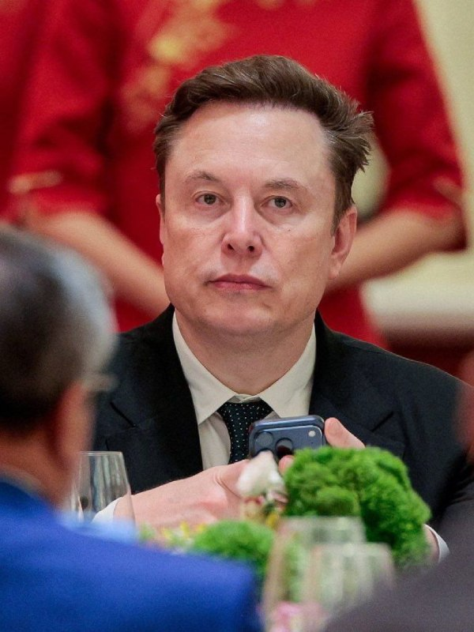

🔴 ایلان ماسک : اینستاگرام واسه دختراست؛

بعضی وقت‌ها یسری مرد بالغ آیدی اینستاگرام‌شون رو واسه من می‌فرستن و من می‌پرسم: آیا داری تغییر جنسیت میدی؟

@Dirty_Kids 👻

## Dirty_Kids — post 389519

  

در تصویر: ترور تروریست ارشد حماس.

احمد وحیدی، داری نگاه می‌کنی؟

@Dirty_Kids 👻

## Dirty_Kids — post 389518

  <a href="telegram/content/Dirty_Kids_389518_1778878012.mp4" target="_blank">🎬 Download video</a>

👑 شاهزاده رضا پهلوی:
جمهوری اسلامی الان برای اینکه سقوطش عقب بیفته، داره فشار و سرکوب مردم رو بیشتر میکنه؛

واسه همین یه تیم حقوقی گذاشتم بررسی کنن اونایی که با سیستم سرکوب همکاری میکنن، بعدا چه بلایی سرشون میاد. نتیجه‌ش این شده که این کارا فقط یه همکاری ساده نیست و میتونه به‌عنوان کمک به جنایت علیه بشریت حساب بشه.
یعنی هر کسی که آگاهانه بره سمت خبرچینی، کمک تو ایست بازرسی، سرکوب مردم یا حتی خرید و فروش اموال مصادره‌شده، باید بدونه بعدا ممکنه محاکمه بشه و جواب پس بده. حتی ممکنه از اموالشون برای جبران خسارت مردم استفاده بشه. به همه اونایی هم که الان دارن با سیستم همکاری میکنن هشدار میدم قبل از هر کاری یه فکر به آینده خودشون و خانوادشون بکنن؛ چون این وضعیت همیشگی نیست و یه روزی میرسه که همه‌چیز روشن میشه و هیچ‌کس نمیتونه از جواب پس دادن فرار کنه.

هدف اینه که ایران تبدیل به یه کشور آزاد بشه که توش حق مردم رعایت بشه و اوضاع کشور درست بشه.

@Dirty_Kids 👻

## Dirty_Kids — post 389517

  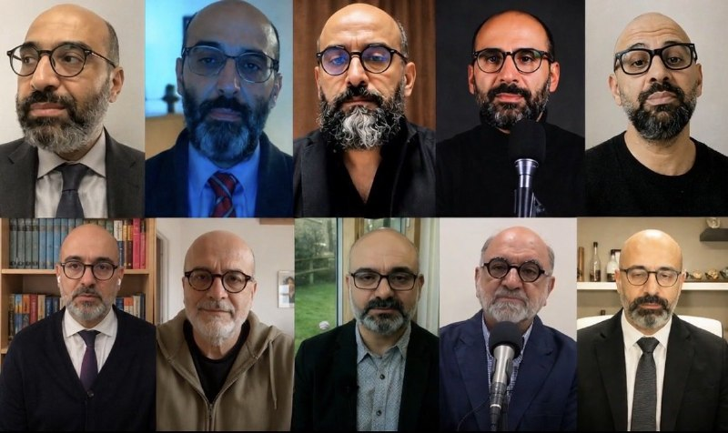

کچل عینکی ریشو دیدین فرار کنید

@Dirty_Kids 👻

## Dirty_Kids — post 389516

  

🔴 کتاب اللمعة البيضاء نوشته آیت الله تبریزی، صفحه ۲۳۵: سینه های حضرت فاطمه انقدر بزرگ و دراز بوده که میتونسته اونو از شونه هاش بندازه پشت سرش و به بچه هاش شیر بده!

همچنین سینه های حضرت فاطمه همیشه بوی خوب میداده و پیامبر سرشو بین سینه های حضرت فاطمه میذاشته تا اونو بو کنه.

@Dirty_Kids 👻

## Dirty_Kids — post 389515

  

یعنی این فیلم The Odyssey که قراره بسازن مزخرف ترین فیلمی خواهد بود که تاحالا ساخته شده! نقش آشیل رو قراره یه زن تغییر جنسیت داده بازی کنه و نقش هلن رو قراره یه سیاه پوست لاغر.🥴 حتی به دول آشیل و رنگ پوست هلن هم رحم نگردن این چپهای کسخل @Dirty_Kids 👻

## Dirty_Kids — post 389514

بنیاد بین‌المللی رسانه‌های زنان (IWMF)، جایزه «شجاعت در خبرنگاری» رو داده به یک خبرنگار که اینترنت سفید داره.
قشنگ داریم یه جوک رو زندگی می‌کنیم

خواهران محمدی، خبرنگاران حوزه محور مقاومت، غزه و حومه.

@Dirty_Kids 👻

## Dirty_Kids — post 389513

  <a href="telegram/content/Dirty_Kids_389513_1778878013.mp4" target="_blank">🎬 Download video</a>

سهمیه بندی حوری برای شهدا ! 🤣🤣🤣

ارزش دانلود ۱۰/۱۰

@Dirty_Kids 👻

## Dirty_Kids — post 389512

  <a href="telegram/content/Dirty_Kids_389512_1778878014.webm" target="_blank">🎬 Download video</a>

سنتکام رسماً تأیید کرد که حمله به مدرسه میناب توسط آمریکا صورت گرفته.

❌ این خبر که تو فضای مجازی داره دست به دست میشه، فیکه؛ سنتکام تأیید نکرده و ترامپ هم امروز گفت که هنوز داریم بررسی می‌کنیم.

@Dirty_Kids 👻

## Dirty_Kids — post 389511

✖️ سایت بین المللی bet120x 
✖️  
👍دارای مجوز رسمی Gambling Judge سوئد
👍       
💳شارژ حساب از طریق ارز و یووچر و پرمیوم ووچر 
💳تسویه حساب دلاری سریع 💊بیمه شرط میکس 
⚠️فروش شرط 
🔔ویرایش شرط                    
3️⃣
2️⃣ 
🎁20%هدیه واریز از طریق ارز و ووچر ┅━━━━━━━━━━━…

## Dirty_Kids — post 389510

  

✖️ سایت بین المللی bet120x 
✖️

 
👍دارای مجوز رسمی Gambling Judge سوئد
👍
     

💳شارژ حساب از طریق ارز و یووچر و پرمیوم ووچر

💳تسویه حساب دلاری سریع
💊بیمه شرط میکس

⚠️فروش شرط

🔔ویرایش شرط                    
3️⃣
2️⃣

🎁20%هدیه واریز از طریق ارز و ووچر
┅━━━━━━━━━━━

🎁 10%برگشت باخت به صورت روزانه

🎁 10%برگشت باخت به صورت هفتگی

🎁10%برگشت باخت به صورت ماهانه

💻ادرس ورود به سایت:
https://bet120x.com/fa/?btag=971470
➖➖➖➖➖
   
👈 آموزش واریز و برداشت دلاری
👉

🔪کانال اطلاع رسانی:
👇

✈️https://t.me/+1Wv5nGY_a54xNzlk

## Dirty_Kids — post 389505

این شما و این منتخب ژانر از کِی فهمیدین کسخلید توی توییتر :))

@Dirty_Kids 👻

## Hranews — post 112959

یک شهروند توسط نیروهای امنیتی در بوکان بازداشت شد

❗️
❗️
❗️
❗️
❗️ – سید علی قریشی، شهروند اهل بوکان روز دوشنبه ۲۱ اردیبهشت ماه، توسط نیروهای امنیتی در این شهرستان #بازداشت و به مکان نامعلومی منتقل شده است.

ادامه مطلب

#سید_علی_قریشی

↘️
@hranews_bot تماس ✉️ -  @Hranews  کانال هرانا 🆑

## Hranews — post 112958

کازرون؛ مرگ یک کارگر در سایه فقدان ایمنی کار

❗️
❗️
❗️
❗️
❗️ – در سایه فقدان ایمنی محیط و شرایط نامناسب کار، روز پنجشنبه ۲۴ اردیبهشت، یک #کارگر در کازرون، حین انجام کار بر اثر سقوط به داخل یک چاه کشاورزی جان خود را از دست داد.

ادامه مطلب

↘️
@hranews_bot تماس ✉️ -  @Hranews  کانال هرانا 🆑

## Hranews — post 112957

اجرای حکم اعدام ۲ زندانی/ رهایی ۲ زندانی از چوبه دار

❗️
❗️
❗️
❗️
❗️ – سحرگاه روز چهارشنبه ۲۳ اردیبهشت ماه، حکم دو زندانی که پیشتر از بابت اتهامات مرتبط با جرائم مواد مخدر و قتل به #اعدام محکوم شده بودند، در ندامتگاه مرکزی کرج و زندان قم اجرا شد. همچنین، دو زندانی محکوم به اعدام در سنندج و استان اصفهان، با گذشت اولیای دم از مجازات مرگ رهایی یافتند.

ادامه مطلب

↘️
@hranews_bot تماس ✉️ -  @Hranews  کانال هرانا 🆑

## Hranews — post 112956

گزارشی از مطالبات مزدی رانندگان سرویس مدارس مشهد

❗️
❗️
❗️
❗️
❗️ – شماری از #رانندگان سرویس مدارس مشهد، نسبت به بلاتکلیفی وضعیت شغلی و عدم دریافت حقوق در سه ماه پایانی سال تحصیلی انتقاد کردند.

ادامه مطلب

↘️
@hranews_bot تماس ✉️ -  @Hranews  کانال هرانا 🆑

## Hranews — post 112955

اردبیل؛ یک شهروند توسط ماموران سازمان اطلاعات سپاه بازداشت شد

❗️
❗️
❗️
❗️
❗️ – سازمان اطلاعات سپاه اردبیل از #بازداشت یک شهروند در این استان به اتهام «#جاسوسی از طریق ارسال تصاویر و اطلاعات به موساد» خبر داد. همزمان ویدیویی از اعترافات این شهروند نیز منتشر شده که شرایط ضبط آن مشخص نیست.

#اعترافات_اجباری

ادامه مطلب

↘️
@hranews_bot تماس ✉️ -  @Hranews  کانال هرانا 🆑

## Hranews — post 112954

  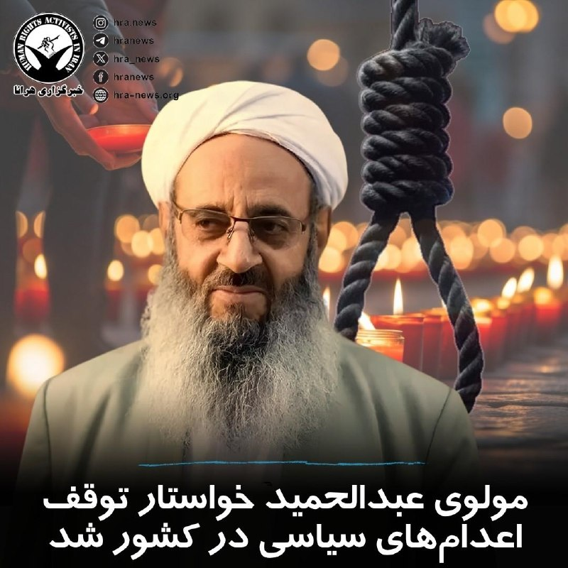

مولوی عبدالحمید اسماعیل‌زهی، امام جمعه اهل سنت زاهدان، با انتقاد از افزایش اعدام‌ها در ایران خواستار توقف «اعدام‌های سیاسی» در کشور شد. او امروز در خطبه‌های نماز جمعه با تأکید بر اینکه اعدام‌ها به مصلحت کشور و مردم نیست، گفت: اعدام نمی‌تواند راه‌حل مشکلات جامعه باشد.

وی همچنین با انتقاد از «اعترافات اجباری» در بازداشتگاه‌ها تأکید کرد که این اعترافات با موازین شرعی، قانون اساسی و قوانین بین‌المللی مغایرت دارد و نباید مبنای صدور حکم قرار گیرد.

همزمان با آغاز درگیری‌های نظامی، روند صدور و اجرای احکام #اعدام در پرونده‌های سیاسی و امنیتی افزایش یافته و تاکنون ۳۲ زندانی با این اتهامات در این بازه زمانی اعدام شده‌اند.

↘️
@hranews_bot تماس ✉️ - @Hranews کانال هرانا 🆑

## officialrezapahlavi — post 1833

  <a href="telegram/content/officialrezapahlavi_1833_1778878015.mp4" target="_blank">🎬 Download video</a>

هم‌میهنان عزیزم،

در روزهایی که شما با شجاعت در برابر رژیم اشغالگر ایران ایستاده‌اید، این نظام منفور و منزوی، همچنان به تجاوز به جان و مال مردم ادامه می‌دهد تا سرنگونی حتمی خود را اندکی به تعویق اندازد. در چنین شرایطی، وظیفه خود می‌دانم که تصویر عدالت در فردای ایران را برای کسانی که با جنایتکاران همکاری کنند، روشن‌تر ترسیم کنم.

در این راستا، از «کمیته‌ تدوین مقررات عدالت انتقالی ایران» خواستم درباره‌ دو موضوع مهم، نظر مشورتی خود را ارائه کند: نخست، موضوع مسئولیت کیفری افرادی که با ساختارهای سرکوبگر جمهوری اسلامی همکاری می‌کنند؛ و دوم، موضوع مصادره‌ اموال معترضان و خانواده‌های آنان.

این کمیته اکنون نخستین نظر مشورتی خود را صادر کرده و پیام آن روشن است: این اقدامات، همکاری‌های ساده یا بی‌اهمیت نیستند؛ بلکه «یاری‌رسانی به جنایت علیه بشریت» محسوب می‌شوند. هیچ مقام، هیچ دستور و هیچ بهانه‌ای نمی‌تواند مسئولیت کیفری فردی را از میان ببرد. بنابراین، هر فردی که آگاهانه و داوطلبانه با ساختارهای سرکوبگر رژیم همکاری کند، چه در داخل و چه در خارج از ایران، باید بداند که در معرض مسئولیت کیفری قرار خواهد گرفت:

خواه این همکاری از نوع گزارش‌دهی یا خبرچینی باشد؛
خواه از نوع مشارکت در ایست‌های بازرسی‌ باشد؛
خواه از نوع به‌کارگیری کودکان و نوجوانان در سرکوب معترضان باشد؛
و خواه از نوع تحصیل، انتقال یا خرید و فروش اموالی باشد که در جریان سرکوب از معترضان و خانواده‌های آنان مصادره شده‌ است.

از این رو، نه‌تنها افرادی که در صدور دستور، اجرای آن، یا تسهیل این مصادره‌ها نقش دارند در معرض مسئولیت قرار خواهند گرفت، بلکه کسانی که آگاهانه و داوطلبانه به خرید و فروش این اموال می‌پردازند نیز باید پاسخگو باشند. این مسئولیت، استفاده از اموال یا دارایی‌های آنان برای جبران خسارت واردشده به مالکان اصلی را نیز شامل می‌‌شود.

بنابراین، به همه‌ کسانی که امروز در صدد همکاری با دستگاه سرکوب رژیم هستند هشدار می‌دهم: پیش از آن‌که دست به اقدامی بزنید که به مردم ایران آسیب جانی، مالی و یا اجتماعی برساند، به آینده‌ خود و خانواده‌تان بیندیشید. به آن روز بیندیشید که ایران آزاد خواهد شد؛ روزی که حقیقت پنهان نخواهد ماند؛ روزی که اسامی آشکار خواهد شد؛ روزی که هیچ متجاوز و جنایتکاری از پاسخ‌گویی در برابر قانون در امان نخواهد ماند.

آن روز، ملت ایران حکومتی خواهد داشت که حقوق ایرانیان را محترم می‌دارد و ایران را به سرزمینی آزاد و آباد بدل می‌کند.

پاینده ایران،
رضا پهلوی
-----------------------------
متن کامل نظر مشورتی «کمیته‌ تدوین مقررات عدالت انتقالی ایران»:

https://iranopasmigirim.com/fa/transitional-justice

@OfficialRezaPahlavi

## manototv — post 105501

  <a href="telegram/content/manototv_105501_1778878016.mp4" target="_blank">🎬 Download video</a>

‌
شیخ خالد بن محمد بن زاید، ولیعهد ابوظبی، اعلام کرد پروژه «خط لوله غرب به شرق» با هدف افزایش صادرات نفت از بندر فجیره و «پاسخ به تقاضای جهانی» با سرعت بیشتری اجرا خواهد شد.

بر اساس اعلام مقام‌های امارات، این پروژه ظرفیت صادرات نفت از مسیر فجیره را دو برابر می‌کند و قرار است تا سال ۲۰۲۷ به بهره‌برداری برسد.

پس از جنگ آمریکا و اسرائیل با جمهوری اسلامی و افزایش تنش‌ها در تنگه هرمز، کشورهای خلیج فارس به دنبال مسیرهای جایگزین برای صادرات نفت و گاز هستند. حدود یک‌پنجم نفت جهان پیش‌تر از تنگه هرمز عبور می‌کرد.

## manototv — post 105500

  <a href="telegram/content/manototv_105500_1778878017.mp4" target="_blank">🎬 Download video</a>

‌
وزارت خارجه آمریکا اعلام کرد آتش‌بس میان اسرائیل و لبنان برای ۴۵ روز دیگر تمدید شده تا فرصت بیشتری برای ادامه مذاکرات فراهم شود.

## manototv — post 105499

  <a href="telegram/content/manototv_105499_1778878017.mp4" target="_blank">🎬 Download video</a>

‌
شاهزاده رضا پهلوی در پیامی ویدیویی خطاب به ملت ایران، درباره همکاری با ساختارهای سرکوبگر جمهوری اسلامی هشدار داد و گفت افرادی که در داخل و خارج کشور آگاهانه در سرکوب معترضان، مصادره اموال شهروندان و همکاری با نهادهای حکومتی نقش داشته باشند، در آینده با «مسئولیت کیفری» روبه‌رو خواهند شد.

او اعلام کرد «کمیته تدوین مقررات عدالت انتقالی ایران» در نخستین نظر مشورتی خود، همکاری با نهادهای سرکوب جمهوری اسلامی را «یاری‌رسانی به جنایت علیه بشریت» دانسته است.

شاهزاده رضا پهلوی تاکید کرد مشارکت در خبرچینی، ایست‌های بازرسی، استفاده از کودکان در سرکوب و خرید و فروش اموال مصادره‌شده معترضان، می‌تواند موجب پیگرد و پاسخگویی قضایی شود.

او همچنین هشدار داد در ایران آزاد، «هیچ جنایتکاری از پاسخ‌گویی در برابر قانون در امان نخواهد بود.»

## manototv — post 105498

  <a href="telegram/content/manototv_105498_1778878019.mp4" target="_blank">🎬 Download video</a>

‌
اسرائیل اعلام کرد در حمله‌ای هوایی، عزالدین الحداد، ارشدترین فرمانده گروه تروریستی حماس در نوار غزه را هدف قرار داده است.

هنوز گزارشی از وضعیت او منتشر نشده و حماس هم واکنشی نشان نداده است.

الحداد در فهرست افراد تحت تعقیب اسرائیل قرار دارد و از سوی اسرائیل به عنوان یکی از «طراحان» حمله تروریستی هفت اکتبر معرفی شده است.

## manototv — post 105497

  <a href="telegram/content/manototv_105497_1778878019.mp4" target="_blank">🎬 Download video</a>

اداره تحقیقات فدرال آمریکا، اف‌بی‌آی، اعلام کرد برای اطلاعاتی که به بازداشت و محکومیت مونیکا ویت، افسر و مأمور سابق ضدجاسوسی ارتش آمریکا متهم به جاسوسی برای جمهوری اسلامی، منجر شود ۲۰۰ هزار دلار جایزه تعیین کرده است.

دفتر اف‌بی‌آی در واشنگتن اعلام کرد مونیکا ویت با وجود صدور کیفرخواست در سال ۲۰۱۹ همچنان متواری است.

او به اتهام جاسوسی و انتقال اطلاعات مرتبط با دفاع ملی آمریکا به ایران تحت پیگرد قرار دارد.

ویت بین سال‌های ۱۹۹۷ تا ۲۰۰۸ در نیروی هوایی آمریکا و دفتر تحقیقات ویژه این نیرو فعالیت می‌کرد و سپس تا سال ۲۰۱۰ به‌عنوان پیمانکار با دولت آمریکا همکاری داشت.

اف‌بی‌آی اعلام کرد او در دوران فعالیت خود به اطلاعات فوق‌محرمانه، از جمله هویت واقعی مأموران مخفی جامعه اطلاعاتی آمریکا، دسترسی داشته است.

بر اساس این بیانیه، ویت در سال ۲۰۱۳ به ایران پناهنده شد و سپس اطلاعات حساسی را در اختیار جمهوری اسلامی قرار داد که برنامه‌های محرمانه آمریکا و امنیت کارکنان آمریکایی را به خطر انداخت.

سی‌ان‌ان پیش‌تر گزارش داده بود مقام‌های آمریکایی معتقدند جمهوری اسلامی او را جذب کرده و ویت پس از فرار به ایران، هویت یک مأمور اطلاعاتی آمریکا و جزئیات یک برنامه فوق‌محرمانه اطلاعاتی را افشا کرده است.

کیفرخواست این پرونده همچنین نام چهار شهروند ایرانی را در ارتباط با اتهام‌هایی از جمله توطئه، تلاش برای هک رایانه‌ای و سرقت هویت ذکر کرده است.

## manototv — post 105496

  <a href="telegram/content/manototv_105496_1778878020.mp4" target="_blank">🎬 Download video</a>

ما صدای فاطمه سپهری هستیم

## manototv — post 105495

  <a href="telegram/content/manototv_105495_1778878022.mp4" target="_blank">🎬 Download video</a>

«صدای فاطمه سپهری و همه زندانیان سیاسی باشیم»

## manototv — post 105494

  <a href="telegram/content/manototv_105494_1778878023.mp4" target="_blank">🎬 Download video</a>

دونالد ترامپ در گفت‌وگو با برت بایر، خبرنگار و مجری فاکس‌نیوز از عملکرد آمریکا در جنگ با جمهوری اسلامی دفاع کرد و گفت واشینگتن با وجود توانایی نابودی کامل زیرساخت‌های ایران، خویشتنداری نشان داده است.

ترامپ در پاسخ به منتقدانی که می‌گویند او وضعیت جنگ را دست‌کم گرفته، گفت: «من هیچ چیزی را دست‌کم نگرفتم. ما ضربه‌ای فوق‌العاده سنگین به آن‌ها زدیم.»

رئیس‌جمهوری آمریکا افزود: «ما پل‌هایشان را باقی گذاشتیم. ظرفیت برقشان را باقی گذاشتیم. می‌توانیم همه آن را ظرف دو روز نابود کنیم. همه‌چیز.»

ترامپ همچنین گفت آمریکا جز بخش مربوط به شیرهای خروج نفت، جزیره خارگ را هدف قرار داده است.

## manototv — post 105493

  <a href="telegram/content/manototv_105493_1778878024.mp4" target="_blank">🎬 Download video</a>

«شما هم به کمپین حمایت از خانم سپهری بپیوندید»

## alonews — post 120286

  <a href="telegram/content/alonews_120286_1778878025.webm" target="_blank">🎬 Download video</a>

👈ادعای نیویورک‌تایمز: دو مقام خاورمیانه‌ای ادعا کردند که آمریکا و اسرائیل در حال آماده‌سازی گسترده برای احتمال ازسرگیری حملات علیه ایران هستند؛ آماده‌سازی‌ای که بزرگ‌ترین سطح از زمان آتش‌بس محسوب می‌شود؛ این حمله ممکن است از هفته آینده آغاز شود

🔴مقام‌های نظامی آمریکا به‌طور غیررسمی می‌گویند پیروزی در حملات جدید بسیار دشوار است، زیرا ایران بخش زیادی از توان موشکی و زیرزمینی خود را بازیابی کرده است

✅ @AloNews خبر جنگ

## alonews — post 120285

  <a href="telegram/content/alonews_120285_1778878025.webm" target="_blank">🎬 Download video</a>

👈نیویورک‌تایمز: ترامپ روز جمعه پس از بازگشت از چین، با تصمیم‌های مهمی درباره ایران مواجه شد؛ در حالی که نزدیک‌ترین مشاورانش طرح‌هایی برای ازسرگیری حملات نظامی در صورت تصمیم او برای شکستن بن‌بست از طریق فشار نظامی تهیه کرده‌اند

🔴مشاوران رئیس جمهور آمریکا می‌گویند ترامپ هنوز درباره گام بعدی درباره ایران تصمیم نگرفته است

✅ @AloNews خبر جنگ

## alonews — post 120284

  <a href="telegram/content/alonews_120284_1778878026.webm" target="_blank">🎬 Download video</a>

👈فارس: نمایندگان مجلس پیشنهاد افزایش ۵۰۰ هزار تا ۱ میلیون‌تومانی رقم کالابرگ را داده‌اند اما دولت گفته که تنها منابع افزایش ۲۵۰ هزارتومانی رقم کالابرگ را در اختیار دارد و سازمان برنامه هم اعلام کرده که پول نداریم!

✅ @AloNews خبر جنگ

## alonews — post 120283

  <a href="telegram/content/alonews_120283_1778878026.webm" target="_blank">🎬 Download video</a>

👈ترامپ رسید آمریکا

✅ @AloNews خبر جنگ

## alonews — post 120282

  <a href="telegram/content/alonews_120282_1778878026.webm" target="_blank">🎬 Download video</a>

👈مقامات آمریکایی مشکوک هستند که هکرهای مرتبط با ایران ممکن است پشت یک سری نفوذهای سایبری باشند که سیستم‌های نظارت بر سوخت در پمپ‌بنزین‌ها در چندین ایالت را هدف قرار داده‌اند، طبق گزارش CNN

🔴هکرها از سیستم‌های اندازه‌گیری خودکار مخازن که به اینترنت متصل بودند بدون حفاظت رمز عبور سوء استفاده کردند و این امکان را برایشان فراهم کرد تا خوانش‌های نمایش داده شده سوخت را دستکاری کنند — هرچند نه سطح واقعی سوخت.

✅ @AloNews خبر جنگ

## alonews — post 120281

  <a href="telegram/content/alonews_120281_1778878026.webm" target="_blank">🎬 Download video</a>

👈ژان-لوک ملانشون، نامزد ریاست‌جمهوری فرانسه، درباره ایران و تنگه هرمز: «وقتی کشوری از خود دفاع می‌کند، از تمام ابزارهای دفاعی خود استفاده می‌کند.

🔴ما هم همین کار را میکردیم.

🔴ما تمام کانال مانش را مین‌گذاری می‌کردیم.»

✅ @AloNews خبر جنگ

## alonews — post 120280

  <a href="telegram/content/alonews_120280_1778878026.webm" target="_blank">🎬 Download video</a>

👈منابع عراقی از حملۀ پهپادی به مقر گروهک‌های تجزیه‌طلب در کردستان عراق خبر می‌دهند.

✅ @AloNews خبر جنگ

## alonews — post 120279

  <a href="telegram/content/alonews_120279_1778878027.webm" target="_blank">🎬 Download video</a>

👈فیلد مارشال ، محسن رضایی: قواعد نظم جدید جهان دیگه آمریکا محور نیست

✅ @AloNews خبر جنگ

## alonews — post 120277

  <a href="telegram/content/alonews_120277_1778878027.mp4" target="_blank">🎬 Download video</a>

👈شهر صور تو "جنوب لبنان" بعد از حمله‌ی سنگین ارتش اسرائیل

✅ @AloNews خبر جنگ

## alonews — post 120276

  <a href="telegram/content/alonews_120276_1778878028.webm" target="_blank">🎬 Download video</a>

👈واشنگتن پست : ایران واضح‌ترین بازنده دیدار ترامپ از پکن است، با مخالفت علنی پکن با اختلال در هرمز، تعهد به عدم ارسال تجهیزات نظامی به تهران و توافق بر اینکه تنگه «باید باز بماند.»

✅ @AloNews خبر جنگ

## alonews — post 120275

  <a href="telegram/content/alonews_120275_1778878028.mp4" target="_blank">🎬 Download video</a>

👈ترامپ درباره تایوان: من به دنبال این نیستم که کسی مستقل شود. و می‌دانید، ما قرار است ۹۵۰۰ مایل سفر کنیم تا جنگی را انجام دهیم. من به دنبال آن نیستم.

🔴می‌خواهم تایوان آرام شود؛ می‌خواهم چین آرام شود.

✅ @AloNews خبر جنگ

## alonews — post 120274

  <a href="telegram/content/alonews_120274_1778878029.mp4" target="_blank">🎬 Download video</a>

👈برت بایر از فاکس: شما در حال انتظار برای تصویب میلیاردها دلار سلاح برای تایوان هستید. آیا این روند پیش می‌رود؟

🔴ترامپ: خوب، هنوز آن را تصویب نکرده‌ام. خواهیم دید چه اتفاقی می‌افتد.

✅ @AloNews خبر جنگ

## alonews — post 120273

  <a href="telegram/content/alonews_120273_1778878030.mp4" target="_blank">🎬 Download video</a>

👈سفیر ایالات متحده مایک والتز ادعا می‌کند که «نتیجه بزرگ» سفر ترامپ به چین، موافقت چین با عقب‌نشینی از ایران بوده است

✅ @AloNews خبر جنگ

## alonews — post 120272

  <a href="telegram/content/alonews_120272_1778878032.webm" target="_blank">🎬 Download video</a>

👈امیر قطر و محمد بن سلمان، ولیعهد عربستان سعودی در یک گفت وگوی تلفنی درباره آخرین تحولات منطقه با یکدیگر گفتگو کردند

✅ @AloNews خبر جنگ

## alonews — post 120271

  <a href="telegram/content/alonews_120271_1778878032.mp4" target="_blank">🎬 Download video</a>

👈۳۰ روز طول کشید تا جنازه عبدالرحیم موسوی، رئیس سابق ستاد کل نیروهای مسلح ایران، رو پیدا کنن

🔴پسرش اینو به صداوسیما گفته

✅ @AloNews خبر جنگ

## alonews — post 120270

  <a href="telegram/content/alonews_120270_1778878033.webm" target="_blank">🎬 Download video</a>

👈توییت جدید و عجیب ترامپ

✅ @AloNews خبر جنگ

## alonews — post 120269

  <a href="telegram/content/alonews_120269_1778878033.webm" target="_blank">🎬 Download video</a>

👈دنا پلاس؛ ۳ میلیارد تومن ناقابل

✅ @AloNews خبر جنگ

## alonews — post 120268

  <a href="telegram/content/alonews_120268_1778878034.webm" target="_blank">🎬 Download video</a>

👈آخرین قیمت نفت ۱۰۹.۴۳ دلار

✅ @AloNews خبر جنگ

## alonews — post 120267

  <a href="telegram/content/alonews_120267_1778878034.webm" target="_blank">🎬 Download video</a>

👈هشدار مرندی: حمله ایالات متحده به زیرساخت‌های ایران به قیمت نابودی نیروهای نیابتی آمریکا در منطقه تمام خواهد شد!

🔴اگر ترامپ به نیروگاه‌ها و پل‌های ایران حمله کند، جمهوری اسلامی برای همیشه نیروهای نیابتی او را در خلیج فارس نابود کرده و زیرساخت‌های حیاتی رژیم صهیونیستی را فوراً در هم خواهد شکست. رکود اقتصادی فاجعه‌بار جهانی تضمین خواهد شد.

✅ @AloNews خبر جنگ

<!-- MSG END -->

<!-- NAV START -->

<a href="https://github.com/cljen94-source/aio-downloader/blob/main/telegram/content/archive_1.md" style="display:inline-block; padding:6px 12px; margin:0 4px; background-color:#2ea44f; color:white; text-decoration:none; border-radius:4px; font-weight:bold;">صفحه بعد</a>

<!-- NAV END -->
